# Câu hỏi phỏng vấn an ninh mạng

## Giới thiệu về an ninh mạng

An ninh mạng là quá trình bảo vệ các hệ thống được kết nối internet như máy tính, máy chủ, thiết bị di động, hệ thống điện tử, mạng và dữ liệu khỏi các cuộc tấn công độc hại. An ninh mạng có thể được chia thành hai phần là: cyber (không gian mạng) và security (bảo mật).

Thuật ngữ "cyber" dùng để chỉ một loạt các công nghệ, bao gồm hệ thống, mạng, chương trình và dữ liệu. Mặt khác, security liên quan đến việc bảo vệ hệ thống, mạng, ứng dụng và dữ liệu. Nó còn được gọi là bảo mật thông tin điện tử hoặc bảo mật công nghệ thông tin trong một số trường hợp. 

**An ninh mạng** được định nghĩa là một tập hợp các công nghệ, quy trình thực tiễn nhằm ngăn chặn các cuộc tấn công, trộm cắp, làm hỏng, sửa đổi hoặc truy cập trái phép vào mạng, thiết bị, chương trình và dữ liệu. Nói cách khác, An ninh mạng là một tập hợp các khái niệm và kỹ thuật nhằm bảo vệ tài nguyên máy tính và thông tin trực tuyến của chúng ta trước những kẻ tấn công.

## Tầm quan trọng của an ninh mạng:

Hiện nay chúng ta đang sống trong kỷ nguyên kỹ thuật số, trong đó internet, máy tính và các thiết bị điện tử khác, cũng như các chương trình phần mềm, là những phần không thể thiếu trong cuộc sống hàng ngày của chúng ta. Tất cả các cơ sở hạ tầng quan trọng, bao gồm hệ thống ngân hàng, bệnh viện, tổ chức tài chính, chính phủ và các công xưởng, nhà máy đều dựa vào các thiết bị kết nối Internet để vận hành doanh nghiệp của họ. Một số dữ liệu chẳng hạn như sở hữu trí tuệ, dữ liệu tài chính và thông tin cá nhân, rất dễ bị truy cập hoặc tiết lộ trái phép, có thể dẫn đến hậu quả nghiêm trọng. Những kẻ xâm nhập và các tác nhân đe dọa có thể sử dụng thông tin cho các lợi ích tài chính như tống tiền, hay vì lý do chính trị - xã hội hoặc đơn giản là phá hoại.

Các cuộc tấn công mạng, làm tổn hại hệ thống, đang trở thành mối quan tâm toàn cầu và các vi phạm an ninh khác có thể gây nguy hiểm cho nền kinh tế toàn cầu. Do đó, việc có một chiến lược an ninh mạng mạnh mẽ để bảo vệ dữ liệu nhạy cảm khỏi các vi phạm bảo mật cấp cao là rất quan trọng. Hơn nữa, khi số lượng các cuộc tấn công mạng tăng lên, các doanh nghiệp và tổ chức, đặc biệt là những tổ chức xử lý thông tin nhạy cảm như hồ sơ an ninh quốc gia, sức khỏe hoặc tài chính, phải sử dụng các biện pháp và quy trình an ninh mạng mạnh mẽ để bảo vệ dữ liệu nhạy cảm của họ.

## Câu hỏi phỏng vấn an ninh mạng cho Fresher

### 1. Đối tượng chính trong an ninh mạng là gì?

Mục tiêu chính của an ninh mạng là bảo vệ dữ liệu. Để bảo vệ dữ liệu khỏi các cuộc tấn công mạng, lĩnh vực bảo mật đưa ra mô hình tam giác gồm ba nguyên tắc. Bộ ba CIA là tên cho nguyên tắc này. Mô hình CIA nhằm giúp các tổ chức phát triển các chính sách cho kiến trúc bảo mật thông tin của họ. Một hoặc nhiều nguyên tắc này sẽ bị phá vỡ khi phát hiện ra vi phạm bảo mật. Tính bảo mật, tính toàn vẹn và tính khả dụng là ba thành phần của mô hình CIA. Đó là một mô hình bảo mật hướng dẫn các cá nhân thông qua nhiều khía cạnh của bảo mật CNTT. Chúng ta hãy xem xét kỹ hơn từng phần.

- **Tính bảo mật** của thông tin là mức độ bảo mật cần thiết nhằm đảm bảo những dữ liệu quan trọng không bị rò rỉ hay tiết lộ. Kẻ tấn công có thể thực hiện nhiều phương thức nhằm đạt được mục đích là lấy những thông tin mong muốn. Những phương thức đó có thể là giám sát hệ thống mạng, lấy các file chứa mật khẩu, hay Social engineering. Thông tin có thể bị lộ do không sử dụng các phương thức mã hóa đủ mạnh khi truyền hay lưu trữ thông tin.
- **Tính toàn vẹn** của thông tin là mức độ bảo mật cần thiết nhằm đảm bảo độ tin tưởng của thông tin không bị thay đổi hay chỉ được chỉnh sửa bởi người có thẩm quyền. Kẻ tấn công có thể thực hiện nhiều phương thức nhằm thay đổi những thông tin mong muốn. Những phương thức đó có thể là đột nhập vượt qua các quá trình xác thực, hoặc tấn công khai thác lỗ hổng bảo mật của hệ thống. Đây là mức độ bảo mật thông tin quan trọng, hàng năm có rất nhiều tổ chức doanh nghiệp bị tấn công khai thác lỗ hổng bảo mật và bị thay đổi dữ liệu.
- **Tính khả dụng**, khả năng đáp ứng của thông tin là điều rất quan trọng, điều này thể hiện tính sẵn sàng phục vụ của các dịch vụ. Khả năng đáp ứng của hệ thống chịu ảnh hưởng bởi khá nhiều thành phần: có thể là phần cứng, phần mềm hay hệ thống Backup. Khả năng đáp ứng của hệ thống cần được tính đến dựa trên số người truy cập và mức độ quan trọng của dữ liệu.

### 2. Sự khác biệt giữa mối đe dọa, lỗ hổng bảo mật và rủi ro?

**Threat:** Mối đe dọa là bất kỳ dạng nguy cơ nào có khả năng phá hủy hoặc đánh cắp dữ liệu, làm gián đoạn hoạt động hoặc gây hại nói chung. Phần mềm độc hại, lừa đảo, vi phạm dữ liệu và thậm chí cả những nhân viên không có đạo đức đều là những ví dụ về các mối đe dọa.
Các tác nhân đe dọa, có thể là các cá nhân hoặc nhóm với nhiều nguồn gốc và động cơ khác nhau. Hiểu các mối đe dọa là điều cần thiết để phát triển các biện pháp giảm thiểu rủi ro và đưa ra các quyết định về an ninh mạng sáng suốt. Thông tin tình báo về mối đe dọa là thông tin liên quan đến các mối đe dọa và tác nhân đe dọa.

**Vulnerability:** Lỗ hổng bảo mật là một lỗ hổng trong phần cứng, phần mềm, nhân sự hoặc quy trình mà các tác nhân đe dọa có thể sử dụng để đạt được mục tiêu của họ.

Các lỗ hổng vật lý, chẳng hạn như thiết bị mạng bị lộ công khai, lỗ hổng phần mềm, chẳng hạn như lỗ hổng tràn bộ đệm trong trình duyệt và thậm chí lỗ hổng con người, chẳng hạn như một nhân viên dễ bị tấn công lừa đảo, đều là những ví dụ về lỗ hổng.

Quản lý lỗ hổng bảo mật là quá trình xác định, báo cáo và sửa chữa các lỗ hổng. Lỗ hổng zero-day là lỗ hổng chưa có biện pháp khắc phục.

**Risk:** Xác suất của một mối đe dọa và hậu quả của một lỗ hổng được kết hợp để tạo thành rủi ro. Nói một cách khác, rủi ro là khả năng tác nhân đe dọa khai thác thành công một lỗ hổng, có thể được tính bằng công thức:

### 3. XSS là gì? Và cách ngăn chặn nó?

Cross-site scripting (XSS) là một kiểu tấn công bảo mật trong đó kẻ tấn công đưa các tập lệnh độc hại vào phần nội dung của các trang web đáng tin cậy khác. Tấn công Cross-site scripting xảy ra khi một nguồn không đáng tin cậy được phép đưa code của chính nó vào một ứng dụng web và mã độc đó được bao gồm trong nội dung gửi đến trình duyệt của nạn nhân.

XSS là một trong những lỗ hổng ứng dụng web phổ biến nhất và xảy ra khi một ứng dụng web sử dụng đầu vào từ người dùng không được xác thực hoặc không được mã hóa trong đầu ra mà nó tạo ra. Tấn công XXS cho phép kẻ tấn công đóng giả người dùng, nạn nhân, và thực hiện bất kỳ hành động nào mà người dùng có thể thực hiện, cũng như truy cập bất kỳ dữ liệu nào của người dùng. Nếu người dùng có quyền truy cập đặc quyền vào ứng dụng, kẻ tấn công có thể kiểm soát hoàn toàn chức năng và dữ liệu của ứng dụng.

Cách ngăn chặn XSS có thể đơn giản trong một số trường hợp, nhưng có thể khó hơn nhiều trong những trường hợp khác, tùy thuộc vào độ tinh vi của ứng dụng và cách nó xử lý dữ liệu do người dùng kiểm soát. Nói chung, việc ngăn chặn các lỗ hổng XSS gần như chắc chắn sẽ cần sự kết hợp của các biện pháp sau: 

- Escape đầu vào của người dùng là một cách để ngăn các lỗ hổng XSS xuất hiện trong các ứng dụng. Điều này có nghĩa là lấy dữ liệu mà ứng dụng đã nhận được và đảm bảo an toàn trước khi hiển thị nó cho người dùng. Escape input từ người dùng sẽ khiến các ký tự quan trọng trong dữ liệu mà trang web nhận được không bị hiểu là mã thực thi. Nhờ đó ngăn trình duyệt diễn giải các ký tự được sử dụng để báo hiệu bắt đầu hoặc kết thúc mã thực thi và dịch chúng thành "escaped". Ví dụ, các ký tự như dấu ngoặc kép, dấu ngoặc đơn, dấu ngoặc vuông và một số dấu chấm câu khác đôi khi được sử dụng để làm nổi bật mã thực thi. Escape các ký tự này có nghĩa là chuyển đổi chúng từ các ký tự đơn thành các chuỗi khi trình duyệt biên dịch.
- Sàng lọc đầu vào của người dùng là một cách khác để ngăn chặn các cuộc tấn công Cross-site scripting, đặc biệt hữu ích trên các trang web cho phép HTML markup. Phương pháp ngăn chặn này sẽ xóa sạch dữ liệu chứa các ký tự có khả năng thực thi, thay đổi đầu vào người dùng thành định dạng có thể chấp nhận và đảm bảo dữ liệu nhận được không thể được hiểu là mã thực thi.
- Xác thực đầu vào đảm bảo việc ứng dụng hiển thị dữ liệu chính xác và ngăn dữ liệu độc hại gây hại cho trang web, cơ sở dữ liệu và người dùng. Xác thực đầu vào giúp ngăn XSS trong các biểu mẫu vì nó ngăn người dùng thêm các ký tự đặc biệt vào các trường nhập dữ liệu trang web bằng cách từ chối yêu cầu. Xác thực đầu vào giúp giảm khả năng gây ảnh hưởng tiêu cực, nếu kẻ tấn công phát hiện ra một lỗ hổng XSS ở đâu đó.

### 4. Tường lửa là gì?

Tường lửa (Firewall) là một hệ thống an ninh mạng, có thể dựa trên phần cứng hoặc phần mềm, sử dụng các quy tắc để kiểm soát lưu lượng truy cập vào, ra khỏi hệ thống. Tường lửa hoạt động như một rào chắn giữa mạng an toàn (LAN) và mạng không an toàn (Internet). Nó kiểm soát các truy cập đến nguồn lực của mạng thông qua một mô hình kiểm soát chủ động. Nghĩa là, chỉ những truy cập phù hợp với chính sách được định nghĩa trong tường lửa mới được truy cập vào mạng, mọi truy cập khác đều bị từ chối.

Như trong hình bên dưới là tường lửa giữa LAN và Internet.

Có hai loại tường lửa trong hệ thống là: một cái dùng bộ lọc tầng network còn cái kia dùng server proxy ở tầng network hay application.

### 5. VPN là gì?

Thuật ngữ VPN dùng để chỉ Virtual Private Network, một mạng riêng ảo. Nó cho phép bạn kết nối máy tính của mình với mạng riêng, thiết lập kết nối được mã hóa để ẩn địa chỉ IP của bạn, cho phép bạn chia sẻ dữ liệu và truy cập web một cách an toàn đồng thời bảo vệ danh tính trực tuyến của bạn.

Mạng riêng ảo, hay VPN, là một liên kết được mã hóa giữa thiết bị và mạng qua Internet. Kết nối được mã hóa hỗ trợ việc truyền dữ liệu nhạy cảm một cách an toàn. Nó chống lại việc nghe trộm lưu lượng truy cập bất hợp pháp và cho phép người dùng làm việc từ xa. Trong các công ty, công nghệ VPN thường được sử dụng.

### 6. Hacker black hat, white hat và grey hat là gì?

Một cách tổng quát, hacker được chia ra làm ba loại là: black hat, grey hat và white hat.

#### Black hat hacker
Đây là những gã mà mọi người nghĩ đến khi họ nghe thấy từ hacker. Những gã này là những người xấu. Họ sử dụng năng lực và trí thông minh của mình để kiếm tiền theo những cách trái pháp luật.

Bất cứ khi nào họ tìm thấy một kẽ hở, họ sẽ tìm cách sử dụng chúng cho lợi ích của mình và không cho chủ nhân của chúng biết về những mối đe doạ và kẽ hở đó.

Họ cố gắng ăn cắp password, email và những thông tin liên quan đến người dùng và bán nó trên Dark Web.

#### Grey hat hacker
Đây là thể loại đứng giữa hai loại hacker mũ trắng và mũ đen. Những gã này tìm ra lỗ hổng và thông báo chúng cho chính phủ, cơ quan tình báo hay đôi khi là quân đội.

Sau đó, chính phủ sẽ sử dụng những thông tin này để hack vào một cơ quan hay một nhóm tội phạm hình sự.

Họ có thể là cá nhân hay những nhà nghiên cứu theo đuổi việc tìm kiếm bugs và những sai sót có thể hữu ích cho chính phủ.

#### White hat hacker
Đây là những người tốt, họ hack vào một hệ thống hay một phần mềm và sau đó thông báo nó cho những người có trách nhiệm về những bugs cần được sửa.

Họ giúp đỡ để xây dựng một phần mềm tốt hơn và an toàn hơn. Họ kiếm tiền dưới hình thức là tiền thưởng khi thông báo cho những công ty biết về lỗ hổng bảo mật.

Tiền thưởng là khác nhau dựa vào mức độ nghiêm trọng của lỗ hổng, tuy nhiên, nó có thể từ $500 đến $100000.

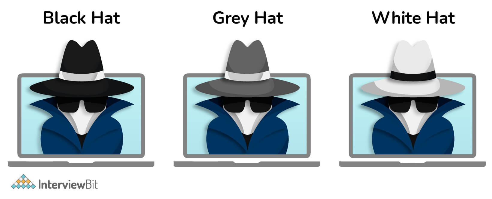

### 7. Các loại an ninh mạng?

An ninh mạnh có thể được phân loại thành năm loại riêng biệt:

* **Bảo mật mạng:** Là quá trình bảo vệ mạng máy tính chống lại sự truy cập trái phép, những kẻ xâm nhập, tấn công, làm gián đoạn và lạm dụng phần cứng và phần mềm. Bảo mật này hỗ trợ trong việc bảo vệ tài sản của tổ chức khỏi các mối đe dọa từ bên ngoài lẫn bên trong. Ví dụ: Sử dụng Tường lửa.
* **Bảo mật ứng dụng:** Nó đòi hỏi phải bảo vệ phần mềm và thiết bị an toàn trước các cuộc tấn công nguy hiểm. Điều này có thể được thực hiện bằng cách thường xuyên cập nhật các ứng dụng để đảm bảo rằng chúng an toàn trước các mối đe dọa.
* **Bảo mật dữ liệu:** Nó đòi hỏi phải có một hệ thống lưu trữ dữ liệu mạnh mẽ để đảm bảo tính toàn vẹn và quyền riêng tư của dữ liệu trong quá trình lưu trữ và vận chuyển.
* **Quản lý danh tính:** Nó đề cập đến quá trình xác định quyền truy cập của mỗi cá nhân bên trong một tổ chức. Ví dụ: Hạn chế quyền truy cập vào dữ liệu theo vai trò công việc của một cá nhân trong công ty.
* **Bảo mật hoạt động:** Nó đòi hỏi phải phân tích và đưa ra quyết định về cách xử lý và bảo mật dữ liệu. Ví dụ: Lưu trữ dữ liệu ở dạng mã hóa trong cơ sở dữ liệu.
* **Bảo mật di động:** Nó đề cập đến việc bảo vệ dữ liệu tổ chức và cá nhân được lưu giữ trên các thiết bị di động như điện thoại di động, máy tính bảng và các thiết bị tương tự khác chống lại nhiều cuộc tấn công thù địch. Truy cập trái phép, mất hoặc trộm thiết bị, phần mềm độc hại và các mối đe dọa khác là những ví dụ về những mối nguy hiểm này.
* **Bảo mật đám mây:** Nó đề cập đến việc bảo vệ dữ liệu được lưu giữ trong môi trường kỹ thuật số hoặc trong cơ sở hạ tầng đám mây cho một tổ chức. Nó sử dụng nhiều nhà cung cấp dịch vụ đám mây khác nhau, bao gồm AWS, Azure, Google và các nhà cung cấp khác, để đảm bảo bảo vệ khỏi nhiều mối đe dọa.

### 8. Ưu điểm của an ninh mạng?

Sau đây là một số ưu điểm của việc áp dụng an ninh mạng:

- Doanh nghiệp được bảo vệ khỏi các cuộc tấn công mạng và vi phạm dữ liệu.
- Cả dữ liệu và mạng đều được bảo vệ.
- Quyền truy cập trái phép của người dùng được hạn chế ở mức tối thiểu.
- Có thời gian phục hồi nhanh hơn sau khi bị tấn công.
- Bảo vệ cho người dùng và thiết bị endpoint.
- Tuân thủ quy định.
- Hoạt động nhất quán.
- Các nhà phát triển, đối tác, người tiêu dùng, các bên liên quan và nhân viên có mức độ tin tưởng cao hơn vào danh tiếng của công ty.

### 9. Botnet là gì? 

Botnet thuật ngữ đầy đủ là “Bots network” dùng để chỉ một mạng lưới các máy tính bị chi phối bởi ai đó và bị điều khiển bởi một con máy tính khác từ xa. Botnet là một phần mềm độc hại, đa phần các máy tính đều bị nhiễm bởi một Bot nào đó mà chúng ta không thể nào phát hiện được.

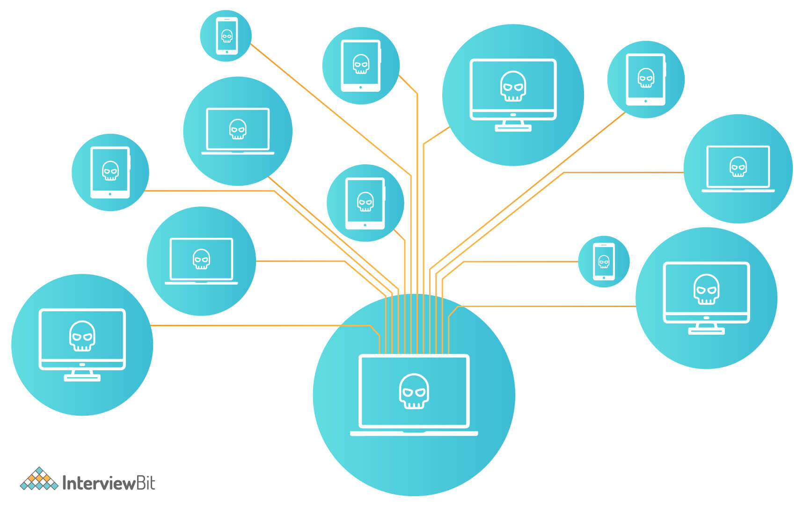

### 10. Honeypot là gì?

Honeypot là một hệ thống tài nguyên thông tin được xây dựng với mục đích giả dạng đánh lừa những kẻ sử dụng và xâm nhập không hợp pháp, thu hút sự chú ý của chúng, ngăn không cho chúng tiếp xúc với hệ thống thật.

Honeypot có thể giả dạng bất cứ loại máy chủ tài nguyên nào như là Mail Server, Domain Name Server, Web Server… Honeypot sẽ trực tiếp tương tác với tin tặc và tìm cách khai thác thông tin về tin tặc như hình thức tấn công, công cụ tấn công hay cách thức tiến hành thay vì bị tấn công.

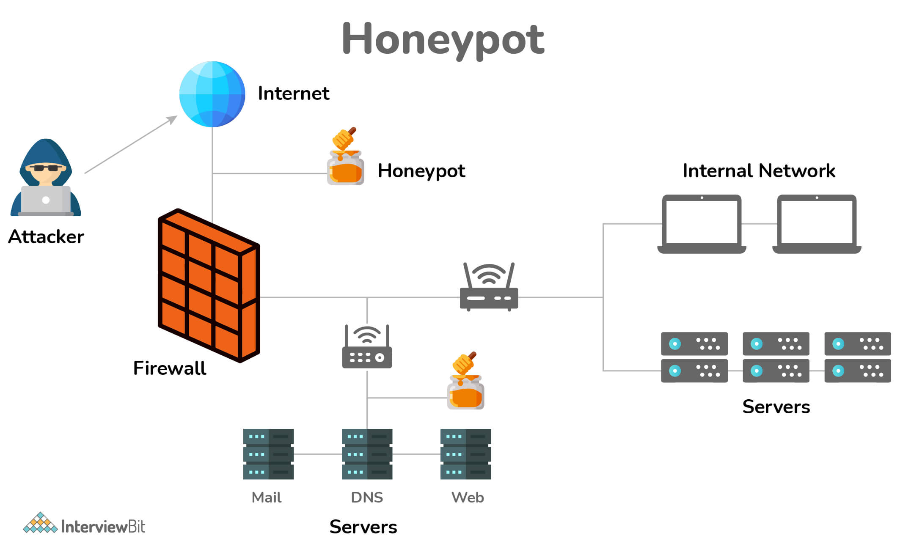

### 11. Sự khác biệt giữa Đánh giá lỗ hổng và Kiểm tra thâm nhập?

Đánh giá lỗ hổng và kiểm tra thâm nhập là hai cụm từ khác nhau, song cả hai đều phục vụ cùng một mục đích: bảo mật môi trường mạng.

**Đánh giá lỗ hổng bảo mật (Vulnerability Asessment)** là quá trình kiểm tra, tìm tòi, nhận diện các biện pháp an toàn cũng như lỗ hổng của hệ thống và ứng dụng. Các hệ thống và ứng dụng được kiểm tra để nhận định tính hiệu quả của các tầng bảo mật hiện thời trong việc chống lại các tấn công và lạm dụng.

**Kiểm tra thâm nhập (Penetration Testing)** là một cuộc tấn công mạng mô phỏng được ủy quyền trên máy tính, nhằm đánh giá tính bảo mật của hệ thống. Quá trình thử nghiệm được thực hiện để xác định tất cả điểm yếu (còn được gọi là lỗ hổng), bao gồm khả năng các bên không được phép truy cập vào những tính năng và dữ liệu hệ thống, cũng như điểm mạnh là cho phép đánh giá rủi ro trên toàn hệ thống.

Đánh giá lỗ hổng tương tự như việc bước đến một cánh cửa và kiểm tra xem nó có được mở khóa hay không trước khi dừng lại. Kiểm tra thâm nhập tiến xa hơn một bước, không chỉ kiểm tra xem cửa có mở khóa hay không mà còn mở cửa và bước vào ngay.

### 12. Null Session nghĩa là gì?

Một phiên truy cập từ xa được tạo lập khi người dùng đăng nhập từ xa vào một máy tính sử dụng một tên người dùng và mật khẩu có quyền truy cập vào tài nguyên hệ thống. Tiến trình đăng nhập này được thực hiện qua giao thức SMB (Server Message Block) và dịch vụ Windows Server. Những kết nối này hoàn toàn hợp pháp khi những thông tin đăng nhập chính xác được sử dụng.

Một Null Session xảy ra khi người dùng thực hiện kết nối tới một hệ thống Windows mà không sử dụng tên người dùng hay mật khẩu. Hình thức kết nối này không thể thực hiện trên bất kỳ hình thức chia sẻ Windows thông thường nào, tuy nhiên lại có thể thực hiện trên chia sẻ quản trị IPC (Interprocess Communication).

### 13. Các kiểu tấn công mạng phổ biến

- Malware 
- Cross-Site Scripting (XSS) 
- Denial-of-Service (DoS)
- Domain Name System Attack
- Man-in-the-Middle Attacks 
- SQL Injection Attack 
- Phishing
- Session Hijacking
- Brute Force

### 14. Tấn công brute force là gì?

Tấn công Brute Force là một loại tấn công mạng, trong đó bạn có một phần mềm, xoay vòng các ký tự khác nhau, kết hợp để tạo ra một mật khẩu đúng. Phần mềm Brute Force Attack password cracker đơn giản sẽ sử dụng tất cả các kết hợp có thể để tìm ra mật khẩu cho máy tính hoặc máy chủ mạng. Nó rất đơn giản và không sử dụng bất kỳ kỹ thuật thông minh nào. Vì phương pháp này chủ yếu dựa trên toán học, phải mất ít thời gian hơn để crack mật khẩu, bằng cách sử dụng các ứng dụng brute force thay vì tìm ra chúng theo cách thủ công. Nói phương pháp này dựa trên toán học vì máy tính làm rất tốt các phép toán và thực hiện chúng trong vài giây, nhanh hơn rất nhiều lần so với bộ não con người (mất nhiều thời gian hơn để tạo ra các sự kết hợp).

### 15. Shouder surfing là gì?

Là một kỹ thuật thu thập password bằng cách xem qua vai người khác khi họ đăng nhập vào hệ thống. Hacker có thể xem người sử dụng thông tin đăng nhập và sau đó sử dụng password đó để giành được quyền truy xuất đến hệ thống.

### 16. Phishing là gì?

Phishing (Tấn công giả mạo) là hình thức tấn công mạng mà kẻ tấn công giả mạo thành một đơn vị uy tín để lừa đảo người dùng cung cấp thông tin cá nhân cho chúng.

Thông thường, tin tặc sẽ giả mạo thành ngân hàng, trang web giao dịch trực tuyến, ví điện tử, các công ty thẻ tín dụng để lừa người dùng chia sẻ các thông tin nhạy cảm như: tài khoản & mật khẩu đăng nhập, mật khẩu giao dịch, thẻ tín dụng và các thông tin quý giá khác.

Phương thức tấn công này thường được tin tặc thực hiện thông qua email và tin nhắn. Người dùng khi mở email và click vào đường link giả mạo sẽ được yêu cầu đăng nhập. Nếu “mắc câu”, tin tặc sẽ có được thông tin ngay tức khắc.

Bạn có thể tự bảo vệ mình khỏi các cuộc tấn công giả mạo bằng cách làm theo các nguyên tắc sau:

- Đừng đưa ra những thông tin quan trọng trên những trang web mà bạn không biết.
- Kiểm tra tính bảo mật của trang web.
- Sử dụng tường lửa.
- Sử dụng công cụ Anti-Phishing.

### 17. Sự khác biệt giữa mã hoá và băm?

#### Băm (hashing)

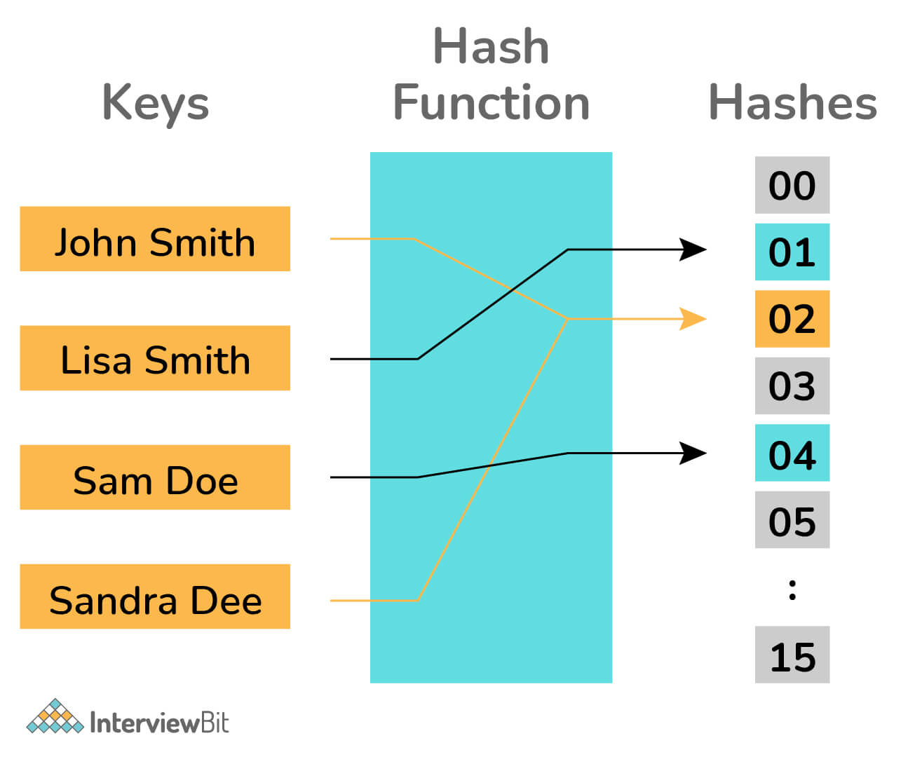

- Hashing là quá trình biến đầu vào là một nội dung có kích thước, độ dài bất kỳ rồi sử dụng những thuật toán, công thức toán học để biến thành đầu ra tiêu chuẩn có độ dài nhất định. Quá trình đó sử dụng những Hàm băm (Hash function).

- Hàm băm mật mã: Như tên gọi của nó vậy, những hàm băm như vậy được sử dụng vào mục đích mã hóa dữ liệu. Những hàm băm mật mã cũng giống như những hàm băm thông thường, nhưng mang trong mình một số đặc điểm khác, quan trọng nhất là không thể đảo ngược. Điều này có nghĩa là khi bạn có trong tay giá trị sau khi băm, bạn không thể biết giá trị ban đầu là gì. Điều này đơn giản như việc bạn uống một cốc sinh tố hỗn hợp rất ngon nhưng không thể nào liệt kê tất cả nguyên liệu của nó vậy.

Ngoài ra, hàm băm mật mã còn mang một số đặc điểm khác như **tính tránh va chạm** (xảy ra khi hai giá trị khác nhau nhưng khi chạy qua hàm băm lại trả về hai kết quả giống nhau), **tính hiệu quả** (thời gian tính toán những giá trị băm phải nhanh) và cả **tính nhạy cảm** (chỉ cần sự thay đổi nhỏ trong giá trị ban đầu có thể thay đổi hoàn toàn giá trị băm).

Vd: MD5, SHA256,... 

#### Mã hoá (encryption)

Thuật ngữ mã hóa dữ liệu (Data Encrypt) mô tả việc làm cho dữ liệu không thể đọc được đối với người hoặc máy tính khác mà nếu không được phép (không thể nhìn thấy nội dung). Dữ liệu được mã hóa được tạo bằng chương trình mã hóa như PGP, máy mã hóa hoặc khóa mật mã đơn giản và xuất hiện dưới dạng ký tự vô nghĩa cho đến khi được giải mã. Để đọc hoặc sử dụng dữ liệu, dữ liệu phải được giải mã và chỉ những người có mật khẩu hoặc khóa giải mã chính xác mới có thể đọc được.

Vd: RSA, AES

### 18. Xác thực hai yếu tố là gì?

Xác thực hai yếu tố (2FA), thường được gọi là xác minh hai bước hoặc xác thực yếu tố kép, là một phương pháp bảo mật trong đó người dùng xác thực danh tính của họ bằng hai yếu tố xác thực độc lập. Quy trình này được thực hiện để bảo vệ tốt hơn thông tin đăng nhập của người dùng cũng như các tài nguyên mà người dùng có quyền truy cập. Xác thực một yếu tố (SFA), trong đó người dùng chỉ cung cấp một yếu tố - thường là mật khẩu hoặc mật mã - cung cấp mức độ bảo mật thấp hơn so với xác thực hai yếu tố (TFA). Vì chỉ sở hữu mật khẩu của người dùng là không đủ để thực hiện kiểm tra xác thực, xác thực hai yếu tố bổ sung thêm một lớp bảo mật cho quá trình xác thực, khiến những kẻ tấn công khó truy cập vào thiết bị hoặc tài khoản trực tuyến của một người hơn.

.jpg)

### 19. Làm thế nào để tránh tấn công brute force?

Có nhiều kỹ thuật để ngăn chặn cuộc tấn công brute force, trong đó một chính sách mật khẩu mạnh mẽ là rõ ràng nhất. Ví dụ như mật khẩu người dùng phải ít nhất 16 ký tự: có ký tự chữ hoa, chữ thường, số và ký tự đặc biệt. Bên cạnh đó là cấm các mật khẩu phổ biến như `12345678` hay `qwerty`.

Tấn công brute fotce cũng có thể tránh bằng các phương pháp sau:
- Giới hạn số lần đăng nhập không thành công.
- Thay đổi file sshd_config, khiến người dùng root không thể truy cập qua SSH.
- Thay đổi cổng mặc định trong file sshd_config.
- Sử dụng Captcha.
- Giới hạn thông tin đăng nhập với một địa chỉ IP nhất định.
- Xác thực hai yếu tố.
- Theo dỗi log của server.

### 20. Tấn công xen giữa là gì?

Tấn công xen giữa (Man in the Middle) là một cuộc tấn công mà kẻ tấn công bí mật chuyển tiếp và có thể làm thay đổi giao tiếp giữa hai bên mà họ tin rằng họ đang trực tiếp giao tiếp với nhau. Một ví dụ về các cuộc tấn công man-in-the-middle là nghe trộm (eavesdropping), trong đó kẻ tấn công kết nối độc lập với các nạn nhân và chuyển tiếp thông tin giữa họ để họ tin rằng họ đang nói chuyện trực tiếp với nhau qua kết nối riêng tư, trong khi thực ra toàn bộ cuộc trò chuyện được kiểm soát bởi kẻ tấn công. Người tấn công phải có khả năng đánh chặn tất cả các thông tin liên quan đi lại giữa hai nạn nhân và thêm những thông tin mới. Điều này đơn giản trong nhiều trường hợp; ví dụ, một kẻ tấn công trong phạm vi tiếp nhận của một điểm truy cập không dây (Wi-Fi) không được mã hóa có thể chèn mình như một "người đàn ông ở giữa" (man-in-the-middle).

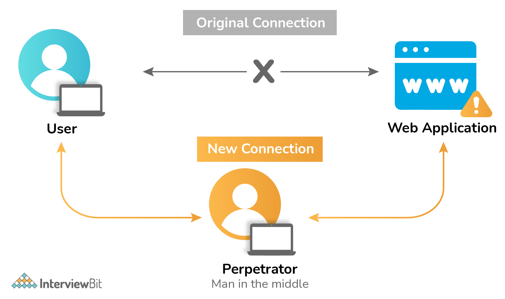

### 21. Sự khác biệt giữa bảo vệ thông tin và bảo đảm thông tin?

**Bảo vệ thông tin (information protection)** là bảo vệ dữ liệu khỏi bị truy cập trái phép bằng cách sử dụng mã hóa, phần mềm bảo mật và các phương pháp khác.

**Bảo đảm thông tin (information assurance)** là đảm bảo tính toàn vẹn của dữ liệu bằng cách duy trì tính khả dụng, xác thực và bí mật của nó, cùng những thứ khác.

## Câu hỏi phỏng vấn an ninh mạng cho Experienced

### 22. Sự khác biệt giữa VPN và VLAN?

Các công ty sử dụng VLAN để hợp nhất các thiết bị được phân tán trên một số địa điểm từ xa vào một miền broadcast duy nhất. Mặt khác, VPN được sử dụng để truyền dữ liệu an toàn giữa hai văn phòng của cùng một tổ chức hoặc giữa các văn phòng của các công ty khác nhau. Các cá nhân cũng sử dụng nó cho nhu cầu cá nhân của họ.

VLAN là một kiểu con VPN. VPN là viết tắt của Virtual Private Network, là công nghệ tạo ra một đường hầm ảo để truyền dữ liệu an toàn qua Internet.

Bởi vì nó cho phép mã hóa và ẩn danh, VPN là một giải pháp tiên tiến hơn nhưng đắt tiền hơn. VLAN hữu ích để phân đoạn mạng thành các phần hợp lý để quản lý dễ dàng hơn, nhưng nó thiếu các đặc tính bảo mật của VPN.

VLAN giảm thiểu số lượng bộ định tuyến cần thiết cũng như chi phí triển khai bộ định tuyến. VPN cải thiện hiệu quả tổng thể của mạng.

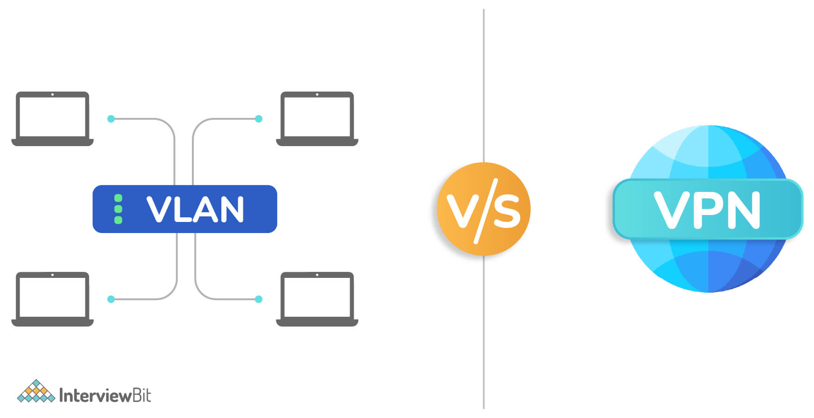

### 23. Bảo mật toàn phần và bảo vệ dữ liệu là gì?

**Permiter-based cybersecurity hay bảo mật toàn phần** đòi hỏi phải áp dụng các biện pháp bảo mật để bảo vệ mạng của công ty bạn khỏi tin tặc. Nó kiểm tra những người cố gắng đột nhập vào mạng của bạn và ngăn chặn bất kỳ nỗ lực xâm nhập đáng ngờ nào. 

**Data-based protection hay bảo vệ dữ liệu** đề cập đến việc sử dụng các biện pháp bảo mật trên dữ liệu. Nó không bị ảnh hưởng bởi kết nối mạng. Do đó, bạn có thể theo dõi và bảo vệ dữ liệu của mình bất kể dữ liệu được lưu trữ ở đâu, ai truy cập hoặc kết nối nào được sử dụng để truy cập. 

### 24. SSL và HTTPS cái nào đáng tin cậy hơn?

- SSL là viết tắt của Secure Sockets Layer, là một công nghệ tiêu chuẩn cho phép hai hoặc nhiều bên giao tiếp an toàn qua internet. Để cung cấp bảo mật, nó hoạt động trên HTTP. Nó hoạt động ở tầng Presentation. 

- HTTPS là viết tắt của Hypertext Transfer Protocol Secure, là kết hợp của HTTP và SSL, sử dụng mã hoá để tạo ra trải nghiệm lướt web an toàn hơn. Hoạt động của HTTPS liên quan đến 4 tầng trên cùng của mô hình OSI, tức là tầng Application, Presentation, Session, và Transport.

### 25. Sự khác biệt giữa mã hoá đối xứng và bất đối xứng?

| Mã hoá đối xứng | Mã hoá bất đối xứng |
|-----------------|---------------------|
| Cả mã hoá và giải mã dùng cùng khoá | Cần hai khoá để mã hoá và giải mã |
| Mã hoá nhanh | Mã hoá chậm |
| Dùng khi kích cỡ dữ liệu lớn | Dùng khi kích cỡ dữ liệu nhỏ |
| Sử dụng ít tài nguyên hơn | Sử dụng nhiều tài nguyên hơn |
| Plaintext có cùng cỡ hoặc nhỏ hơn ciphertext | Plaintext có cùng cỡ hoặc lớn hơn ciphertext | 

### 26. Tấn công DDoS là gì? Làm thế nào để chặn nó?

Một cuộc tấn công từ chối dịch vụ phân tán là một nỗ lực độc hại nhằm phá vỡ lưu lượng truy cập bình thường của máy chủ, dịch vụ hoặc mạng được nhắm mục tiêu bằng cách áp đảo mục tiêu hoặc cơ sở hạ tầng xung quanh với lưu lượng truy cập Internet. Các cuộc tấn công DDoS đạt được hiệu quả bằng cách sử dụng nhiều hệ thống máy tính bị xâm nhập làm nguồn lưu lượng tấn công. Các yêu cầu bắt nguồn từ nhiều địa chỉ IP, có thể khiến hệ thống không hoạt động được, làm quá tải các máy chủ của nó, khiến chúng chậm lại hoặc chuyển sang chế độ ngoại tuyến hoặc ngăn tổ chức thực hiện các trách nhiệm thiết yếu của mình. 

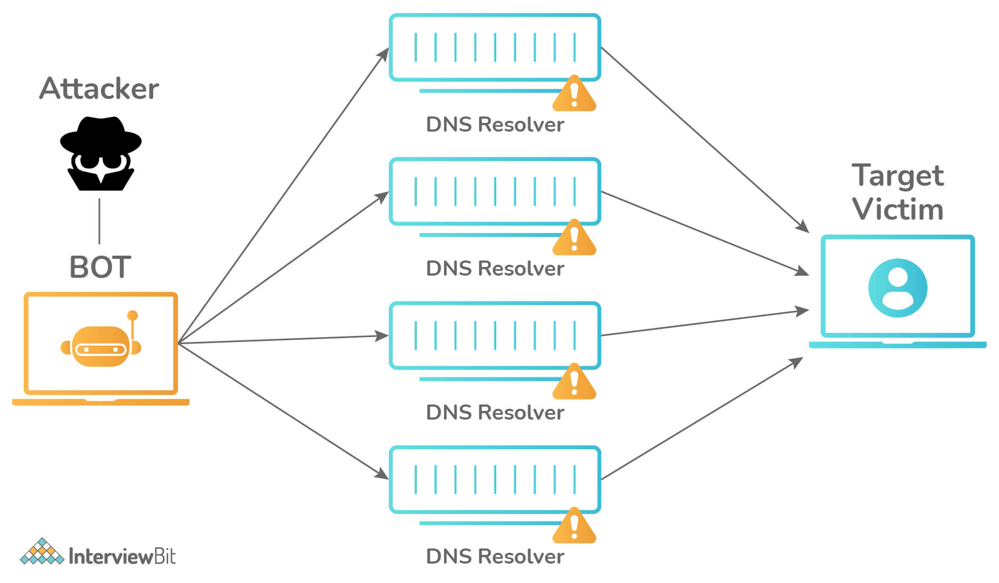

Các phương pháp được liệt kê dưới đây sẽ hỗ trợ ngăn chặn các cuộc tấn công DDOS:

- Tăng cường khả năng xử lý của hệ thống:
    
    + Tối ưu hóa các thuật toán xử lý, mã nguồn của máy chủ web
    
    + Nâng cấp hệ thống máy chủ
    
    + Nâng cấp đường truyền và các thiết bị liên quan,
    
    + Cài đặt đầy đủ các bản vá cho hệ điều hành và các phần mềm khác để phòng ngừa khả năng bị lỗi tràn bộ đệm, cướp quyền điều khiển,v.v…
 
- Hạn chế số lượng kết nối tại thiết bị tường lửa tới mức an toàn hệ thống cho phép.
 
- Sử dụng các tường lửa cho phép lọc nội dung thông tin (tầng ứng dụng) để ngăn chặn các kết nối nhằm tấn công hệ thống.
 
- Phân tích luồng tin (traffic) để phát hiện các dấu hiệu tấn công và cài đặt các tường lửa cho phép lọc nội dung thông tin (tầng ứng dụng) ngăn chặn theo các dấu hiệu đã phát hiện.

### 27. Sự khác biệt giữa IDS và IPS?

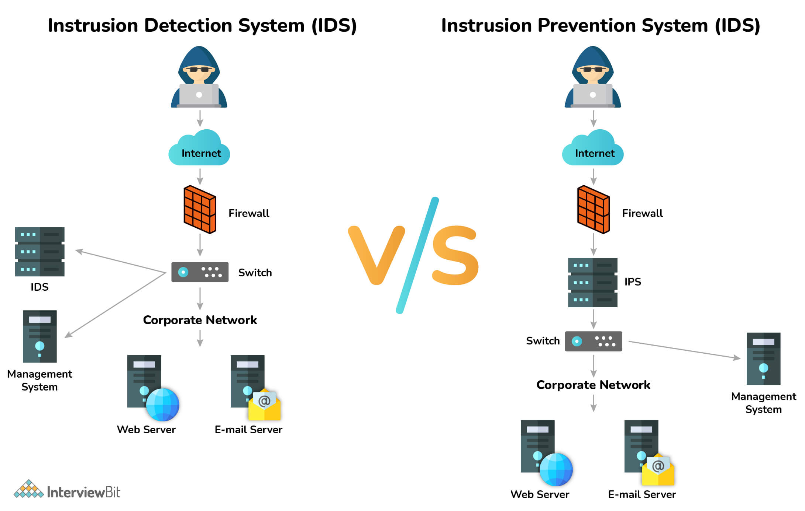

* **IDS** là viết tắt của Intrusion Detection System - Hệ thống Phát hiện Xâm nhập. Đây là các phần mềm hoặc công cụ giúp bạn bảo mật hệ thống và cảnh báo mỗi khi có xâm nhập. IDS thường là một phần của các hệ thống bảo mật hoặc phần mềm khác, đi kèm với nhiệm vụ bảo vệ hệ thống thông tin.

* **IPS** (Intrusion Prevention System) là Hệ thống Ngăn chặn Xâm nhập. Như vậy, IPS bao gồm IDS cùng hệ thống kiểm soát hoặc phản hồi. IDS không thể điều chỉnh các xâm nhập, trong khi IPS có khả năng ngăn chặn phát tán dựa vào nội dung của các xâm nhập.

Cả IDS và IPS đều là các hệ thống dựa trên dữ liệu những mối đe dọa đã được biết đến. IDS cần quản trị viên xem xét những mối nguy được cảnh báo, trong khi IPS có thể tự ngăn chặn các mối nguy này. 

### 28. Sniffing là gì?

Sniffing là một kỹ thuật để đánh giá các gói dữ liệu được phân phối qua mạng. Điều này có thể được thực hiện thông qua việc sử dụng phần mềm hoặc phần cứng chuyên dụng. Sniffing có thể được sử dụng cho nhiều mục đích khác nhau, bao gồm:
- Nắm bắt thông tin bí mật, chẳng hạn như mật khẩu.
- Nghe tin nhắn trò chuyện
- Theo dõi gói dữ liệu qua mạng

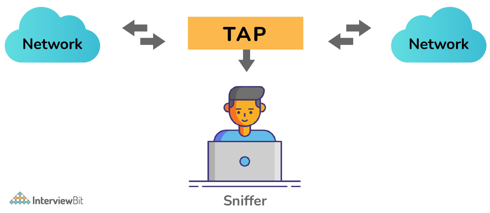

### 29. Phân biệt black box test và white box test?

| Black box test | White box test |
|----------------|----------------|
| Là phương pháp kiểm thử phần mềm trong đó cấu trúc bên trong của chương trình hoặc phần mềm được che giấu | Là phương pháp kiểm thử phần mềm trong đó người kiểm thử đã quen thuộc với cấu trúc hoặc code bên trong của phần mềm |
| Người kiểm thử không cần thiết phải có kiến thức về việc mã hoá, cấu trúc bên trong của phần mềm, cũng như không yêu cầu phải biết lâp trình phần mềm | Người kiểm thử phải có kiến thức nhất định về việc mã hoá, cấu trúc bên trong của chức năng, biết lâp trình phần mềm |
| Việc kiểm thử được tiến hành dựa vào việc kiểm thử phần mềm làm được gì, có phù hợp với yêu cầu của người dùng hay không. Các tester nhập số liệu vào phần mềm và chỉ cần xem kết quả của phần mềm và các mục tiêu kiểm tra | Việc kiểm thử được tiến hành dựa vào việc kiểm xem giải thuật, mã lệnh đã làm có đúng không |
| Mức test này thường yêu cầu các tester phải viết test case đầy đủ trước khi test; khi test, đơn giản chỉ cần thực hiện theo các bước mô tả trong test case thao tác và nhập data vào, sau đó xem kết quả trả về hoặc hành vi của phần mềm, rồi so sánh với kết quả mong đọi được viết trong testcase | Mức test này thường yêu cầu các tester phải viết test case đầy đủ các nhánh trong code; khi test, sẽ set điều kiện và data để chạy vào đủ tất cả các nhánh trong giải thuật, đảm bảo thực hiện đầy đủ |

### 30. System hardening là gì?

Nói chung, tăng cường hệ thống (system hardening) đề cập đến một tập hợp các công cụ và thủ tục để quản lý các lỗ hổng trong hệ thống, ứng dụng, chương trình cơ sở và các thành phần khác của tổ chức.
Mục tiêu của việc tăng cường hệ thống là giảm thiểu rủi ro bảo mật bằng cách giảm thiểu các cuộc tấn công tiềm ẩn và nén bề mặt tấn công của hệ thống. Các kiểu tăng cường hệ thống:
- Tăng cường cơ sở dữ liệu
- Tăng cường hệ điều hành
- Tăng cường ứng dụng
- Tăng cường máy chủ
- Tăng cường mạng

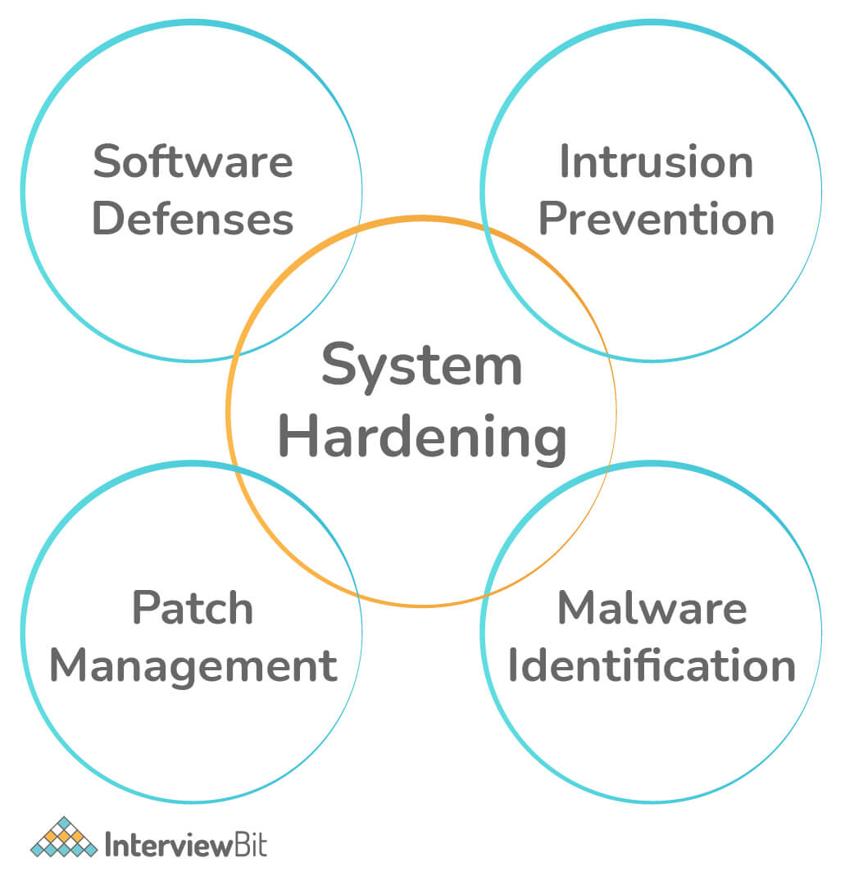

### 31. Sự khác biệt giữa HIDS và NIDS?

**Host-Based IDS (HIDS)** chỉ làm nhiệm vụ giám sát và ghi lại log cho một máy chủ (host-system). Đây là dạng IDS với giới hạn chỉ giám sát và ghi lại toàn bộ những khả năng của host-system (nó bao gồm cả hệ điều hành và các ứng dụng cũng như toàn bộ service của máy chủ đó). Một Host-Based IDS có khả năng phát hiện các vấn đề nếu các thông tin về máy chủ đó được giám sát và ghi lại. Là thiết bị bảo mật cho phát hiện các tấn công trực tiếp tới một máy chủ.

**Network-Based IDS (NIDS)**  sẽ kiểm tra các giao tiếp trên mạng với thời gian thực (real-time). Nó kiểm tra các giao tiếp, quét header của các gói tin, và có thể kiểm tra nội dung của các gói đó để phát hiện ra các đoạn mã nguy hiểm hay các dạng tấn công khác nhau. Một Network-Based IDS hoạt động tin cậy trong việc kiểm tra, phát hiện các dạng tấn công trên mạng, ví dụ như dựa vào băng thông (bandwidth-based) của tấn công Denied of Service (DoS).

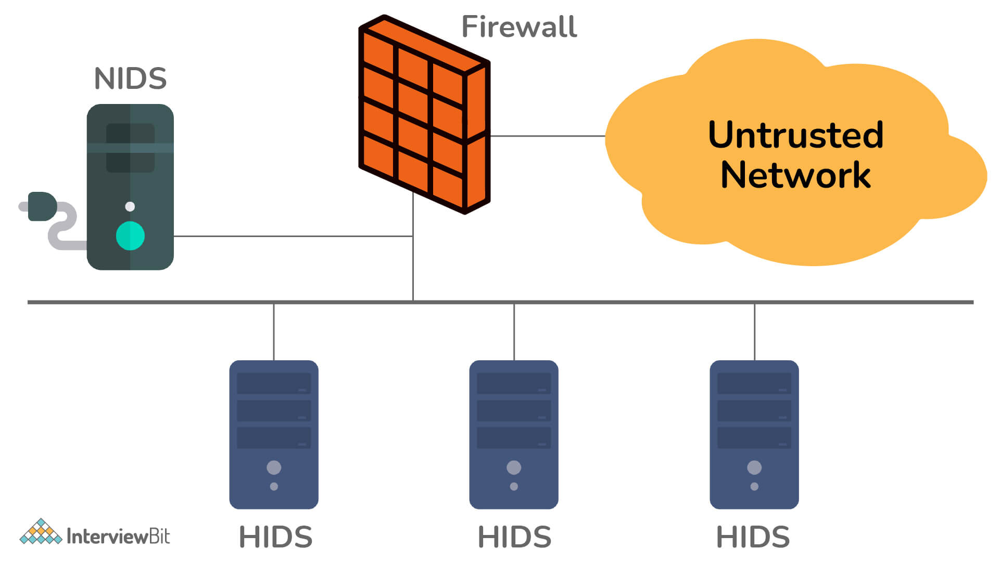

### 32. Tấn công DNS là gì?

Tấn công DNS là một dạng tấn công mạng, trong đó kẻ trộm mạng sử dụng các điểm yếu trong DNS để chuyển hướng người dùng đến các trang web độc hại và đánh cắp dữ liệu từ các máy được nhắm mục tiêu. Bởi vì hệ thống DNS là một phần quan trọng của cơ sở hạ tầng internet, nó gây ra rủi ro an ninh mạng nghiêm trọng.

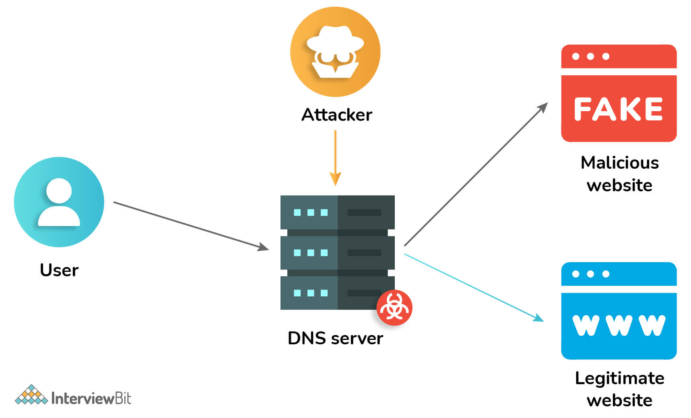

Có thể tránh được những điều này bằng các biện pháp phòng ngừa sau: 
* Kiểm tra các vùng DNS trong hệ thống của bạn.
* Đảm bảo máy chủ DNS của bạn được cập nhật.
* Phiên bản BIND bị ẩn.
* Việc chuyển giao giữa các khu vực nên được hạn chế.
* Để tránh các nỗ lực nhiễm độc DNS, hãy tắt đệ quy DNS.
* Sử dụng các máy chủ DNS được phân tách.
* Sử dụng dịch vụ giảm thiểu DDOS