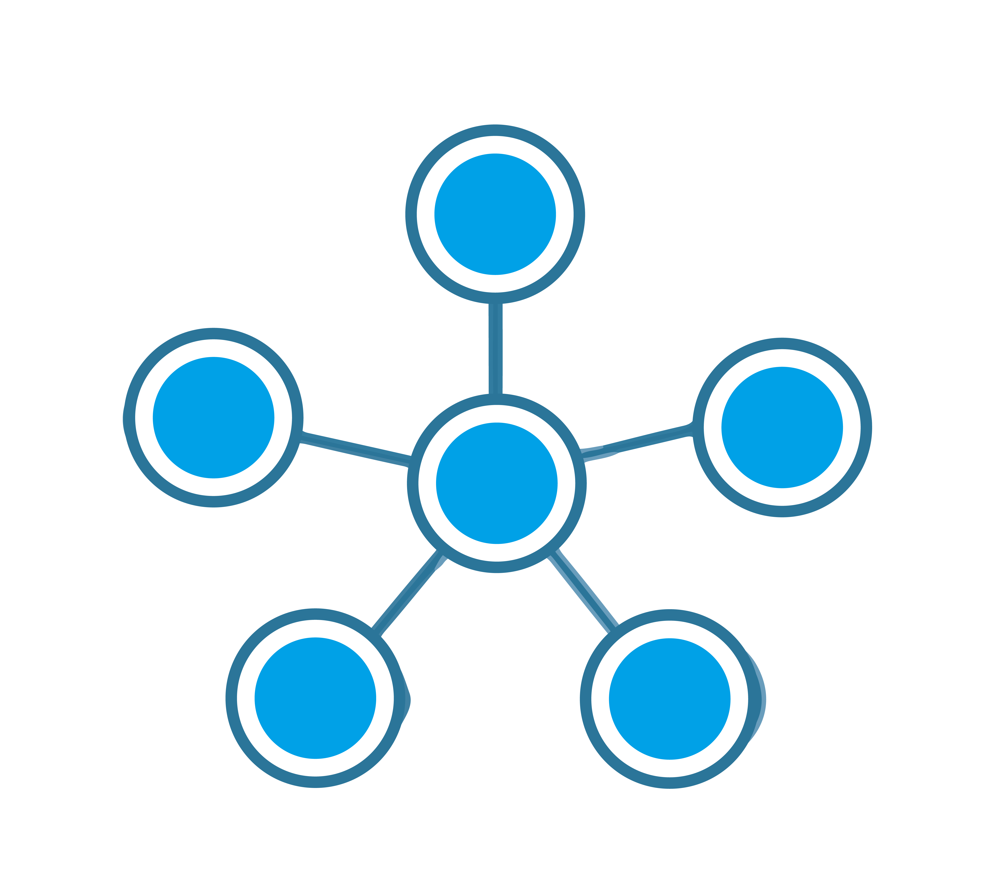
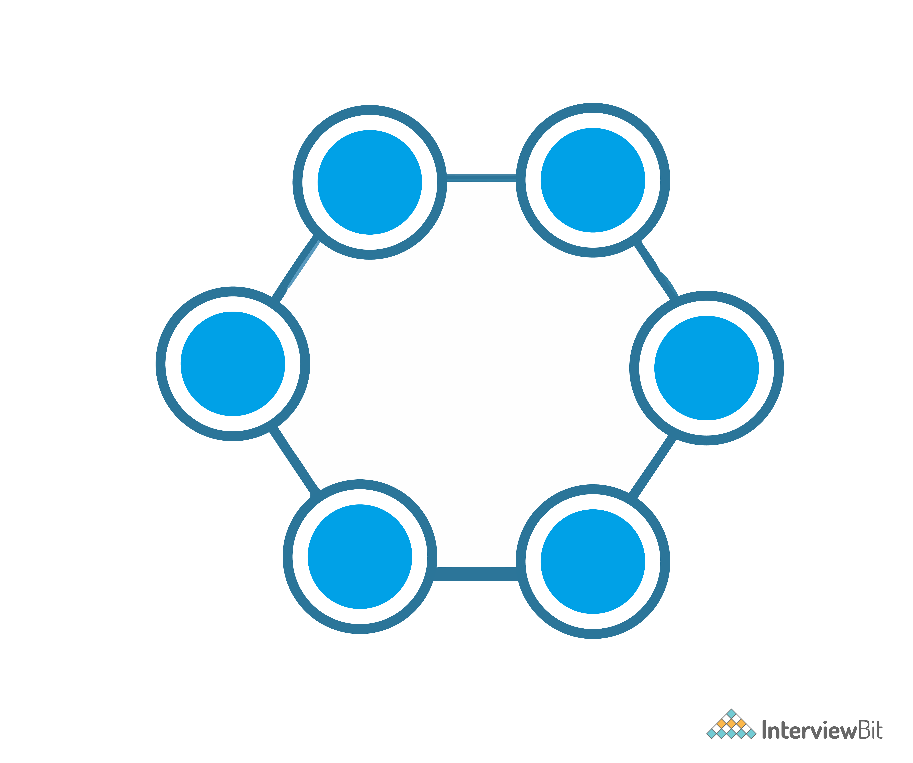
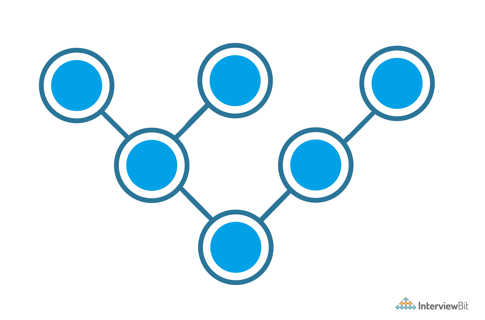
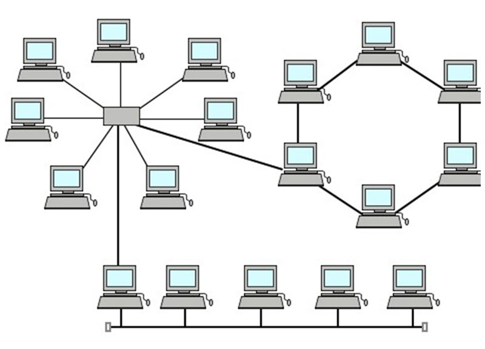

# Mạng máy tính

## Mạng máy tính là gì?

Theo Merriam Webster, mạng là một nhóm được kết nối với nhau một cách không chính thức bởi các thực thế khác nhau như con người, máy tính, đài phát thanh,...

Ví dụ, Dominos có mạng lưới 1232 chi nhánh trên khắp Ấn Độ. Cho thấy mạng máy tính là một hệ thống các thiết bị ngoại vi hoặc máy tính được kết nối với nhau và có một kênh giao tiếp tiêu chuẩn được thiết lập giữa chúng để trao đổi các loại thông tin và dữ liệu khác nhau. 

## Tại sao mang máy tính quan trọng?

Bạn đã bao giờ nghe nói về Internet hoặc NET? Tôi đoán là có, vì bạn chỉ có thể đọc bài viết này nhờ vào Internet. Nhưng, bạn đã bao giờ nghĩ về internet chưa? Internet là một mạng lưới kết nối tất cả các thiết bị hỗ trợ mạng khác nhau cho phép chia sẻ dữ liệu và thông tin giữa chúng và điều đó làm cho mạng máy tính trở thành một phần cốt lõi trong cuộc sống của chúng ta và các cuộc phỏng vấn công nghệ.

Dưới đây là danh sách tất cả các câu hỏi mạng thường gặp trong các cuộc phỏng vấn từ cấp độ cơ bản đến nâng cao.

## Câu hỏi phỏng vấn mạng máy tính cho Fresher

### 1. Mạng máy tính được phân loại như thế nào?

Các loại mạng có thể được phân loại và phân chia dựa trên khu vực phân bố của chúng. Sơ đồ dưới đây sẽ giúp hiểu nhanh hơn:

### 2. Giải thích về các loại mạng?

| Loại | Mô tả |
|------|-------|
| PAN (Personal Area Network) | Các thiết bị kết nối và giao tiếp trong phạm vi người dùng (như kết nối bluetooth) |
| LAN (Local Area Network) | Mạng thuộc sở hữu tư nhân như trong một văn phòng, nhà máy,...
| MAN (Metropolotan Area Network) | Được kết nối trên khu vực toàn thành phố vd như hệ thống TV cable |
| WAN (Wide Area Network) | Nó trải dài trên một khu vực địa lý rộng lớn, thường là một quốc gia hoặc lục địa. Internet là mạng WAN lớn nhất |
| GAN (Global Area Network) | Còn được gọi là internet, kết nối toàn cầu thông qua vệ tinh. |

### 3. Giải thích về LAN?

Mạng LAN được sử dụng rộng rãi để kết nối máy tính/laptop và thiết bị điện tử tiêu dùng cho phép chúng chia sẻ tài nguyên (ví dụ: máy in, máy fax) và trao đổi thông tin. Khi mạng LAN được sử dụng bởi các công ty hoặc tổ chức, chúng được gọi là mạng doanh nghiệp. Có hai loại mạng LAN khác nhau, tức là mạng LAN không dây (không có dây, khi sử dụng Wi-Fi) và mạng LAN có dây (sử dụng được bằng cáp LAN). Ngày nay, mạng LAN không dây rất phổ biến ở những nơi khó lắp đặt dây. Các sơ đồ dưới đây giải thích cả mạng LAN không dây và có dây.

.png)

### 4. VPN là gì?

VPN hay Virtual Private Network là một mạng WAN riêng tư được xây dựng trên internet. Nó cho phép tạo một đường hầm bảo mật (secured tunnel) giữa hai mạng khác nhau sử dụng internet. Bằng cách dùng VPN, một client có thể kết nối từ xa tới mạng của tổ chức. So đồ dưới đây cho thấy một mạng wan của tổ chức ở Úc sử dụng VPN:

.png)

### 5. Lợi ích của VPN?

- VPN được sử dụng để kết nối các văn phòng ở các vị trí địa lý khác nhau từ xa và rẻ hơn khi so sánh với kết nối WAN.
- VPN được sử dụng cho các giao dịch an toàn và truyền dữ liệu bí mật giữa nhiều văn phòng đặt tại các vị trí địa lý khác nhau.
- VPN giữ cho thông tin của tổ chức được bảo mật trước mọi mối đe dọa hoặc sự xâm nhập tiềm ẩn bằng cách sử dụng ảo hóa.
- VPN mã hóa lưu lượng truy cập internet và che giấu danh tính trực tuyến.

### 6. Các loại VPN khác nhau?

- **Access VPN** được dùng để cung cấp kết nối cho người dùng di động từ xa và thiết bị viễn thông. Nó phục vụ như một sự thay thế cho kết nối dial-up hay ISDN (Integrated Services Digital Network). Nó là một giải pháp chi phí thấy và cung cấp một loạt kết nối.
- **Site-to-Site VPN** hay Router-to-Router VPN thường được dùng bởi các công ty lớn có các chi nhánh ở các địa điểm khác nhau để kết nối mạng cho các văn phòng ở các địa điểm khác nhau. Nó có hai kiểu phụ là:
- **Intranet VPN**: hữu ích khi kết nối các văn phòng từ xa trên các khu vực địa lý khác nhau bằng cơ sở hạ tầng chung (kết nối internet và server) với các chĩnh sách hỗ trợ như mạng WAN riêng tư.
- **Extranet VPN** sử dụng cơ sở hạ tầng chung qua mạng intranet, nhà cung cấp, khách hàng, đối tác và các thực thể khác và kết nối chúng bằng kết nối chuyên dụng. 

### 7. Nodes và links là gì?

**Node** tạm dịch là nút, bất kỳ thiết bị giao tiếp nào trong mạng đều được gọi là nút. Một nút là một điểm giao nhau trong mạng. Nó có thể gửi/nhận dữ liệu và thông tin trong mạng. Ví dụ một nút có thể là máy tính, laptop, máy in, máy fax,...

**Link** tạm dịch là liên kết, đề cập đến khả năng kết nối giữa hai nút trong mạng. Nó bao gồm kiểu kết nối không dây và có dây giữa các nút và giao thức được sử dụng để chúng có thể giao tiếp lẫn nhau.

### 8. Cấu trúc liên kết mạng là gì?

Cấu trúc liên kết mạng là một bố trí vật lý của mạng, kết nối các nút khác nhau bằng các liên kết. Nó mô tả kết nối giữa các máy tính, thiết bị, cáp, v.v.

## 9. Các kiểu cấu trúc liên kết mạng khác nhau?

#### Dạng bus:

- Tất cả nút đều kết nối với liên kết trung tâm gọi là bus.
- Hữu ích với số lượng thiết bị nhỏ.
- Nếu cáp chính bị hỏng, nó sẽ làm hỏng toàn bộ mạng.

#### Dạng sao:

- Tất cả các nút được kết nối với một nút duy nhất được gọi là nút trung tâm.
- Nó mạnh mẽ hơn. bus
- Nếu nút trung tâm bị lỗi, toàn bộ mạng sẽ bị hỏng.
- Dễ dàng khắc phục sự cố.
- Chủ yếu được sử dụng trong mạng gia đình và văn phòng.

#### Dạng vòng:

- Mỗi nút được kết nối với chính xác hai nút tạo thành cấu trúc vòng.
- Nếu một trong các nút bị hỏng, nó sẽ làm hỏng toàn bộ mạng.
- Nó rất hiếm khi được sử dụng vì nó đắt và khó cài đặt và quản lý.

#### Dạng lưới:

- Mỗi nút được kết nối với một hoặc nhiều nút.
- Nó chắc chắn hỏng khi một liên kết ngắt kết nối nút đó.
- Nó hiếm khi được sử dụng và việc cài đặt cũng như quản lý rất khó khăn.

#### Dạng cây:

- Là kết hợp giữa dạng sao và dạng bus còn được gọi là dạng bus mở rộng.
- Tất cả các mạng sao nhỏ hơn được kết nối với một bus duy nhất.
- Nếu bus chính bị lỗi, toàn bộ mạng bị hỏng.

#### Dạng nâng cao:

- Nó là sự kết hợp của các cấu trúc liên kết khác nhau để tạo thành một cấu trúc liên kết mới.
- Nó giúp bỏ qua nhược điểm của một cấu trúc liên kết cụ thể và giúp chọn điểm mạnh từ cấu trúc khác.

### 10. Địa chỉ IPv4 là gì? Các lớp của IPv4?

Một địa chỉ IP là địa chỉ 32-bit của một nút trong mạng. Một địa chỉ IPv4 có 4 octet, mỗi octet là 8-bit với mỗi số có giá trị lên đến 255.

Các lớp IPv4 được phân biệt dựa trên số lượng máy chủ mà nó hỗ trợ trên mạng. Có năm loại lớp IPv4 và dựa trên octet đầu tiên của địa chỉ IP được phân loại là Lớp A, B, C, D hoặc E.

| Lớp IPv4 | Địa chỉ bắt đầu | Địa chỉ kết thúc | Sử dụng |
|----------|-----------------|------------------|---------|
| A | 0.0.0.0 | 127.255.255.255 | Dùng cho mạng lớn |
| B | 128.0.0.0 | 191.255.255.255 | Dùng cho mạng cỡ vừa |
| C | 192.0.0.0 | 223.255.255.255 | Dùng cho mạng LAN |
| D | 224.0.0.0 | 239.255.255.255 | Dành riêng cho nhiều người |
| E | 240.0.0.0 | 255.255.255.254 | Nghiên cứu và R&D |

### 11. Địa chỉ IP riêng tư và đặc biệt?

**Địa chỉ riêng tư:** Đối với mỗi lớp, có các IP cụ thể được dành riêng cho mục đích sử dụng riêng. Không thể sử dụng địa chỉ IP này cho các thiết bị trên Internet vì chúng không thể định tuyến được.

| Lớp IPv4 | Địa chỉ bắt đầu | Địa chỉ kết thúc |
|----------|-----------------|------------------|
| A | 10.0.0.0 | 10.255.255.255 |
| B | 172.16.0.0 | 172.31.255.255 |
| B | 192.168.0.0 | 192.168.255.255 |

**Địa chỉ đặc biệt:** Dải IP từ 127.0.0.1 đến 127.255.255.255 là địa chỉ kiểm tra mạng còn được gọi là địa chỉ loopback là địa chỉ IP đặc biệt.