# Câu hỏi phỏng vấn hệ điều hành

## Hệ điều hành là gì?

Hệ điều hành (Operating System: OS) là một chương trình phần mềm để quản lý và xử lý tất cả nguồn tài nguyên của máy tính như phần cứng và phần mềm. Hệ điều hành đầu tiên được giới thiệu vào năm 1950 là GMOs. Hệ điều hành chịu trách nhiệm cho quản lý, xử lý, điều phối các hoạt động tổng thể và chia sẻ tài nguyên máy tính. Nó đóng vai trò trung gian giữa người dùng máy tính và phần cứng máy tính.

Chức năng của hệ điều hành:

- Quản lý bộ nhớ và các tiến trình.
- Cung cấp giao diện người dùng.
- Quản lý file và thiết bị.
- Lên kế hoạch các nguồn tài nguyên và công việc.
- Phát hiện lỗi.
- Bảo mật

## Câu hỏi phỏng vấn hệ điều hành cho Fresher

### 1. Tại sao hệ điều hành quan trọng?

Hệ điều hành là phần thiết yếu và quan trọng nhất của máy tính mà không có nó thì máy tính gần như là vô dụng. Nó kích hoạt một giao diện hoặc hoạt động giống như một liên kết để tương tác giữa phần mềm máy tính được cài đặt trên hệ điều hành và người dùng. Đồng thời giúp giao tiếp với phần cứng và duy trì sự cân bằng giữa phần cứng và CPU. Nó cũng cung cấp các dịch vụ cho người dùng và một nền tảng cho các chương trình chạy trên đó. Nó thực hiện tất cả các tác vụ chung mà ứng dụng yêu cầu.

### 2. Mục đích chính của hệ điều hành là gì? Các loại hệ điều hành khác nhau là gì?

Mục đích chính của HĐH là thực thi các chương trình của người dùng và giúp người dùng hiểu và tương tác với máy tính cũng như chạy các ứng dụng dễ dàng hơn. Nó được thiết kế đặc biệt để đảm bảo rằng hệ thống máy tính hoạt động tốt hơn bằng cách quản lý tất cả các hoạt động tính toán. Nó cũng quản lý bộ nhớ máy tính, các tiến trình và hoạt động của tất cả phần cứng và phần mềm.

Các loại hệ điều hành:

- Batched OS (Payroll System, Transactions Process, ...)
- Multi-Programmed OS (Windows OS, UNIX OS, ...)
- Timesharing OS (Multics, ...)
- Distributed OS (LOCUS, ...)
- Real-Time OS (PSOS, VRTX, ...)

### 3. Lợi ích của hệ thống đa xử lý?

Hệ thống đa xử lý là một loại hệ thống bao gồm hai hoặc nhiều CPU. Nó liên quan đến việc xử lý các chương trình máy tính khác nhau cùng một lúc, bởi hệ thống máy tính này có hai hoặc nhiều CPU đang chia sẻ một bộ nhớ duy nhất.

Lợi ích:

- Các hệ thống như vậy ngày nay được sử dụng rộng rãi để cải thiện hiệu suất trong các hệ thống đang chạy nhiều chương trình đồng thời.
- Bằng cách tăng số lượng bộ xử lý, số lượng tác vụ lớn hơn có thể được hoàn thành trong thời gian ngắn.
- Nó còn gia tăng đáng kể về thông lượng cũng như hiệu quả về chi phí vì tất cả các bộ xử lý đều chia sẻ cùng một nguồn tài nguyên.
- Cuối cùng là cải thiện độ tin cậy của hệ thống máy tính.

### 4. Cấu trúc RAID trong hệ điều hành là gì?

RAID (Redundant Arrays of Independent Disks) là một phương pháp được dùng để lưu trữ dữ liệu trên nhiều đĩa cứng do đó có thể xem nó là một công nghệ lưu trữ dữ liệu ảo hoá để kết hợp nhiều đĩa cứng. Nhằm mụuc đích là cân bằng, bảo vệ dữ liệu, cải thiện hiệu suất hệ thống, không gian lưu trữ, v.v. 

Nó được dùng để cải thiện toàn bộ hiệu suất và độ tin cậy của bộ lưu trữ dữ liệu. Nó còn tăng không gian lưu trữ của hệ thống nhằm mục đích chính là dự phòng dữ liệu để tránh thất thoát.

#### Các level khác nhau của RAID.

Hiện tại, RAID có các level như sau:

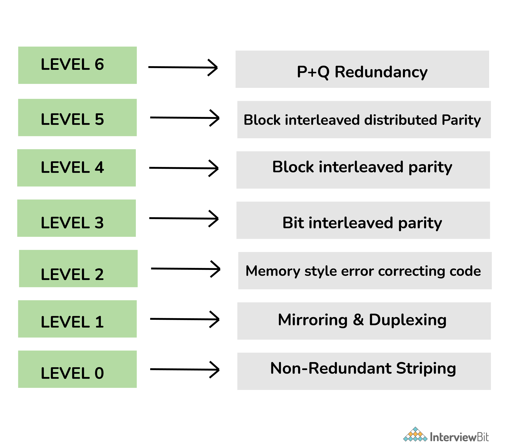

- **RAID 0 - Non-redundant striping:** Được dùng để tăng hiệu suất của server.
- **RAID 1 - Mirroring and duplexing:** còn gọi là "disk mirroring" dữ liệu được ghi vào hai ở đĩa như nhau, trong trường hợp một ổ bị trục trặc ổ còn lại sẽ hoạt động bình thường. 
- **RAID 2 - Memory-style error-correcting codes:** sử dụng kỹ thuật parity (tính chẵn lẻ - là dữ liệu bổ sung cho việc khôi phục). Dữ liệu được parity ở cấp độ bit, các bit dự phòng được tính toán bằng mã Hamming. Nếu một lỗi đơn xảy ra, nó sẽ được sửa ngay tức thì. Cấp độ này có khả năng chịu lỗi một ổ đĩa.
- **RAID 3 - Bit-interleaved Parity:** Cấp độ này yêu cầu một drive parity để lưu trữ thông tin parity.
- **RAID 4 - Block-interleaved Parity:** tương tự như RAID 5 nhưng khác biệt duy nhất là cấp này giới hạn tất cả dữ liệu parity trong một drive duy nhất.
- **RAID 5 - Block-interleaved distributed Parity:** Cấp độ này cung cấp hiệu suất tốt hơn nhiều so với tính năng sao chép đĩa và khả năng chịu lỗi.
- **RAID 6 - P+Q Redundancy:** Cấp độ này thường cung cấp khả năng chịu lỗi cho hai lỗi ổ đĩa.

### 5. GUI là gì?

GUI (Graphical User Interface) về cơ bản là một loại giao diện người dùng cho phép người dùng sử dụng đồ họa để tương tác với hệ điều hành. GUI được tạo ra vì nó thân thiện với người dùng hơn, ít phức tạp hơn và dễ hiểu hơn là một giao diện dòng lệnh. Mục tiêu chính của nó là tăng hiệu quả và dễ sử dụng. Thay vì phải ghi nhớ các lệnh, người dùng có thể chỉ cần click vào một nút để thực hiện công việc một cách đơn giản. Ví dụ về GUI bao gồm Microsoft Windows, macOS, v.v.

### 6. Pipe là gì và khi nào sử dụng? 

Pipe - đường ống - nói chung là một kết nối giữa hai hoặc nhiều tiến trình có liên quan đến nhau. Nó là một cơ chế được sử dụng để giao tiếp giữa các tiến trình bằng cách truyền tin nhắn. Người ta có thể dễ dàng gửi thông tin chẳng hạn như đầu ra của một tiến trình chương trình đến một tiến trình chương trình khác bằng cách sử dụng một đường ống. Nó có thể được sử dụng khi hai tiến trình muốn giao tiếp một chiều, tức là giao tiếp giữa các tiến trình (IPC).

### 7. Các loại hoạt động khác nhau có thể có trên semaphore là gì?

Có hai hoạt động có thể là :
- Wait()
- Signal()

### 8. Chương trình bootstrap trong hệ điều hành là gì?

Nó là một chương trình khởi tạo hệ điều hành trong quá trình khởi động, tức là dòng code đầu tiên được thực thi bất cứ khi nào hệ thống máy tính khởi động. Hệ điều hành được tải thông qua một tiến trình khởi động hoặc chương trình thường được gọi là booting. Nhìn chung hệ điều hành chỉ phụ thuộc vào chương trình bootstrap để thực hiện và hoạt động chính xác. Nó được lưu trữ đầy đủ trong các khối khởi động tại một vị trí cố định trên đĩa. Nó cũng định vị nhân (kernel) và tải nó vào bộ nhớ chính, sau đó chương trình bắt đầu thực thi.

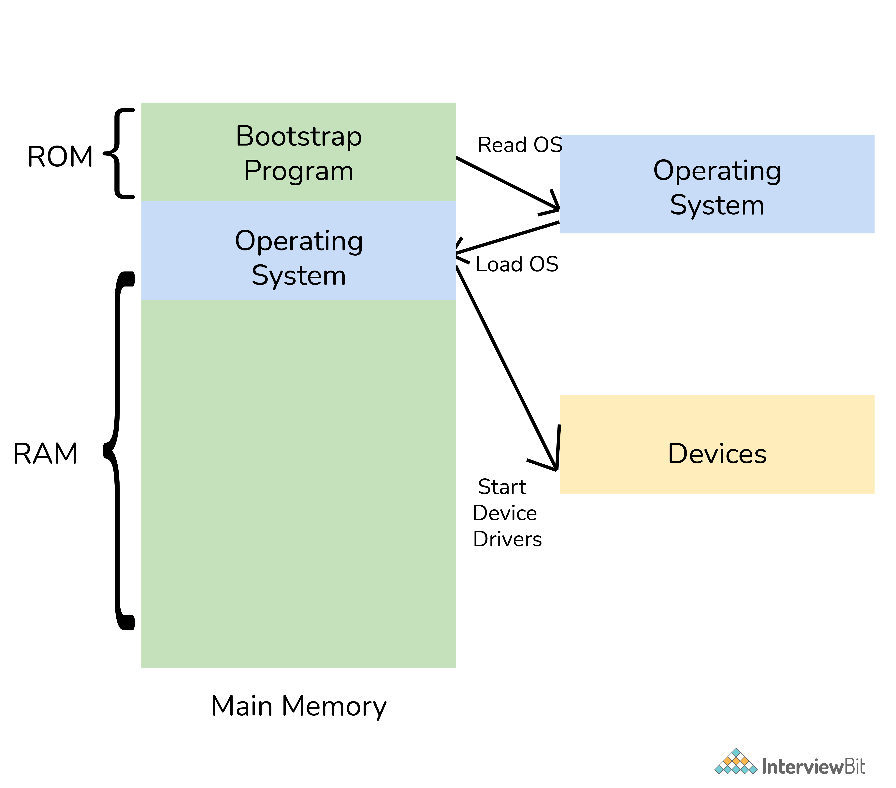

### 9. Demand Paging là gì?

Demand paging (tạm dịch: phân trang theo yêu cầu) là một phương pháp tải các trang vào bộ nhớ theo yêu cầu. Phương pháp này chủ yếu được sử dụng trong bộ nhớ ảo. Trong đó, một trang chỉ được đưa vào bộ nhớ khi một vị trí trên trang cụ thể đó được tham chiếu trong quá trình thực thi. Các bước sau thường được tuân theo: 

- Truy cập trang.
- Nếu trang đó hợp lệ (có trong bộ nhớ) các tiến trình của lệnh sẽ diễn ra bình thường
- Nếy là không hợp lệ, thì xảy ra **page-fault trap**.
- Kiểm tra nếu tham chiếu bộ là hợp lệ tham chiếu đến một vùng ở bộ nhớ phụ. Nếu không, tiến trình sẽ bị chấm dứt (**truy cập bộ nhớ bất hợp pháp**). Ngược lại, ta có trang trong trang được yêu cầu.
- Lên lịch hoạt động của đĩa để đọc trang mong muốn vào bộ nhớ chính.
- Khởi động lại lệnh đã bị gián đoạn bởi trap của hệ điều hành.

### 10. RTOS là gì?

Real Time Operating System (RTOS) là một hệ điều hành được sử dụng cho các ứng thời gian thực. Nó hoạt động tốt hơn nhiều đối với các tác vụ cần được thực thi trong thời gian ngắn. Nó cũng xử lý các quá trình thực thi, giám sát và kiểm soát tất cả. Nó cũng chiếm ít bộ nhớ hơn và tiêu thụ ít tài nguyên hơn. 

Các loại RTOS:

- Hard Real-Time
- Firm Real-Time
- Soft Real-Time

RTOS được sử dụng trong Hệ thống kiểm soát không lưu, Hệ thống chống bó phanh và Máy tạo nhịp tim.

### 11. Đồng bộ hoá tiến trình là gì?

Đồng bộ hóa tiến trình về cơ bản là một cách để điều phối các tiến trình sử dụng tài nguyên hoặc dữ liệu được chia sẻ. Điều cần thiết là đảm bảo thực hiện đồng bộ các tiến trình hợp tác để duy trì tính nhất quán của dữ liệu. Mục đích chính của nó là chia sẻ tài nguyên mà không có bất kỳ sự can thiệp nào bằng cách sử dụng loại trừ lẫn nhau. Có hai loại đồng bộ hóa tiến trình:

- Tiến trình độc lập
- Tiến trình hợp tác

### 12. IPC là gì? Các cơ chế IPC khác nhau?

IPC (Interprocess Communication) là một cơ chế yêu cầu sử dụng các tài nguyên như bộ nhớ được chia sẻ giữa các tiến trình hoặc luồng. Với IPC, hệ điều hành cho phép các tiến trình khác nhau giao tiếp với nhau. Nó được sử dụng để trao đổi dữ liệu giữa nhiều luồng trong một hoặc nhiều chương trình hoặc tiến trình. Trong cơ chế này, các tiến trình khác nhau có thể giao tiếp với nhau dưới sự chấp thuận của HĐH.

Các cơ chế IPC khác nhau:

- Pipes
- Message Queuing
- Semaphores
- Socket
- Shared Memory
- Signals

### 13. Sự khác biệt giữa bộ nhớ chính và bộ nhớ phụ?

**Bộ nhớ chính:** bộ nhớ chính trong máy tính là RAM (Random Access Memory). Nó còn được gọi là bộ nhớ chính hoặc bộ nhớ đọc-ghi hoặc bộ nhớ trong. Các chương trình và dữ liệu mà CPU yêu cầu trong quá trình thực thi được lưu trữ trong bộ nhớ này.
**Bộ nhớ phụ:** bộ nhớ phụ trong máy tính là thiết bị lưu trữ có thể lưu trữ dữ liệu và chương trình. Nó còn được gọi là bộ nhớ ngoài hoặc bộ nhớ bổ sung hoặc bộ nhớ dự phòng hoặc bộ nhớ phụ. Các thiết bị lưu trữ như vậy có khả năng lưu trữ dữ liệu kích cỡ lớn. Thiết bị lưu trữ có thể là ổ cứng, ổ USB flash, CD, v.v.

| Bộ nhớ chính | Bộ nhớ phụ |
|--------------|------------|
|Dữ liệu được truy cập trực tiếp bởi đơn vị xử lý | Đầu tiên, dữ liệu được chuyển đến bộ nhớ chính và sau đó được chuyển đến đơn vị xử lý |
| Có thể ổn định hoặc không ổn định | Luôn là ổn định |
| Tốn nhiều chi phí hơn bộ nhớ phụ | Tốn ít chi phí hơn |
| Dữ liệu chỉ được lưu trữ tạm thời | Dữ liệu được lưu trữ dài lâu |
| Có thể mất dữ liệu khi sập nguồn | Dữ liệu không thể mất nếu sập nguồn |
| Nhanh hơn bộ nhớ phụ và lưu dữ liệu đang được máy tính sử dụng | Chậm hơn nếu so với bộ nhớ chính và lưu nhiều kiểu định dạng dữ liệu |
| Truy cập bằng dữ liệu | Truy cập bằng kênh I/O |

### 14. Overlay trong hệ điều hành là gì?

Overlay về cơ bản là một phương pháp lập trình chia các tiến trình thành các phần để các lệnh quan trọng và cần thiết có thể được lưu vào bộ nhớ. Nó không cần bất kỳ loại hỗ trợ nào từ hệ điều hành. Nó có thể chạy các chương trình có kích thước lớn hơn bộ nhớ vật lý bằng cách chỉ giữ lại các dữ liệu và câu lệnh quan trọng có thể cần thiết tại bất kỳ thời điểm nào.

### 15. Các hệ điều hành nổi tiếng?

* MS-Windows
* Ubuntu
* Mac OS
* Fedora
* Solaris
* Free BSD
* Chrome OS
* CentOS
* Debian
* Android

## Câu hỏi phỏng vấn hệ điều hành cho Experienced

### 16. Bộ nhớ ảo là gì?

Là một kỹ thuật quản lý bộ nhớ được thực hiện bởi hệ điều hành. Bộ nhớ ảo cho phép lập trình viên sử dụng nhiều bộ nhớ cho các chương trình hơn bộ nhớ vật lý có sẵn. Nếu bộ nhớ vật lý là 4GB và bộ nhớ ảo là 16 GB, lập trình viên có thể sử dụng bộ nhớ ảo 16 GB để thực hiện chương trình. Sử dụng bộ nhớ ảo, ta có thể thực thi các chương trình phức tạp đòi hỏi nhiều bộ nhớ hơn bộ nhớ vật lý.

Bộ nhớ ảo có thể quản lý theo hai cách phổ biến là phân trang (paging) và phân đoạn (segmentation).

### 17. Luồng trong hệ điều hành là gì?

Luồng (thread) là một đơn vị cơ bản trong CPU, nó là một dòng điều khiển trong một tiến trình, nó có thể thực hiện nhiều tác vụ tại một thời điểm. Nó bao gồm:
- ID của luồng
- Bộ đếm chương trình
- Ngăn xếp
- Tập thanh ghi trong tiến trình.

Nó giúp giao tiếp hiệu quả hơn và cho phép sử dụng kiến trúc đa xử lý ở quy mô lớn hơn và hiệu quả cao hơn, đồng thời giảm thời gian cần thiết trong chuyển đổi ngữ cảnh. Nó cung cấp một cách để cải thiện và tăng hiệu suất của các ứng dụng bằng song song (paralle). Các luồng đôi khi được gọi là tiến trình **nhẹ** vì nó có ngăn xếp riêng nhưng có thể truy cập dữ liệu chung.

Nhiều luồng chạy trong một tiến trình chia sẻ với nhau đoạn mã, đoạn dữ liệu và các tài nguyên hệ thống như tín hiệu, file,...

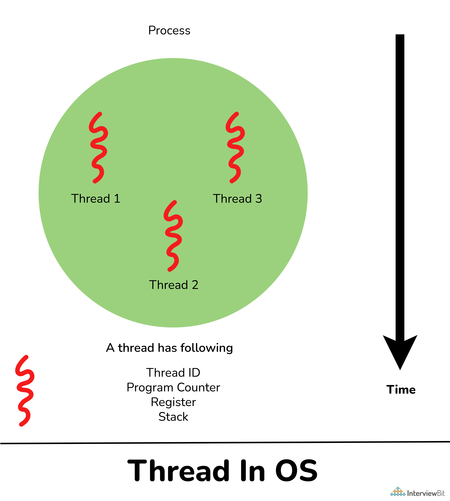

### 18. Tiến trình là gì? Các trạng thái tiến trình khác nhau?

Tiến trình về cơ bản là một chương trình hiện đang được thực thi. Chức năng chính của hệ điều hành là quản lý và xử lý tất cả các tiến trình này. Khi một chương trình được tải vào bộ nhớ và trở thành tiến trình nó có thể được chia thành bốn phần: heap, text, stack và data. Có hai loại tiến trình:
1. Tiến trình hệ điều hành
2. Tiến trình người dùng

#### Trạng thái tiến trình

- **new** : Tiến trình vừa được tạo.
- **ready** :Tiến trình đã có đủ tài nguyên, đang chờ được cấp CPU để chạy.
- **running** :Các lệnh của tiến trình đang được thực thi.
- **waiting** : Tiến trình đợi I/O hoàn tất.
- **terminated** : Tiến trình đã kết thúc (đã thực thi xong).

### 19. FCFS nghĩa là gì?

FCFS (First Come First Serve) là một loại thuật toán định thời hệ điều hành thực thi các tiến trình theo thứ tự mà các tiến trình đến. Nói cách đơn giản, tiến trình nào đến trước sẽ được thực thi trước. Nó không có tính ưu tiên. Định thời FCFS có thể gây ra vấn đề chết đói nếu thời gian của tiến trình đầu tiên là lâu nhất trong số tất cả các tiến trình. Nó được coi là thuật toán định thời hệ điều hành dễ nhất và đơn giản nhất so với các thuật toán khác. Việc thực hiện FCFS thường được quản lý với sự trợ giúp của hàng đợi FIFO (First In First Out).

### 20. Reentrancy là gì?

Reentrant là một chức năng trong đó các client khác nhau có thể sử dụng và chia sẻ một bản sao của một chương trình trong một khoảng thời gian tương tự. Khái niệm này thường được liên kết với code hệ điều hành và không liên quan đến đồng thời. Nó có hai chức năng chính:
- Mã chương trình không thể tự thay đổi hoặc chỉnh sửa.
- Dữ liệu cục bộ cho mọi tiến trình client cần được lưu trữ trong các đĩa khác nhau.

### 21. Thuật toán định thời là gì? Các loại thuật toán định thời?

Thuật toán định thời được sử dụng để cải thiện hiệu quả sử dụng CPU và cung cấp thời gian chờ tối thiểu cho các tác vụ. Nó chỉ đơn giản là giải quyết vấn đề quyết định yêu cầu nào trong số các yêu cầu còn tồn đọng sẽ được phân bổ tài nguyên. Mục đích chính của nó là giảm nạn đói tài nguyên và đảm bảo sự công bằng giữa các bên đang sử dụng tài nguyên. Nói cách đơn giản, nó được sử dụng để phân bổ tài nguyên giữa các nhiệm vụ cạnh tranh khác nhau.

#### Các loại thuật toán định thời

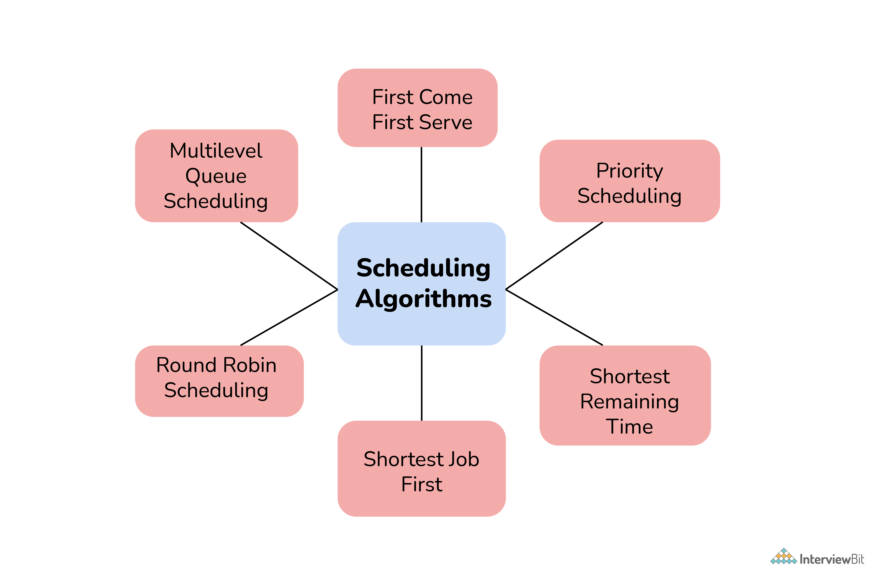

### 22. Sự khác biệt giữa phân trang và phân đoạn?

**Phân trang:** nói chung là một kỹ thuật quản lý bộ nhớ cho phép hệ điều hành truy xuất các tiến trình từ bộ nhớ phụ vào bộ nhớ chính. Nó là một kỹ thuật phân bổ không liền kề để phân chia mỗi tiến trình dưới dạng các trang.

**Phân đoạn:** nói chung là một kỹ thuật quản lý bộ nhớ bằng cách chia các tiến trình thành các mô-đun và các phần có kích thước khác nhau. Các thành phần và mô-đun này được gọi là các phân đoạn có thể được phân bổ cho tiến trình.

| Phân trang | Phân đoạn |
|------------|-----------|
| Là vô hình với lập trình viên | Lập trình viên có thể thấy |
| Kích thước trang là cố định | Kích thước đoạn không cố định |
| Thủ tục và dữ liệu không thể tách biệt trong phân trang | Thủ tục và dữ liệu có thể tách biệt trong phân đoạn |
| Nó cho phép tổng số không gian bộ nhớ ảo vượt qua bộ nhớ vật lý | Nó cho phép tất cả các chương trình, dữ liệu và code chia thành các không gian địa chỉ độc lập |
| Khả dụng với hầu hết CPU và MMU | Khả dụng với Window Server có hỗ trợ khả năng tương thích ngược, trong khi Linuxx hạn chế hỗ trợ | 
| Truy cập dữ liệu nhanh hơn so với phân đoạn | Chậm hơn so với phân trang |
| Hệ điều hành cần duy trì một frame | Hệ điều hành cần một danh sách đen của bộ nhớ chính |
| Phân mảnh bên trong | Phân mảnh bên ngoài |
| Kích thước trang được quyết định bởi bộ nhớ khả dụng | Kích thước đoạn được quyết định bởi người dùng |

### 23. Thrashing trong hệ điều hành là gì?

Thrashing xảy ra khi không có đủ bộ nhớ để lưu trữ các bộ làm việc của tất cả các chương trình đang hoạt động.

Nó thường là một tình huống trong đó CPU thực hiện công việc kém hiệu quả hơn. Nó dành nhiều thời gian cho các hoạt động hoán đổi hoặc phân trang hơn là thực thi. Bằng cách đánh giá mức độ sử dụng CPU, một hệ thống có thể phát hiện ra thrashing. Nó xảy ra khi tiến trình không có đủ trang do đó tỷ lệ lỗi trang tăng lên. Nó ức chế nhiều tiến trình xử lý ở cấp độ ứng dụng khiến hiệu suất máy tính giảm hoặc sập.

### 24. Đối tượng chính trong Đa chương trình là gì?

Đa chương trình (multiprogramming) đề cập đến khả năng thực thi nhiều hơn một chương trình trên một bộ xử lý duy nhất. Kỹ thuật này được giới thiệu để khắc phục tình trạng CPU và bộ nhớ hoạt động kém hiệu quả. Nói một cách dễ hiểu, nó là sự phối hợp thực hiện đồng thời nhiều chương trình khác nhau trên một bộ xử lý (CPU). Mục tiêu chính của đa chương trình là luôn có ít nhất một tiến trình chạy mọi thời điểm. Nó cải thiện việc sử dụng CPU vì nó tổ chức nhiều công việc trong đó CPU luôn có một công việc để thực thi. 

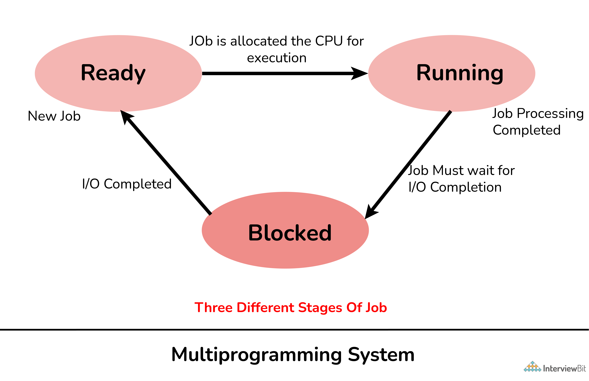

### 25. Nhóm bất đối xứng là gì?

Asymmetric Clustering, tạm dịch nhóm bất đối xứng là một hệ thống trong đó một máy trong số tất cả các máy ở chế độ dự phòng nóng (hot standby) trong khi tất cả các máy còn lại chạy các ứng dụng khác nhau. Nói đơn giản hơn là nó sử dụng toàn bộ tài nguyên cứng do đó nó là một hệ thống đáng tin cậy so với những hệ thống khác.

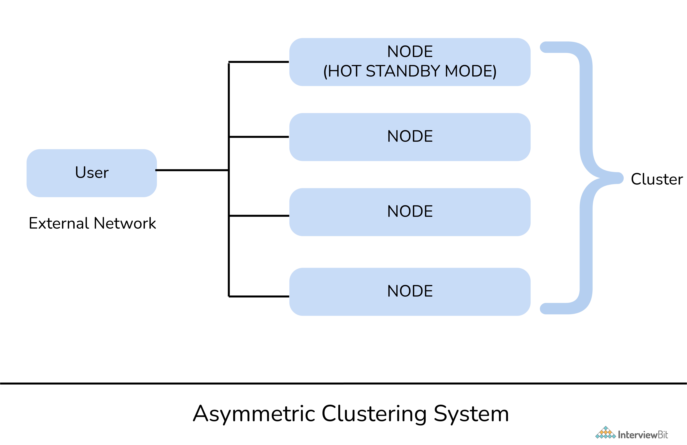

### 26. Sự khác biệt giữa đa nhiệm và đa tiến trình là gì?

**Đa nhiệm (multitasking)** là khi một CPU duy nhất thực hiện một số tác vụ (chương trình, quy trình, tác vụ, luồng) cùng một lúc. Để thực hiện đa nhiệm, CPU chuyển đổi giữa các nhiệm vụ rất thường xuyên để người dùng có thể tương tác với từng chương trình cùng một lúc.

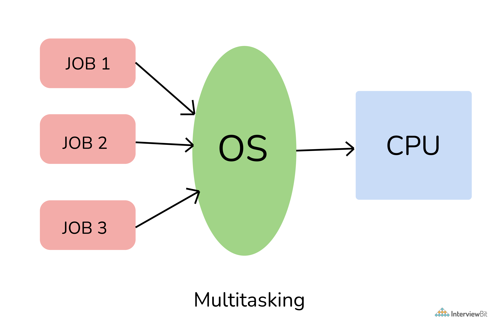

**Đa tiến trình (multiprocessing):** Nó là một hệ thống cho phép nhiều bộ xử lý khác nhau trong máy tính xử lý đồng thời hai hoặc nhiều phần khác nhau của cùng một chương trình. Nó được sử dụng để hoàn thành nhiều công việc hơn trong một khoảng thời gian ngắn hơn.

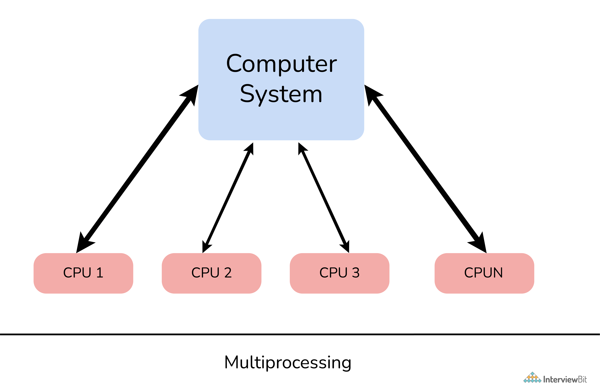

| Đa nhiệm | Đa tiến trình |
|----------|---------------|
| Thực hiện nhiều tác vụ cùng lúc bằng một bộ xử lý duy nhất | Thực hiện nhiều tác vụ cùng lúc bằng nhiều bộ xử lý |
| Số lượng CPU là một | Nhiều hơn một CPU |
| Tiết kiệm hơn | Ít tiết kiệm |
| Kém hiệu quả hơn đa tiến trình | Hiệu quả hơn đa nhiệm |
| Cho phép chuyển đổi nhanh các tác vụ khác nhau | Cho phép xử lý mượt mà nhiều tiến trình cùng lúc |
| Yêu cầu nhiều thời gian hơn so với đa tiến trình | Ít thời gian hơn so với đa nhiệm |

### 27. Socket trong hệ điều hành là gì?

Socket trong hệ điều hành thường được coi là endpoint cho IPC (Interprocess Communication). Ở đây, endpoint được gọi là sự kết hợp của địa chỉ IP và số cổng (port). Sockets được sử dụng để giúp các nhà phát triển phần mềm dễ dàng tạo các chương trình hỗ trợ mạng. Nó cũng cho phép giao tiếp hoặc trao đổi thông tin giữa hai tiến trình khác nhau trên cùng một máy hoặc nhiều máy. Nó chủ yếu được sử dụng trong các hệ thống dựa trên mô hình client-server.

#### Các loại socket:

* Stream Sockets
* Datagram Sockets
* Sequenced Packet Sockets
* Raw Sockets

### 28. Giải thích về tiến trình thây ma?

Tiến trình thây ma (zombie process) đề cập đến tiến trình không tồn tại, về cơ bản là một tiến trình đã kết thúc hoặc hoàn thành nhưng toàn bộ khối điều khiển tiến trình không được dọn sạch khỏi bộ nhớ chính vì nó vẫn có một mục trong bảng tiến trình để báo cáo cho tiến trình cha của nó. Nó không tiêu thụ bất kỳ tài nguyên nào và đã chết, nhưng nó vẫn tồn tại. Nó cũng cho thấy rằng tài nguyên được nắm giữ bởi tiến trình và không được giải phóng. 

### 29. Kết thúc hàng loạt là gì?

Kết thúc hàng loạt (cascading termination) là sự kết thúc tiến trình trong đó nếu tiến trình cha đang thoát hoặc kết thúc thì tiến trình con cũng sẽ bị chấm dứt. Nó không cho phép tiến trình con tiếp tục xử lý khi tiến trình cha của nó đã kết thúc. Nó thường được khởi tạo bằng hệ điều hành.

### 30. Starvation và aging trong hệ điều hành là gì?

**Starvation**: là vấn đề thường xảy ra khi một tiến trình không thể nhận được các tài nguyên cần thiết mà nó cần để tiến trình thực thi trong một khoảng thời gian dài. Trong điều kiện này, các tiến trình có mức độ ưu tiên thấp bị chặn và chỉ các tiến trình có mức độ ưu tiên cao mới tiếp tục hoàn thành, vì thế các tiến trình có mức độ ưu tiên thấp bị thiếu tài nguyên. 

**Aging**: là một kỹ thuật được sử dụng để khắc phục vấn đề *starvation*. Nó đơn giản là tăng mức độ ưu tiên của các tiến trình chờ tài nguyên trong hệ thống trong một khoảng thời gian dài. Nó được coi là kỹ thuật tốt nhất để giải quyết vấn đề starvation vì nó thêm một yếu tố aging vào mức độ ưu tiên của mọi yêu cầu của các tiến trình khác nhau về tài nguyên. Nó cũng đảm bảo rằng các công việc hoặc tiến trình cấp thấp hoàn thành việc thực thi của chúng. 

### 31. Semaphore là gì trong hệ điều hành?

Semaphore là một cơ chế báo hiệu. Nó chỉ chứa một giá trị nguyên dương. Được sử dụng để giải quyết vấn đề hoặc sự cố của các phần quan trọng trong quá trình đồng bộ hóa bằng cách sử dụng hai hoạt động cơ bản, là `wait()` và `signal()`.

Có hai loại semaphore là:
* Binary Semaphore
* Counting Semaphore

#### So sánh Binary Semaphore với Mutex
| Binary Semaphore | Mutex |
|------------------|--------------------|
| Về cơ bản là một số nguyên | Là một đối tượng |
| Nhanh hơn so với mutex | Chậm hơn binary semaphore |
| Các chức năng của nó dựa trên cơ chế tín hiệu | Các chức năng của nó dựa trên cơ chế khóa |
| Nó cho phép các luồng tiến trình khác nhau nhận được hữu hạn của tài nguyên cho đến khi tài nguyên có sẵn | Nó cho phép các luồng tiến trình khác nhau chỉ nhận được tài nguyên được chia sẻ duy nhất tại một thời điểm |

### 32. Kernel là gì? Chức năng chính của nó?

Kernel là một chương trình máy tính điều khiển mọi thứ khác, nó là hạt nhân - trái tim của hệ điều hành! Bất cứ điều gì xảy ra trên máy tính đều đi qua nó. Đó là chương trình cốt lõi trong hệ điều hành, cũng là chương trình đầu tiên tải sau khi bộ nạp khởi động. Sau đó, nó thực hiện tất cả các cuộc nói chuyện giữa phần cứng và phần mềm hoặc ứng dụng. Vì vậy, nếu bạn khởi chạy một chương trình, giao diện người dùng sẽ gửi yêu cầu tới Kernel. Kernel sau đó gửi yêu cầu tới CPU, Bộ nhớ để gán sức mạnh xử lý, bộ nhớ và những thứ khác để ứng dụng có thể chạy trơn tru ở giao diện người dùng.

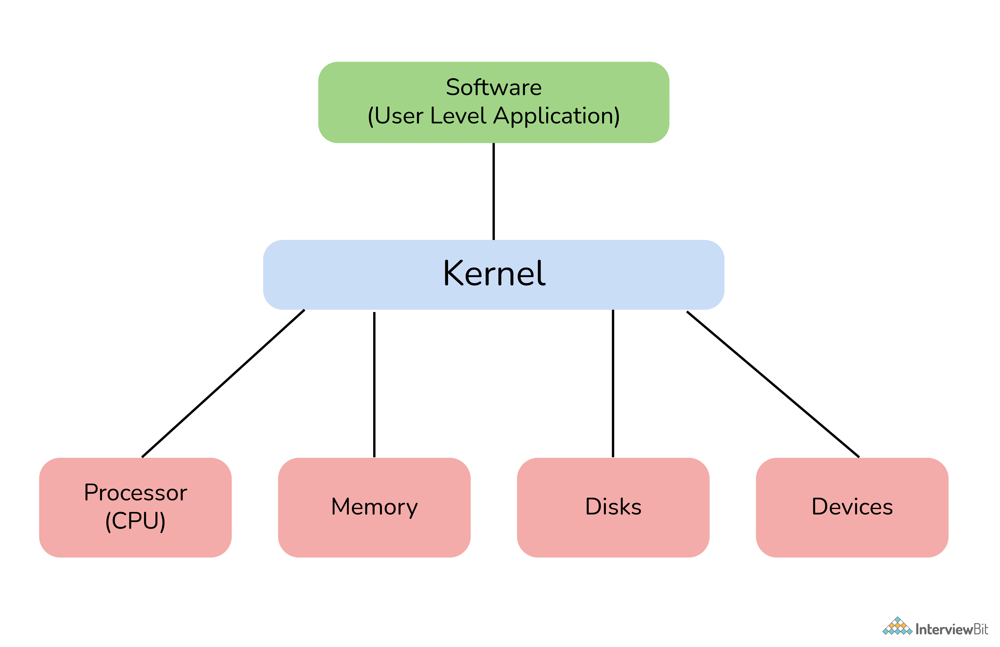

Chức năng chính của Kernel:
* Nó chịu trách nhiệm quản lý tất cả các tài nguyên máy tính như CPU, bộ nhớ, file, tiến trình, v.v.
* Nó tạo điều kiện hoặc khởi tạo sự tương tác giữa các thành phần của phần cứng và phần mềm.
* Nó quản lý bộ nhớ RAM để tất cả các tiến trình và chương trình đang chạy có thể hoạt động hiệu quả.
* Nó cũng kiểm soát và quản lý tất cả các tác vụ chính của HĐH cũng như quản lý việc truy cập và sử dụng các thiết bị ngoại vi khác nhau được kết nối với máy tính.
* Nó lên kế hoạch cho công việc được thực hiện bởi CPU để công việc của mỗi người dùng được thực thi một cách hiệu quả nhất có thể.

### 33. Các kiểu Kernel khác nhau?

- Monolithic Kernel
- MicroKernel
- Hybrid Kernel 
- Nano Kernel
- Exo Kernel

### 34. Sự khác biệt giữa MircoKernel và Monolithic Kernel?

**MicroKernel:** là lượng phần mềm gần như tối thiểu có thể cung cấp các cơ chế cần thiết để triển khai một hệ điều hành.
Vd: QNX, Mac OS X, K42,...

**Monolithic Kernel:** là một kiến trúc hệ điều hành hỗ trợ tất cả các tính năng cơ bản của các thành phần máy tính như quản lý tài nguyên, bộ nhớ, file, v.v.
Vd: Solaris, DOS, Linux, ...

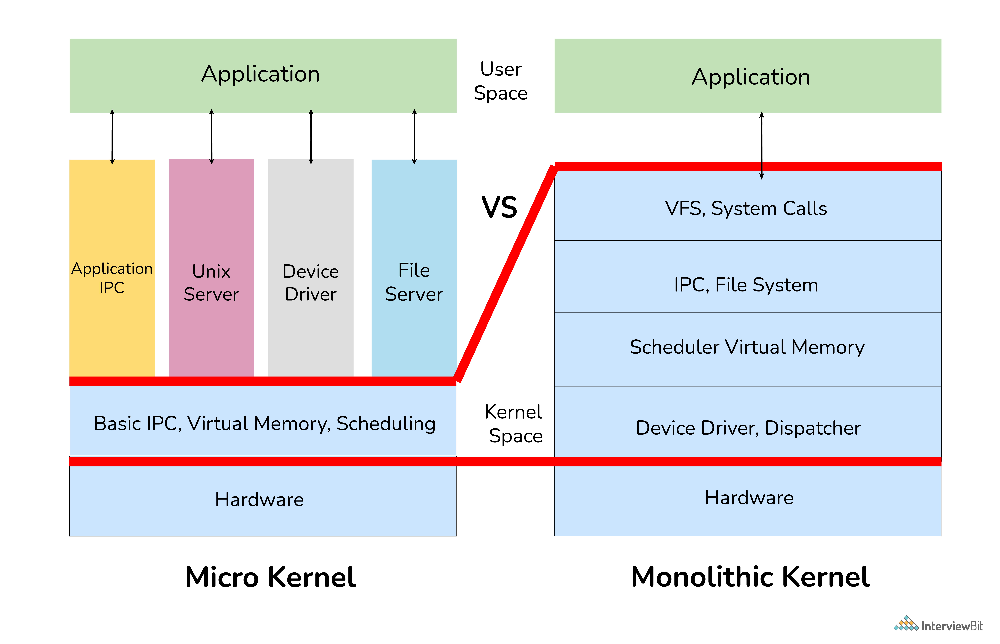

| MicroKernel | Monolithic Kernel |
|-------------|-------------------|
| Dịch vụ kernel và dịch vụ người dùng ở các không gian địa chỉ khác nhau | Dịch vụ kernel và dịch vụ người dùng ở cùng không gian địa chỉ |
| Kích cỡ nhỏ | Kích cỡ lớn |
| Dễ mở rộng | Khó mở rộng |
| Khi dịch vụ hỏng, nó ảnh hưởng đến hoạt động của microkernel | Khi dịch vụ hỏng, toàn bộ hệ thống sẽ hỏng trên monolithic kernel |
| Sử dụng message queue để giao tiếp giữa các inter-process | Sử dụng signal và socket để giao tiếp giữa các inter-process |

### 35. SMP là gì?

SMP (Symmetric Multiprocessing) đề cập đến kiến trúc máy tính trong đó việc xử lý các chương trình được thực hiện bởi nhiều bộ xử lý chia sẻ một hệ điều hành và bộ nhớ chung. SMP rất cần thiết nếu bạn muốn tận dụng phần cứng đa xử lý. Nó cho phép bất kỳ bộ xử lý nào hoạt động trên bất kỳ tác vụ nào bất kể dữ liệu hoặc tài nguyên cho tác vụ cụ thể đó nằm ở đâu trong bộ nhớ. Các hệ thống này đáng tin cậy hơn các hệ thống một bộ xử lý.

### 36. Hệ thống chia sẻ thời gian là gì?

Nó là một hệ thống cho phép nhiều người dùng truy cập vào các tài nguyên của một hệ thống cụ thể ở nhiều vị trí. Nói cách đơn giản, nó thực hiện nhiều tác vụ trên một bộ xử lý hoặc CPU. Như tên cho thấy, nó có nghĩa là chia sẻ thời gian vào nhiều thời điểm trong một số tiến trình. Nó cũng cho phép những người dùng khác nhau từ các địa điểm khác nhau sử dụng một hệ thống máy tính cụ thể cùng một lúc, do đó nó được coi là một trong những loại hệ điều hành quan trọng.

### 37. Context Switching là gì?

Context switching về cơ bản là một quá trình lưu ngữ cảnh của một tiến trình và tải ngữ cảnh của một tiến trình khác. Đây là một trong những biện pháp hiệu quả về chi phí và tiết kiệm thời gian được thực hiện bởi CPU vì nó cho phép nhiều tiến trình chia sẻ một CPU. Vì vậy, nó được coi là một phần quan trọng của HĐH hiện đại. Kỹ thuật này được OS sử dụng để chuyển một tiến trình từ trạng thái này sang trạng thái khác, tức là từ trạng thái **running** sang trạng thái **ready**. Nó cũng cho phép một CPU duy nhất xử lý và kiểm soát nhiều tiến trình hoặc luồng khác nhau mà thậm chí không cần thêm tài nguyên.

### 38. Sự khác biệt giữa Kernel và hệ điều hành?

**Kernel:** là một chương trình hệ thống điều khiển tất cả chương trình đang chạy trên máy tính. Kernel là cầu nối giữa phần cứng và phần mềm trong hệ thống.
**OS:** là chương trình máy tính cung cấp một giao diện người dùng để có thể thực hiện các thao tác trên máy tính một cách dễ dàng.

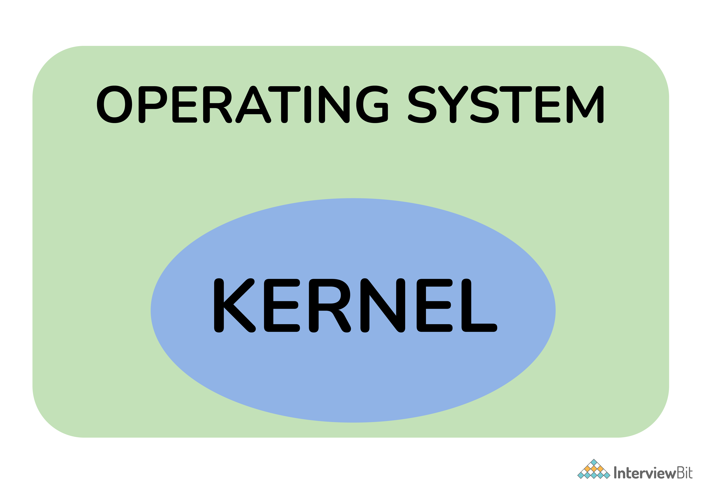

| Kernel | OS |
|--------|----|
| Nó là thành phần phần trung tâm của hệ điều hành | Nó là một phần mềm hệ thống |
| Có nhiệm vụ chuyển đổi lệnh người dùng thành lệnh máy tính | Có nhiệm vụ quản lý tài nguyên hệ thống |
| Là interface giữa phần cứng và ứng dụng | Là interface giữa phần cứng và người dùng |
| Thực hiện các chức năng như quản lý tiến trình, file, thiết bị, giao tiếp I/O | Thực hiện các chức năng như bảo mật dữ liệu, file, điều khiển truy cập người dùng, duy trì chính sách hệ thống,... |
| Có kiểu là MicroKernel, Monolithic Kernel | Có kiểu là Single và Multiprogramming batch systems, Distributed OS, Real-time OS |

### 39. Sự khác biệt giữa tiến trình và luồng?

**Tiến trình (process):** là chương trình đang được thực thi hiện tại bởi một hay nhiều luồng. Nó là rất quan trọng trong các hệ điều hành hiện đại.

**Luồng (thread):** là đường dẫn thực thi bao gồm id của luồng, bộ đếm chương trình, ngăn xếp và tập thanh ghi trong tiến trình.

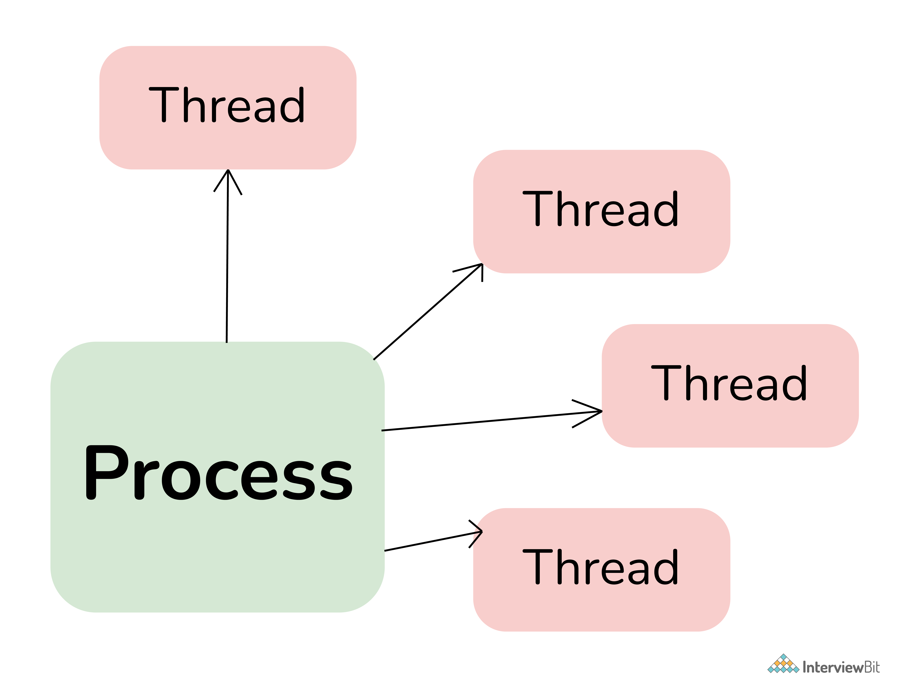

| Tiến trình | Luồng |
|------------|-------|
| Là chương trình đang được thực thi | Là thành phần của tiến trình, là đơn vị thực thi nhỏ nhất |
| Có không gian bộ nhớ riêng | Dùng bộ nhớ của tiến trình |
| Khó để tạo tiến trình | Dễ dàng tạo luồng |
| Yêu cầu nhiều tài nguyên | Yêu cầu ít tài nguyên |
| Mất thời gian để tạo và huỷ | Ít tốn thời gian cho tạo và huỷ |
| Thường chạy trong không gian bộ nhớ riêng biệt | Thường chạy trong không gian bộ nhớ chung |
| Không chia sẻ dữ liệu | Chia sẻ dữ liệu với nhau |
| Có thể được chia trong đa luồng | Không thể chia |

### 40. Các thành phần khác nhau của tiến trình?

Nó có 4 thành phần như sau:

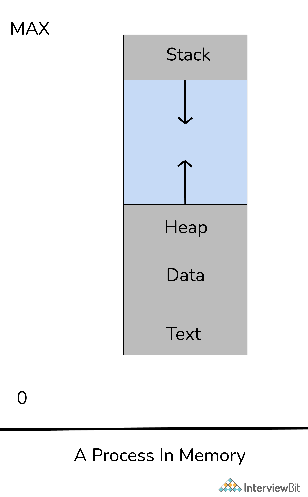

* **Stack**: dùng cho biến cục bộ và trả về địa chỉ.
* **Heap**: dùng cho cấp phát bộ nhớ động.
* **Data**: dùng cho lưu trữ biến toàn cục và biến tĩnh.
* **Text**: bao gồm code chương trình đã biên dịch.

### 41. Deadlock trong hệ điều hành là gì?

Trong môi trường đa chương, nhiều tiến trình có thể cạnh tranh một số tài nguyên giới hạn. Một tiến trình yêu cầu tài nguyên, nếu tài nguyên không có sẵn tại thời điểm đó, tiến trình đi vào trạng thái chờ. Tiến trình chờ có thể không bao giờ chuyển trạng thái vì tài nguyên chúng yêu cầu bị giữ bởi những tiến trình chờ khác. Trường hợp này gọi là deadlock (khoá chết)

#### Điều kiện cần của Deadlock

Bốn yếu tố cơ bản để xảy ra deadlock là
- Loại trừ tương hỗ
- Tồn tại chu trình trong đồ thị cấp phát tài nguyên
- Không đòi lại tài nguyên từ tiến trình đang giữ chúng
- Giữ và chờ cấp thêm tài nguyên

### 42. Belady’s Anomaly nghĩa là gì?

Trong hệ điều hành, dữ liệu tiến trình được tải theo các phần có kích thước cố định và mỗi phần được gọi là một trang. Bộ xử lý tải các trang này trong các phần bộ nhớ có kích thước cố định được gọi là frame. Nghịch lý Belady (Belady’s Anomaly) là một hiện tượng mà nếu chúng ta tăng số lượng frame trong bộ nhớ, thì số lỗi trang cũng tăng lên. Nó thường được xuất hiện khi ta sử dụng thuật toán thay thế trang FIFO (First in First out).

### 43. Spooling trong hệ điều hành là gì?

Spooling là viết tắt của Simultaneous peripheral operations online. Spool là một loại bộ đệm chứa các công việc cho một thiết bị cho đến khi thiết bị sẵn sàng chấp nhận công việc. Spooling coi đĩa là một bộ đệm khổng lồ có thể lưu trữ nhiều công việc cho thiết bị cho đến khi các thiết bị đầu ra sẵn sàng chấp nhận chúng.

Trong spooling, I/O của một công việc bị chồng chéo với tính toán của một công việc khác. Ví dụ, bộ đệm tại một thời điểm có thể đọc đầu vào của một công việc, đồng thời, nó cũng có thể in đầu ra của một công việc khác. Spooling tăng hiệu suất của hệ thống bằng cách tăng tốc độ làm việc của các thiết bị. Nó tự nhiên dẫn đến đa chương trình.