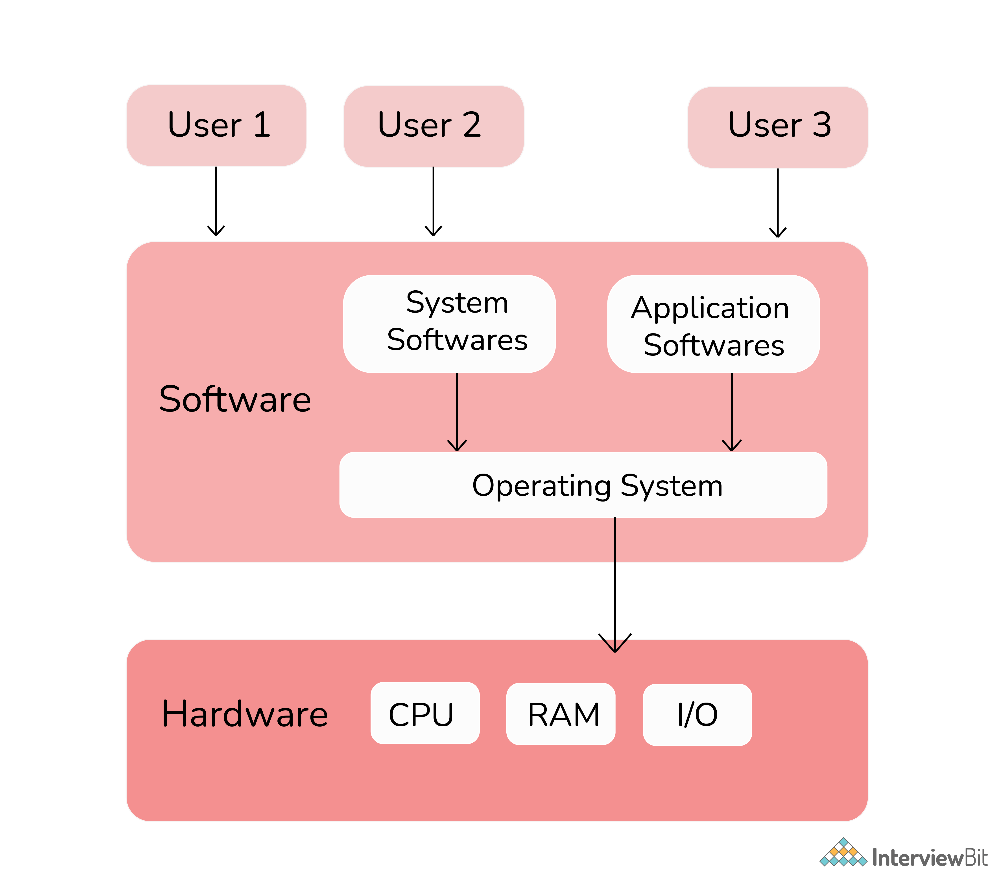
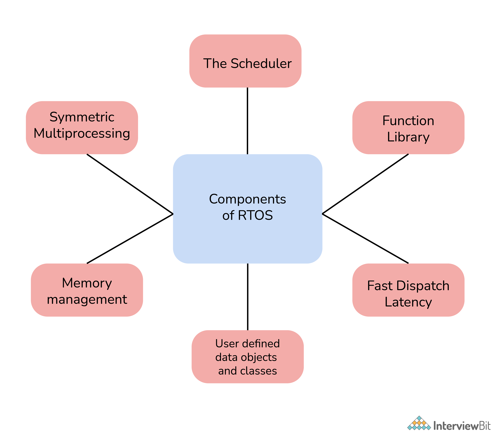
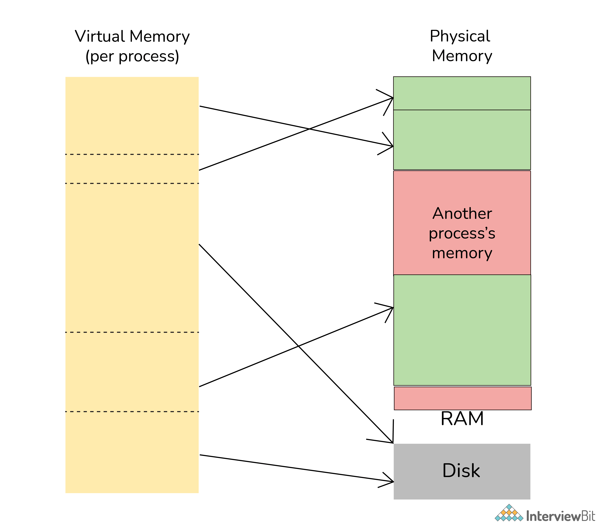
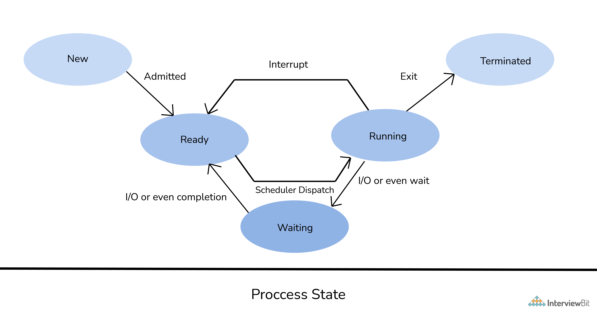

# Câu hỏi phỏng vấn hệ điều hành

## Hệ điều hành là gì?

Hệ điều hành (Operating System: OS) là một chương trình phần mềm để quản lý và xử lý tất cả nguồn tài nguyên của máy tính như phần cứng và phần mềm. Hệ điều hành đầu tiên được giới thiệu vào năm 1950 là GMOs. Hệ điều hành chịu trách nhiệm cho quản lý, xử lý, điều phối các hoạt động tổng thể và chia sẻ tài nguyên máy tính. Nó đóng vai trò trung gian giữa người dùng máy tính và phần cứng máy tính.

Chức năng của hệ điều hành:

- Quản lý bộ nhớ và các tiến trình.
- Cung cấp giao diện người dùng.
- Quản lý file và thiết bị.
- Lên kế hoạch các nguồn tài nguyên và công việc.
- Phát hiện lỗi.
- Bảo mật

## Câu hỏi phỏng vấn hệ điều hành cho Fresher

### 1. Tại sao hệ điều hành quan trọng?

Hệ điều hành là phần thiết yếu và quan trọng nhất của máy tính mà không có nó thì máy tính gần như là vô dụng. Nó kích hoạt một giao diện hoặc hoạt động giống như một liên kết để tương tác giữa phần mềm máy tính được cài đặt trên hệ điều hành và người dùng. Đồng thời giúp giao tiếp với phần cứng và duy trì sự cân bằng giữa phần cứng và CPU. Nó cũng cung cấp các dịch vụ cho người dùng và một nền tảng cho các chương trình chạy trên đó. Nó thực hiện tất cả các tác vụ chung mà ứng dụng yêu cầu.

### 2. Mục đích chính của hệ điều hành là gì? Các loại hệ điều hành khác nhau là gì?

Mục đích chính của HĐH là thực thi các chương trình của người dùng và giúp người dùng hiểu và tương tác với máy tính cũng như chạy các ứng dụng dễ dàng hơn. Nó được thiết kế đặc biệt để đảm bảo rằng hệ thống máy tính hoạt động tốt hơn bằng cách quản lý tất cả các hoạt động tính toán. Nó cũng quản lý bộ nhớ máy tính, các tiến trình và hoạt động của tất cả phần cứng và phần mềm.

Các loại hệ điều hành:

- Batched OS (Payroll System, Transactions Process, ...)
- Multi-Programmed OS (Windows OS, UNIX OS, ...)
- Timesharing OS (Multics, ...)
- Distributed OS (LOCUS, ...)
- Real-Time OS (PSOS, VRTX, ...)

### 3. Lợi ích của hệ thống đa xử lý?

Hệ thống đa xử lý là một loại hệ thống bao gồm hai hoặc nhiều CPU. Nó liên quan đến việc xử lý các chương trình máy tính khác nhau cùng một lúc, bởi hệ thống máy tính này có hai hoặc nhiều CPU đang chia sẻ một bộ nhớ duy nhất.

Lợi ích:

- Các hệ thống như vậy ngày nay được sử dụng rộng rãi để cải thiện hiệu suất trong các hệ thống đang chạy nhiều chương trình đồng thời.
- Bằng cách tăng số lượng bộ xử lý, số lượng tác vụ lớn hơn có thể được hoàn thành trong thời gian ngắn.
- Nó còn gia tăng đáng kể về thông lượng cũng như hiệu quả về chi phí vì tất cả các bộ xử lý đều chia sẻ cùng một nguồn tài nguyên.
- Cuối cùng là cải thiện độ tin cậy của hệ thống máy tính.

### 4. Cấu trúc RAID trong hệ điềuh ành là gì?

RAID (Redundant Arrays of Independent Disks) là một phương pháp được dùng để lưu trữ dữ liệu trên nhiều đĩa cứng do đó có thể xem nó là một công nghệ lưu trữ dữ liệu ảo hoá để kết hợp nhiều đĩa cứng. Nhằm mụuc đích là cân bằng, bảo vệ dữ liệu, cải thiện hiệu suất hệ thống, không gian lưu trữ, v.v. 

Nó được dùng để cải thiện toàn bộ hiệu suất và độ tin cậy của bộ lưu trữ dữ liệu. Nó còn tăng không gian lưu trữ của hệ thống nhằm mục đích chính là dự phòng dữ liệu để tránh thất thoát.

#### Các level khác nhau của RAID.

Hiện tại, RAID có các level như sau:

- **RAID 0 - Non-redundant striping:** Được dùng để tăng hiệu suất của server.
- **RAID 1 - Mirroring and duplexing:** còn gọi là "disk mirroring" dữ liệu được ghi vào hai ở đĩa như nhau, trong trường hợp một ổ bị trục trặc ổ còn lại sẽ hoạt động bình thường. 
- **RAID 2 - Memory-style error-correcting codes:** sử dụng kỹ thuật parity (tính chẵn lẻ - là dữ liệu bổ sung cho việc khôi phục). Dữ liệu được parity ở cấp độ bit, các bit dự phòng được tính toán bằng mã Hamming. Nếu một lỗi đơn xảy ra, nó sẽ được sửa ngay tức thì. Cấp độ này có khả năng chịu lỗi một ổ đĩa.
- **RAID 3 - Bit-interleaved Parity:** Cấp độ này yêu cầu một drive parity để lưu trữ thông tin parity.
- **RAID 4 - Block-interleaved Parity:** tương tự như RAID 5 nhưng khác biệt duy nhất là cấp này giới hạn tất cả dữ liệu parity trong một drive duy nhất.
- **RAID 5 - Block-interleaved distributed Parity:** Cấp độ này cung cấp hiệu suất tốt hơn nhiều so với tính năng sao chép đĩa và khả năng chịu lỗi.
- **RAID 6 - P+Q Redundancy:** Cấp độ này thường cung cấp khả năng chịu lỗi cho hai lỗi ổ đĩa.

### 5. GUI là gì?

GUI (Graphical User Interface) về cơ bản là một loại giao diện người dùng cho phép người dùng sử dụng đồ họa để tương tác với hệ điều hành. GUI được tạo ra vì nó thân thiện với người dùng hơn, ít phức tạp hơn và dễ hiểu hơn là một giao diện dòng lệnh. Mục tiêu chính của nó là tăng hiệu quả và dễ sử dụng. Thay vì phải ghi nhớ các lệnh, người dùng có thể chỉ cần click vào một nút để thực hiện công việc một cách đơn giản. Ví dụ về GUI bao gồm Microsoft Windows, macOS, v.v.

### 6. Pipe là gì và khi nào sử dụng? 

Pipe - đường ống - nói chung là một kết nối giữa hai hoặc nhiều tiến trình có liên quan đến nhau. Nó là một cơ chế được sử dụng để giao tiếp giữa các tiến trình bằng cách truyền tin nhắn. Người ta có thể dễ dàng gửi thông tin chẳng hạn như đầu ra của một tiến trình chương trình đến một tiến trình chương trình khác bằng cách sử dụng một đường ống. Nó có thể được sử dụng khi hai tiến trình muốn giao tiếp một chiều, tức là giao tiếp giữa các tiến trình (IPC).

### 7. Các loại hoạt động khác nhau có thể có trên semaphore là gì?

Có hai hoạt động có thể là :
- Wait()
- Signal()

### 8. Chương trình bootstrap trong hệ điều hành là gì?

Nó là một chương trình khởi tạo hệ điều hành trong quá trình khởi động, tức là dòng code đầu tiên được thực thi bất cứ khi nào hệ thống máy tính khởi động. Hệ điều hành được tải thông qua một tiến trình khởi động hoặc chương trình thường được gọi là booting. Nhìn chung hệ điều hành chỉ phụ thuộc vào chương trình bootstrap để thực hiện và hoạt động chính xác. Nó được lưu trữ đầy đủ trong các khối khởi động tại một vị trí cố định trên đĩa. Nó cũng định vị nhân (kernel) và tải nó vào bộ nhớ chính, sau đó chương trình bắt đầu thực thi.

### 9. Demand Paging là gì?

Demand paging (tạm dịch: phân trang theo yêu cầu) là một phương pháp tải các trang vào bộ nhớ theo yêu cầu. Phương pháp này chủ yếu được sử dụng trong bộ nhớ ảo. Trong đó, một trang chỉ được đưa vào bộ nhớ khi một vị trí trên trang cụ thể đó được tham chiếu trong quá trình thực thi. Các bước sau thường được tuân theo: 

- Truy cập trang.
- Nếu trang đó hợp lệ (có trong bộ nhớ) các tiến trình của lệnh sẽ diễn ra bình thường
- Nếy là không hợp lệ, thì xảy ra **page-fault trap**.
- Kiểm tra nếu tham chiếu bộ là hợp lệ tham chiếu đến một vùng ở bộ nhớ phụ. Nếu không, tiến trình sẽ bị chấm dứt (**truy cập bộ nhớ bất hợp pháp**). Ngược lại, ta có trang trong trang được yêu cầu.
- Lên lịch hoạt động của đĩa để đọc trang mong muốn vào bộ nhớ chính.
- Khởi động lại lệnh đã bị gián đoạn bởi trap của hệ điều hành.

### 10. RTOS là gì?

Real Time Operating System (RTOS) là một hệ điều hành được sử dụng cho các ứng thời gian thực. Nó hoạt động tốt hơn nhiều đối với các tác vụ cần được thực thi trong thời gian ngắn. Nó cũng xử lý các quá trình thực thi, giám sát và kiểm soát tất cả. Nó cũng chiếm ít bộ nhớ hơn và tiêu thụ ít tài nguyên hơn. 

Các loại RTOS:

- Hard Real-Time
- Firm Real-Time
- Soft Real-Time

RTOS được sử dụng trong Hệ thống kiểm soát không lưu, Hệ thống chống bó phanh và Máy tạo nhịp tim.

### 11. Đồng bộ hoá tiến trình là gì?

Đồng bộ hóa tiến trình về cơ bản là một cách để điều phối các tiến trình sử dụng tài nguyên hoặc dữ liệu được chia sẻ. Điều cần thiết là đảm bảo thực hiện đồng bộ các tiến trình hợp tác để duy trì tính nhất quán của dữ liệu. Mục đích chính của nó là chia sẻ tài nguyên mà không có bất kỳ sự can thiệp nào bằng cách sử dụng loại trừ lẫn nhau. Có hai loại đồng bộ hóa tiến trình:

- Tiến trình độc lập
- Tiến trình hợp tác

### 12. IPC là gì? Các cơ chế IPC khác nhau?

IPC (Interprocess Communication) là một cơ chế yêu cầu sử dụng các tài nguyên như bộ nhớ được chia sẻ giữa các tiến trình hoặc luồng. Với IPC, hệ điều hành cho phép các tiến trình khác nhau giao tiếp với nhau. Nó được sử dụng để trao đổi dữ liệu giữa nhiều luồng trong một hoặc nhiều chương trình hoặc tiến trình. Trong cơ chế này, các tiến trình khác nhau có thể giao tiếp với nhau dưới sự chấp thuận của HĐH.

Các cơ chế IPC khác nhau:

- Pipes
- Message Queuing
- Semaphores
- Socket
- Shared Memory
- Signals

### 13. Sự khác biệt giữa bộ nhớ chính và bộ nhớ phụ?

**Bộ nhớ chính:** bộ nhớ chính trong máy tính là RAM (Random Access Memory). Nó còn được gọi là bộ nhớ chính hoặc bộ nhớ đọc-ghi hoặc bộ nhớ trong. Các chương trình và dữ liệu mà CPU yêu cầu trong quá trình thực thi được lưu trữ trong bộ nhớ này.
**Bộ nhớ phụ:** bộ nhớ phụ trong máy tính là thiết bị lưu trữ có thể lưu trữ dữ liệu và chương trình. Nó còn được gọi là bộ nhớ ngoài hoặc bộ nhớ bổ sung hoặc bộ nhớ dự phòng hoặc bộ nhớ phụ. Các thiết bị lưu trữ như vậy có khả năng lưu trữ dữ liệu kích cỡ lớn. Thiết bị lưu trữ có thể là ổ cứng, ổ USB flash, CD, v.v.

| Bộ nhớ chính | Bộ nhớ phụ |
|--------------|------------|
|Dữ liệu được truy cập trực tiếp bởi đơn vị xử lý | Đầu tiên, dữ liệu được chuyển đến bộ nhớ chính và sau đó được chuyển đến đơn vị xử lý |
| Có thể ổn định hoặc không ổn định | Luôn là ổn định Ư
| Tốn nhiều chi phí hơn bộ nhớ phụ | Tốn ít chi phí hơn |
| Dữ liệu chỉ được lưu trữ tạm thời | Dữ liệu được lưu trữ dài lâu |
| Có thể mất dữ liệu khi sập nguồn | Dữ liệu không thể mất nếu sập nguồn |
| Nhanh hơn bộ nhớ phụ và lưu dữ liệu đang được máy tính sử dụng | Chậm hơn nếu so với bộ nhớ chính và lưu nhiều kiểu định dạng dữ liệu |
| Truy cập bằng dữ liệu | Truy cập bằng kênh I/O |

### 14. Overlay trong hệ điều hành là gì?

Overlay về cơ bản là một phương pháp lập trình chia các tiến trình thành các phần để các lệnh quan trọng và cần thiết có thể được lưu vào bộ nhớ. Nó không cần bất kỳ loại hỗ trợ nào từ hệ điều hành. Nó có thể chạy các chương trình có kích thước lớn hơn bộ nhớ vật lý bằng cách chỉ giữ lại các dữ liệu và câu lệnh quan trọng có thể cần thiết tại bất kỳ thời điểm nào.

### 15. Các hệ điều hành nổi tiếng?

* MS-Windows
* Ubuntu
* Mac OS
* Fedora
* Solaris
* Free BSD
* Chrome OS
* CentOS
* Debian
* Android

## Câu hỏi phỏng vấn hệ điều hành cho Experienced

### 16. Bộ nhớ ảo là gì?

Là một kỹ thuật quản lý bộ nhớ được thực hiện bởi hệ điều hành. Bộ nhớ ảo cho phép lập trình viên sử dụng nhiều bộ nhớ cho các chương trình hơn bộ nhớ vật lý có sẵn. Nếu bộ nhớ vật lý là 4GB và bộ nhớ ảo là 16 GB, lập trình viên có thể sử dụng bộ nhớ ảo 16 GB để thực hiện chương trình. Sử dụng bộ nhớ ảo, ta có thể thực thi các chương trình phức tạp đòi hỏi nhiều bộ nhớ hơn bộ nhớ vật lý.

Bộ nhớ ảo có thể quản lý theo hai cách phổ biến là phân trang (paging) và phân đoạn (segmentation).

### 17. Luồng trong hệ điều hành là gì?

Luồng (thread) là một đơn vị cơ bản trong CPU, nó là một dòng điều khiển trong một tiến trình, nó có thể thực hiện nhiều tác vụ tại một thời điểm. Nó bao gồm:
- ID của luồng
- Bộ đếm chương trình
- Ngăn xếp
- Tập thanh ghi trong tiến trình.

Nó giúp giao tiếp hiệu quả hơn và cho phép sử dụng kiến trúc đa xử lý ở quy mô lớn hơn và hiệu quả cao hơn, đồng thời giảm thời gian cần thiết trong chuyển đổi ngữ cảnh. Nó cung cấp một cách để cải thiện và tăng hiệu suất của các ứng dụng bằng song song (paralle). Các luồng đôi khi được gọi là tiến trình **nhẹ** vì nó có ngăn xếp riêng nhưng có thể truy cập dữ liệu chung.

Nhiều luồng chạy trong một tiến trình chia sẻ với nhau đoạn mã, đoạn dữ liệu và các tài nguyên hệ thống như tín hiệu, file,...

### 18. Tiến trình là gì? Các trạng thái tiến trình khác nhau?

Tiến trình về cơ bản là một chương trình hiện đang được thực thi. Chức năng chính của hệ điều hành là quản lý và xử lý tất cả các tiến trình này. Khi một chương trình được tải vào bộ nhớ và trở thành tiến trình nó có thể được chia thành bốn phần: heap, text, stack và data. Có hai loại tiến trình:
1. Tiến trình hệ điều hành
2. Tiến trình người dùng

#### Trạng thái tiến trình

- **new** : Tiến trình vừa được tạo.
- **ready** :Tiến trình đã có đủ tài nguyên, đang chờ được cấp CPU để chạy.
- **running** :Các lệnh của tiến trình đang được thực thi.
- **waiting** : Tiến trình đợi I/O hoàn tất.
- **terminated** : Tiến trình đã kết thúc (đã thực thi xong).