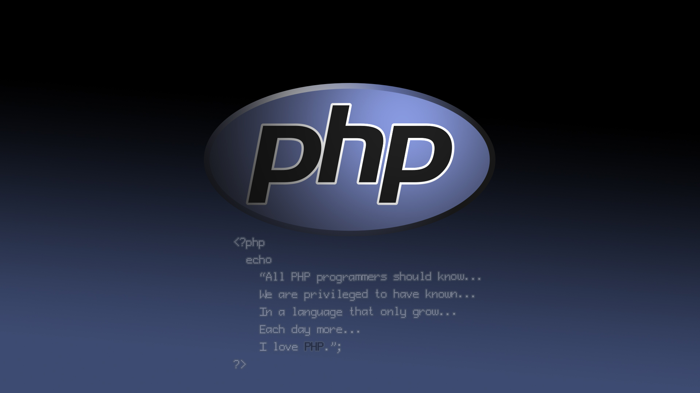
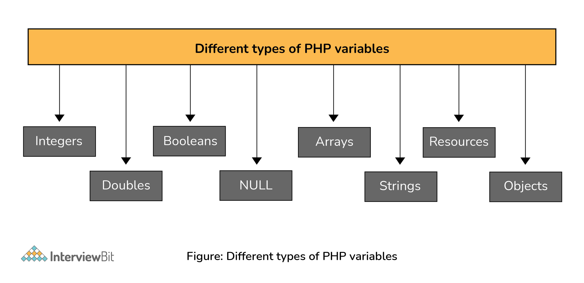
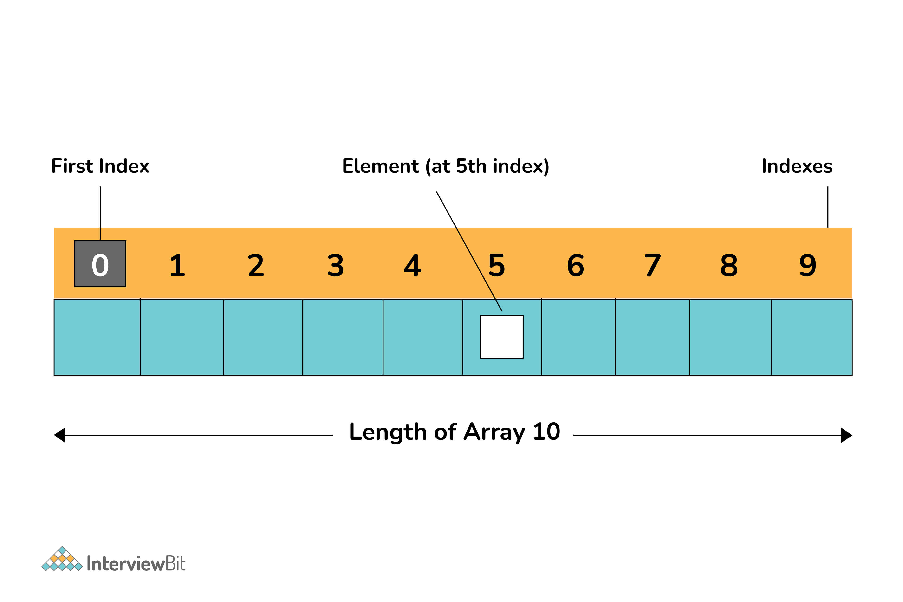
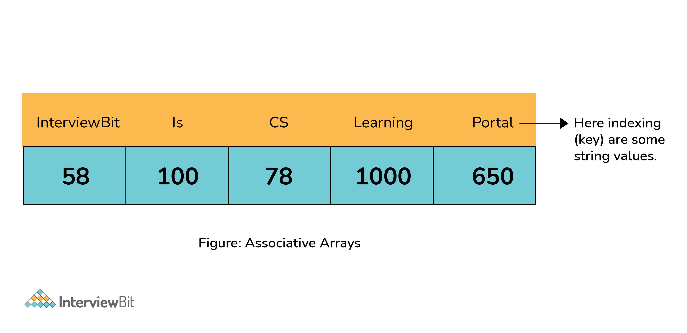

# Câu hỏi phỏng vấn PHP



## PHP là gì ?

PHP là viết tắt của PHP Hypertext Preprocessor là ngôn ngữ script server-side mã nguồn mở được sử dụng rộng rải cho thiết kế website động và API di động.

PHP hỗ trợ nhiều cơ sở dữ liệu như MySQL, Solid, PostgreSQL, Oracle, Sybase, ... Code PHP được nhúng trong HTML.

PHP cũng là ngôn ngữ cho xây dựng WordPress chiếm khoảng 80% website trên Internet.

## Tại sao lại học PHP

PHP không phải là ngôn ngữ script phía server duy nhất có sẵn – vẫn còn nhiều ngôn ngữ khác nữa. Tuy nhiên, nó lợi thế hơn các đối thủ cạnh tranh nếu như bạn đang chạy trang web WordPress.

Như chúng tôi đã đề cập trước đó, WordPress được xây dựng dựa trên việc sử dụng PHP. Vì vậy sử dụng ngôn ngữ này giúp cải thiện đáng kể số lượng tùy chỉnh có thể có trên trang web. Bạn có thể sử dụng nó để sửa đổi plugins và themes có sẵn hoặc tự tạo plugin! Nếu bạn muốn trở thành nhà phát triển và WordPress, bạn bắt buộc phải học PHP.

Nếu vẫn chưa bị thuyết phục, đây là một số lý do khác khiến PHP là ngôn ngữ script tuyệt vời để sử dụng:

* **Dễ học** – bạn có thể học dễ dàng vì nó có tài liệu tuyệt vời về các chức năng cùng các ví dụ.
* **Được sử dụng rộng rãi** – nó được sử dụng để tạo ra các loại nền tảng như thương mại điện tử, blogs, phương tiện truyền thông xã hội, v.v. Thống kê cho thấy 80% tất cả các trang web đều sử dụng PHP!
* **Chi phí thấp** – nó là nguồn mở để bạn có thể sử dụng miễn phí.
* **Cộng đồng lớn** – nếu gặp phải bất kỳ vấn đề nào với nó, bạn không phải lo lắng vì có rất nhiều blog PHP trên internet.

## Câu hỏi phỏng vấn PHP cho Fresher

### 1. Sự khác biệt giữa biến và hằng trong PHP?

| Biến | Hằng |
|------|------|
| Có thể thay đổi giá trị khi thực thi script | Không thể thay đổi giá trị khi thực thi script |
| Các biến yêu cầu bắt buộc sử dụng ký hiệu $ khi bắt đầu | Ký hiệu $ không bắt buộc khi dùng hằng |
| Có thể khai báo thông qua phép gán đơn giản | Không thể khai báo qua phép gán mà phải sử dụng hàm define() |
| Scope mặc định là scope đang truy cập | Có thể được truy cập bởi bất kỳ scope nào |

### 2. Session trong PHP là gì?

Session là một cách để lưu trữ thông tin (trong các biến) được sử dụng trên nhiều trang.

Không giống như một cookie, thông tin được lưu trữ trên server, chứ không được lưu trữ trên máy tính người dùng.

Khi bạn làm việc với một ứng dụng, bạn mở nó, thực hiện một số thay đổi, và sau đó bạn đóng nó lại. Điều này giống như một phiên (session). Máy tính biết bạn là ai. Nó biết khi bạn bắt đầu ứng dụng và khi bạn kết thúc. Nhưng trên internet có một vấn đề: máy chủ web không biết bạn là ai hoặc bạn làm gì, vì địa chỉ HTTP không duy trì trạng thái.

Các biến session giải quyết vấn đề này bằng cách lưu trữ thông tin người dùng được sử dụng trên nhiều trang (ví dụ: tên người dùng, sở thích, v.v.). Theo mặc định, các biến session tồn tại cho đến khi người dùng đóng trình duyệt.

Vì thế biến sesion giữ thông tin về một người dùng duy nhất và có sẵn cho tất cả các trang trong một ứng dụng.

### 3. PEAR là gì?

PEAR là viết tắt của **PHP Extension and Application Repository**. Mục đích chính của nó là trở thành một kho chứa cho phần mã thư viện và mở rộng dùng cho PHP, và với tham vọng định ra các chuẩn mực có thể giúp các nhà phát triển tạo nên những dòng mã khả chuyển và có thể dùng lại.

PEAR  nó cung cấp:

• Một thư viện có cấu trúc các mã nguồn mở cho người dùng PHP
• Một hệ thống phân phối và đóng gói mã nguồn
• Một phong cách chuẩn viết mã trong PHP
• PHP Foundation Classes (PFC)
• PHP Extension Community Library (PECL)

### 4. Giải thích sự khác biệt giữa $message và $$message?

| $message | $$message |
| Là biến thông thường | Là biến tham chiếu |
| Có tên và lưu trữ giá trị cố định | Lưu trữ dữ liệu về biến |
| Lưu trữ dữ liệu cố định | Dữ liệu được lưu có thể thay đổi khi giá trị của biến thay đổi |

### 5. PHP có phải là case-sensitive?

PHP chỉ case-sensitive một nữa. Tên các biến là phân biệt hoa thường nhưng hàm thì không. 

Ví dụ: các hàm do người dùng định nghĩa trong PHP có thể được định nghĩa bằng chữ thường nhưng sau đó được gọi bằng chữ hoa thì nó vẫn hoạt động bình thường.

### 6. Các kiểu dữ liệu trong PHP?



Có 8 kiểu dữ liệu chính trong PHP cho khai báo biến:
- **Integer:** bao gồm toàn bộ số nguyên. Vd: 1235
- **Double:** bao gồm các số dấu phẩy động như 7.786
- **Booleans:** biểu diễn giá trị luân lý - true hoặc false.
- **NULL:** là kiểu đặc biệt chỉ có một giá trị là NULL. Khi không có giá trị nào được gán cho một biến, nó có thể được gán với NULL. 
- **Arrays:** là tập hợp có thứ tự với kiểu dữ liệu giống nhau. 
- **Strings:** là chuỗi tuần tự các ký tự.
- **Resources:** là biến đặc biệt bao gồm tham chiếu đến các nguồn tài nguyên bên ngoài PHP.
- **Objects:** là thực thể của lớp bao gồm dữ liệu và hàm

### 7. Luật đặt tên biến trong PHP?

- Biến phải bắt đầu với ký tự dollar "$", theo sau là tên biến. Ví dụ: `$price=100`, trong đó price là tên biến.
- Tên biến phải bắt đầu là một ký tự chữ cái hoặc gạch dưới.
- Tên biến có thể bao gồm chữ cái, số hay gạch dưới. Nhưng không thể sử dụng ký tự như `+`, `-`, `%`, `&`,...
- Tên biến không thể bao gồm khoảng trắng.
- Biến PHP phân biệt hoa thường. Nên $NAME và $name là hai biến khác nhau.

### 8. Sự khác biệt giữa echo và print trong PHP?

| echo | print |
|------|-------|
| echo có thể xuất một hay nhiều chuỗi | print chỉ xuất một chuỗi và luôn trả về 1 |
| echo nhanh hơn print vì không phải trả về giá trị | print chậm hơn echo |
| Nếu bạn muốn truyền nhiều hơn một tham số cho echo, thì nên sử dụng dấu ngoặc đơn | Không bắt buộc phải sử dụng dấu ngoặc với danh sách đối số |

### 9. Hạn chế của PHP?

- Nhược điểm phải nói đến đầu tiên khi dùng PHP chính là cấu trúc ngôn ngữ của nó nhìn không được gọn gàng cho lắm. Mọi câu lệnh được viết trong cặp câu lệnh `<?php … ?>`.
- Không giống như Java và C# khi bạn học thì có thể làm website, các ứng dụng điện thoại, chương trình hay phần mềm… . tuy nhiên đối với PHP chỉ có thể sử dụng làm website và các ứng dụng website mở rộng mà thôi.
- Nhược điểm lớn nhất đáng nói đến là khả năng bị sao chép và hack mã code dễ hơn và độ an toàn không cao như các ngôn ngữ lập trình khác. Nhưng từ khi lên phiên bản PHP 7 chấm trở lên đã khác phục được rất nhiều vấn đề này.

### 10. HTML và PHP tương tác như thế nào?

Script PHP có thể tạo ra HTML, và có thể chuyển thông tin từ HTML sang PHP.

PHP là ngôn ngữ server-side trong khi HTML là ngôn ngữ client-side. Vì vậy PHP thực thi ở phía server và tạo ra kết quả là chuỗi, mảng, đối tượng rồi hiển thị các giá trị đó ở HTML.

### 11. @ trong PHP là gì?

PHP có một toán tử kiểm soát lỗi, tức là ký hiệu (`@`). Bất cứ khi nào nó được sử dụng với một biểu thức, bất kỳ thông báo lỗi nào có thể được tạo ra bởi biểu thức đó sẽ bị bỏ qua.

### 12. Giải thích về Parser trong PHP?

Một PHP Parser là một phần mềm chuyển mã nguồn PHP thành code mà máy tính có thể hiểu được. Tức là bất cứ tập hợp mà tập hướng dẫn mà ta đưa ra dưới dạng code PHP đều được trình phân tích cú pháp chuyển đổi thành dạng máy có thể đọc được.

Ta có thể parse code PHP bằng cách dùng hàm `token_get_all()`.

### 13. Các kiểu array trong PHP?

Trong PHP có 3 kiểu array:


#### Indexed Array

Một mảng với giá trị khoá là số còn được gọi là indexed array. Giá trị được lưu trữ và truy cập theo thứ tự tuyến tính.



#### Associative Array

Một mảng với giá trị khoá được đặt tên và là chuỗi còn được gọi là associative array. Giá trị phần tử được lưu cùng với giá trị khoá thay vì theo thứ tự tuyến tính.



#### Multidimensional Array

Một mảng có một hoặc nhiều mảng khác nằm trong nó được gọi là multidimensional array. Giá trị có thể truy cập bằng nhiều chỉ mục.


### 14. Giải thích các kiểu lỗi?

Có 3 kiểu lỗi trong PHP:
- **Notices**: là những lỗi không nghiêm trọng có thể xảy ra trong quá trình thực thi script. Những điều này không hiển thị cho người dùng. Ví dụ một biến undefined.
- **Warrnings**: là những cảnh báo quan trọng hơn. Warning không làm gián đoạn quá trình thực thi script. Theo mặc định chúng hiển thị cho người dùng. Vd: `include` một file không tồn tại.
- **Fatal**: là loại lỗi nghiêm trọng nhất khi xảy ra, nó sẽ chấm dứt thực thi script. Vd truy cập thuộc tính của một đối tượng không tồn tại hoặc `require()` một file không tồn tại.

### 15. Trait là gì?

Traits là một cơ chế để tái sử dụng code trong các ngôn ngữ đơn kế thừa như PHP. Một Trait nhằm giảm hạn chế của sự đơn thừa kế bằng cách cho phép nhà phát triển sử dụng lại các bộ phương thức một cách tự do trong một số lớp độc lập trong các hệ thống phân cấp lớp khác nhau.

Một Trait tương tự như một lớp (Class), nhưng chỉ nhằm mục đích nhóm chức năng một cách chi tiết và nhất quán. Và nó không có khả năng khởi tạo ví dụ: `new class ABC()`. Nó là một sự bổ sung cho sự thừa kế truyền thống (đơn kế thừa) trong ngôn ngữ PHP.

### 16. JavaScript có thể tương tác với PHP?

JavaScript là ngôn ngữ dùng cả hai phía server và client (chủ yếu), còn PHP dùng cho phía server. PHP có khả năng tạo biến JavaScript, và có thể thực thi chúng trên trình duyệt. Từ đó giúp bạn có thể chuyển các biến sang PHP bằng một URL đơn giản. 

### 17. Vòng lặp foreach trong PHP?

Lệnh foreach là một vòng lặp dùng trong PHP cho phép lặp qua các kiểu dữ liệu array.

Hoạt động của foreach rất đơn giản, với mỗi lần truyền giá trị, các phần tử được gán một giá trị và các con trỏ được tăng dần. Quá trình này được thực hiện lặp đi lặp lại cho đến khi đến cuối mảng.

Cú pháp :

```php
foreach($array as $value)
{
    Code inside the loop;
}
```

### 18. Cách băm mật khẩu trong PHP?

Hàm `crypt()` dùng cho chức năng băm với một lượng lớn thuật toán băm có thể sử dụng như `sha1`, `sha256` hoặc `md5`.

### 19. Sự khác biệt giữa include và require()?

Khi import một file bằng hàm `require()` nếu file không tồn tại hoặc chương trình không tìm thấy, nó sẽ trả về lỗi (`E_COMPILE_ERROR`) và tạm dừng chương trình. Còn với `include()` nó chỉ trả về cảnh báo (`E_WARNING`) và tiếp tục chương trình.

### 20. Cookie trong PHP là gì?

Cookie là mẩu tin nhỏ được lưu ở máy người dùng (cụ thể là tại trình duyệt), cookie sử dụng với mục đích để theo dõi, lưu lại hoạt động truy cập. Ví dụ nhớ tên người dùng truy cập vào website có thể hoạt động qua các bước như sau:

- Server gửi các cookie cho trình duyệt (ví dụ tên người dùng: username) ...
- Trình duyệt lưu lại thông tin này (cookie)
- Lần sau truy cập URL cùng domain (tên miền) trình duyệt sẽ gửi ngược các cookie này lên server và server sẽ nhận được cookie, từ đó xác định được thông tin (như username) ...
Nên nhớ cookie được lưu lại ở trình duyệt, sau đó mỗi lần gửi yêu cầu đến server nó sẽ tự động gửi thông tin này đến server

Theo mặc định, cookie là URL cụ thể. Ví dụ, các cookie của Gmail không được Yahoo hỗ trợ và ngược lại. Mỗi trang có thể tạo 20 cookie trong một trang web hoặc ứng dụng web. 50 byte là kích thước ban đầu của cookie và 4096 byte là kích thước tối đa của cookie.

#### Tạo cookie trong PHP:

Cú pháp 

```php
setcookie(name, value, expire, path, domain, secure, httponly);
```

Ví dụ:

```php
setcookie(“instrument_selected”, “guitar”)
```

