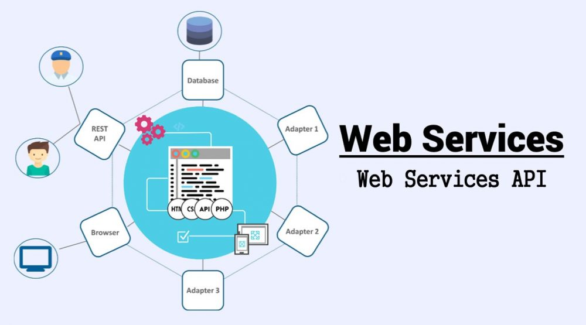
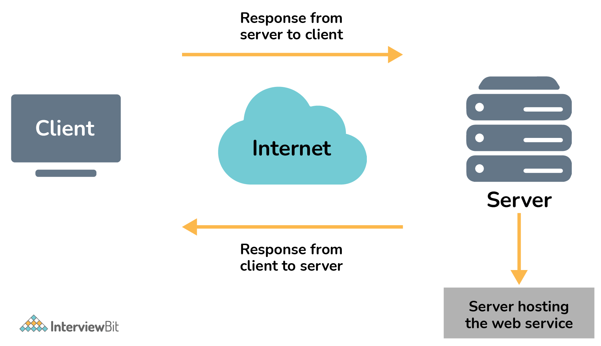
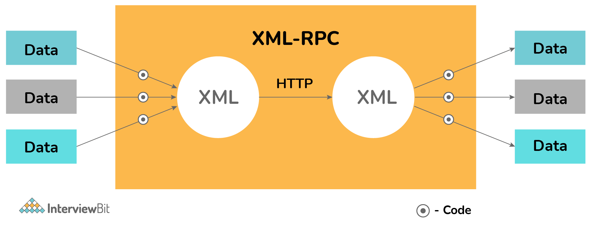
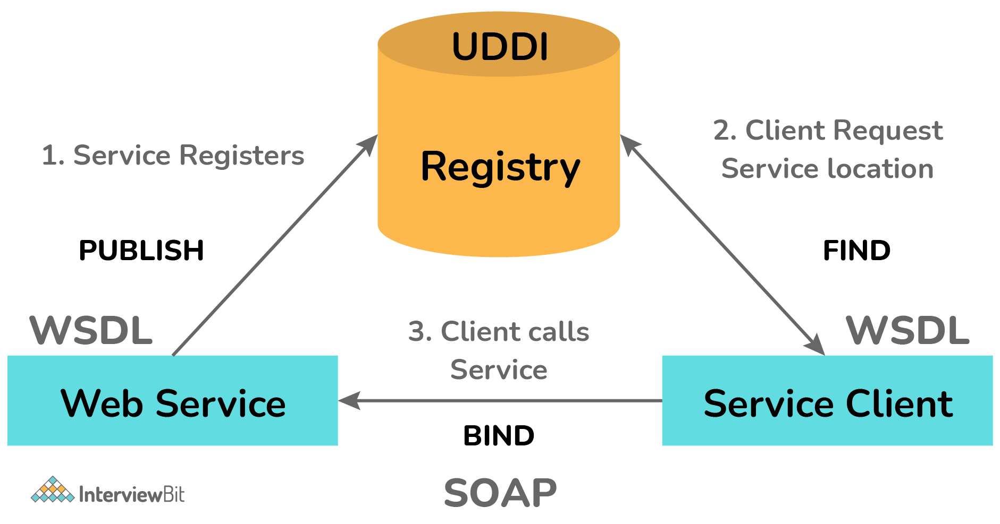
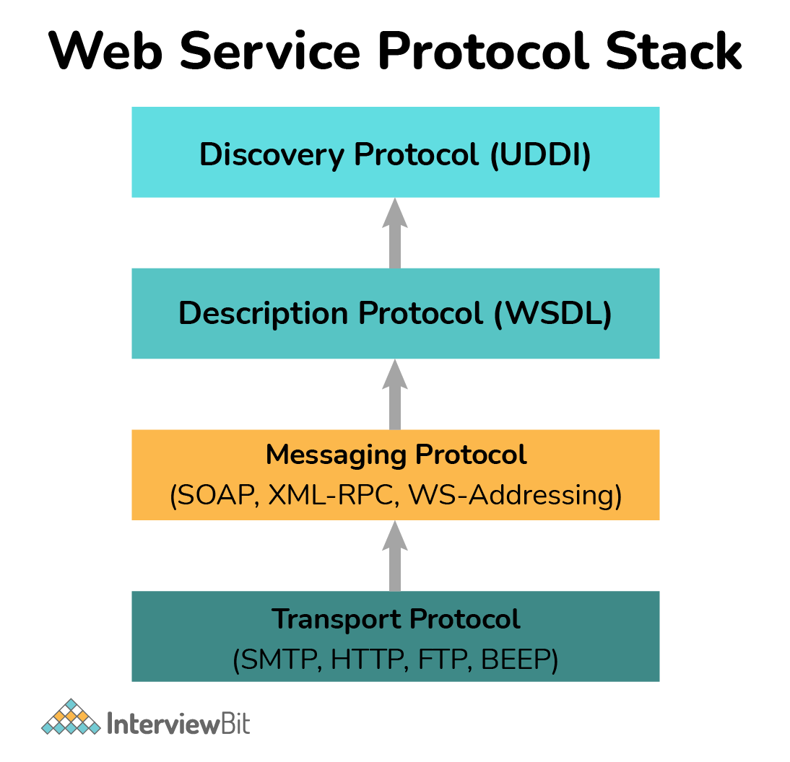
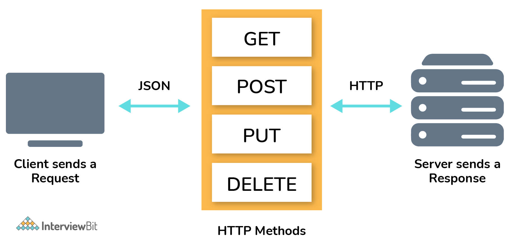
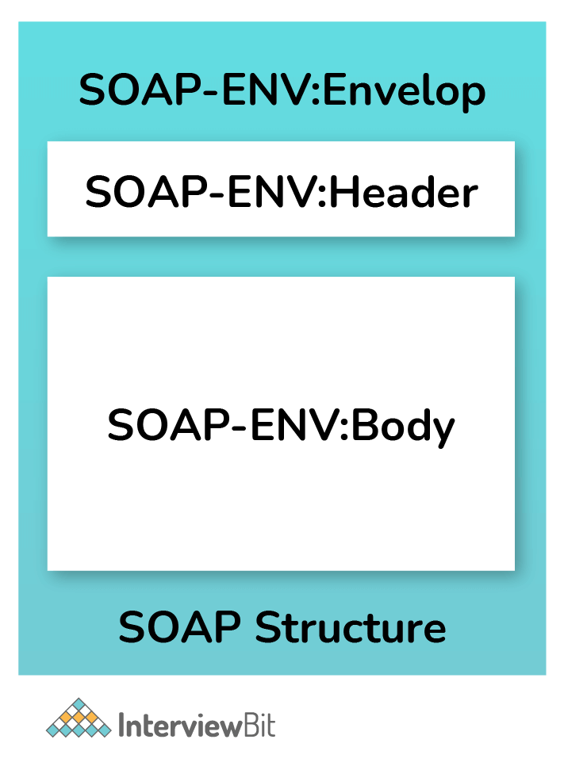

# Câu hỏi phỏng vấn dịch vụ web



## Dịch vụ Web là gì ? 

Dịch vụ Web đơn giản là một hệ thống phần mềm được thiết kế đặc biệt để giao tiếp với các ứng dụng server và client trên WWW (World Wide Web). Nói đơn giản hơn, nó là một phương thức cho giao tiếp giữa hai hay nhiều thiết bị trên mạng. Nó cho phép các ứng dụng được tạo bởi các ngôn ngữ lập trình khác nhau giao tiếp với nhau mà không có vấn đề gì. Nó sử dụng internet cho tương tác trực tiếp giữa ứng dụng với nhau, đồng thời cũng cho phép bạn hiển thị logic nghiệp vụ bằng cách sử dụng API.



## Câu hỏi phỏng vấn cho Fresher

## 1. Giải thích các kiểu dịch vụ web khác nhau?

Có hai kiểu dịch vụ web cơ bản là :


**SOAP (Simple Object Access Protocol)**: Nó còn được gọi là giao thức truyền tải thông điệp độc lập với mục đích chính là truyền thông báo, và dựa trên giao thức XML. 

**RESTful (Representational State Transfer)**: Nó được phát triển để khắc phục những thiếu sót của SOAP và làm cho các dịch vụ web hiệu quả hơn.

### 2. Các tính năng quan trọng của dịch vụ Web?

Một số tính năng quan trọng của dịch vụ web bao gồm:

- Được sử dụng để tiêu chuẩn hóa hệ thống truyền tải thông điệp XML.
- Không ràng buộc với bất kỳ ngôn ngữ lập trình hoặc hệ điều hành nào.
- Có thể tìm thấy thông qua một cơ chế tìm kiếm đơn giản.
- Có sẵn trên internet hoặc các mạng riêng.
- Hỗ trợ kết nối mềm giữa các hệ thống.
- Có thể đồng bộ hoặc bất đồng bộ.
- Hỗ trợ trao đổi dữ liệu minh bạch để tạo điều kiện tích hợp.
- Hỗ trợ giao tiếp giữa các ứng dụng khác nhau bằng HTML, XML, WSDL, SOAP, v.v.
- Hỗ trợ RPC (Remote Procedure Calls).

### 3. Các thành phần của dịch vụ Web?

Các thành phần khác nhau của dịch vụ web:

- SOAP (Simple Object Access Protocol) 
- UDDI (Universal Description, Discovery, and Integration) 
- WSDL (Web Services Description Language) 
- RDF (Resource Description Framework) 
- XML (Extensible Markup Language) 

### 4. Khác biệt giữa API và dịch vụ Web?

**API (Application Programming Interface):** hành động như một interface giữa hai thiết bị để chúng có thể giao tiếp với nhau mà không cần người dùng can thiệp. Một số tính năng của chúng như linh động, dễ tích hợp với GUI, ngôn ngữ độc lập,... Các API không nhất thiết phải là dịch vụ Web

**Dịch vụ Web:** tạo điều kiện tương tác giữa hai thiết bị qua mạng. Chúng được sử dụng rộng rãi để trao đổi dữ liệu giữa các hệ thống hoặc ứng dụng. Một số tính năng của nó bao gồm liên kết mềm, hỗ trợ trao đổi dữ liệu, khả năng tương tác, khả năng mở rộng, v.v. Mọi dịch vụ Web đều là API.

| API | Dịch vụ Web |
|-----|-------------|
| Có thể online hoặc offline | Buộc phải có mạng |
| Kiến trúc gọn nhẹ | Yêu cầu SOAP cho gửi và nhận dữ liệu mạng, do đó kiến trúc không nhẹ |
| Có thể dùng bất kỳ kiểu thiết kế hay giao thức nào | Chỉ dùng SOAP, thỉnh thoảng dùng REST, RPC, XML |
| Không yêu cầu mạng cho các thao tác | Cần mạng cho mọi thao tác |
| Mã nguồn mở và dùng XML | Mã nguồn đóng và dùng JSON |

### 5. Các công cụ kiểm thử dịch vụ web?

Có nhiều công cụ khác nhau cho kiểm tra dịch vụ web:

* SoapUI 
* Poster 
* Postman 
* REST client 
* JMeter

### 6. WSDL là gì? 

WSDL (Web Services Description Language) được coi là định dạng tiêu chuẩn được sử dụng để mô tả tính khả dụng của các dịch vụ web và cách truy cập chúng. Nó dựa trên giao thức XML để trao đổi dữ liệu trong các môi trường phân tán và phi tập trung. Nó cũng mô tả các chi tiết kỹ thuật hoặc định vị giao diện người dùng cho dịch vụ web. Tài liệu WSDL chứa một số thông tin quan trọng như được cung cấp bên dưới:
- Tên phương thức và tham số
- Kiểu cổng
- Dịch vụ endpoint
- Thông tin header


### 7. XML-RPC là gì?

XML-RPC được xem là giao thức đơn giản và căn bản dựa trên XML để trao đổi dữ liệu giữa các thiết bị khác nhau trên mạng. Nó sử dụng HTTP như một giao thức truyền tải để truyền thông tin dữ liệu giữa hai thiết bị một cách nhanh chóng và dễ dàng. XML-RPC có thể sử dụng các ngôn ngữ như C, C++, Java, Python,...



### 8. Tính năng của XML-RPC?

- Nền tảng độc lập
- Cho phép ứng dụng giao tiếp đa dạng.
- Được coi là cách dễ nhất và đơn giản nhất để bắt đầu với các dịch vụ web.
- Sử dụng XML để mã hóa các cuộc gọi của nó và HTTP làm giao thức truyền tải.

### 9. UDDI là gì?

UDDI (Universal Description, Discovery, and Integration) là một dịch vụ thư mục được sử dụng để mô tả, phát hành và tìm kiếm các dịch vụ web. Nó dựa trên một tập hợp các tiêu chuẩn web bao gồm HTTP, XML, SOAP, WSDL, XML. Mục tiêu chính của nó là hợp lý hóa các giao dịch kỹ thuật số và thương mại điện tử giữa các hệ thống công ty.



### 10. Các tính năng nổi bật của UDDI

* Nền tảng độc lập
* Sử dụng WSDL để mô tả interface cho các dịch vụ web
* Có thể giao tiếp thông qua SOAP, Java RMI và giao thức CORBA
* Phân định giữa interface và triển khai
* Trung lập về giao thức

### 11. Tên ngôn ngữ thường được sử dụng bởi UDDI?

Ngôn ngữ thường được UDDI sử dụng là WSDL (Web Service Description Language).

### 12. Giải thích về kiến trúc dịch vụ web?

Mọi framework đều yêu cầu một số kiểu kiến trúc để đảm bảo rằng toàn bộ framework hoạt động hoàn hảo như mong muốn, đối với các dịch vụ web cũng vậy. Kiến trúc dịch vụ web được sử dụng để hỗ trợ nhà phát triển với các bước và thủ tục cần thiết để hoàn thành việc tạo. Kiến trúc dịch vụ web bao gồm ba vai trò riêng biệt, tức là nhà cung cấp dịch vụ (provider), người yêu cầu dịch vụ (requestor) và sổ đăng ký dịch vụ (registry). Nó cũng bao gồm ba hoạt động khác nhau bao gồm:

**Publish (Publication of Service Descriptions):** Một mô tả dịch vụ cần được phát hành để người yêu cầu dịch vụ có thể xác định vị trí và có quyền truy cập vào nó. Nó có thể được phát hành ở bất cứ đâu tùy thuộc vào yêu cầu của ứng dụng.

**Find (Finding of Services Descriptions):** một mô tả dịch vụ được truy xuất trực tiếp bởi người yêu cầu dịch vụ. Người yêu cầu tham khảo ý kiến của broker để tìm một dịch vụ web đã được phát hành. 

**Bind (Invoking of Service based on Service Description):** mọi dịch vụ cần được gọi. Để xác định vị trí, liên hệ và gọi dịch vụ, người yêu cầu dịch vụ bắt đầu tương tác với dịch vụ trong thời gian chạy bằng cách sử dụng các chi tiết ràng buộc trong mô tả dịch vụ.


### 13. Web Service Provider là gì?

Nhà cung cấp dịch vụ (Web Service Provider) tạo các dịch vụ web và cung cấp quyền truy cập vào ứng dụng client cần nó. Mục đích chính của nó là triển khai dịch vụ và cung cấp dịch vụ này trên internet để các ứng dụng client có thể sử dụng bất cứ khi nào được yêu cầu. Nói dễ hiểu, nó là một nền tảng để tạo và lưu trữ các dịch vụ web.

### 14. Web Service Requestor là gì?

Người yêu cầu dịch vụ (Web Service Requestor) là ứng dụng client yêu cầu sử dụng dịch vụ web. Mục đích chính của nó là sử dụng một dịch vụ web hiện có bằng cách mở một kết nối mạng và gửi một yêu cầu XML. Nói một cách dễ hiểu, họ là những người sử dụng dịch vụ web. 

### 15. Web Service Registry là gì?

Sổ đăng ký dịch vụ (Web Service Registry) về cơ bản giống như một 'danh bạ điện thoại' cho các dịch vụ web. Nó cho phép các ứng dụng client có thể xuất bản các dịch vụ mới hoặc có thể xác định vị trí các dịch vụ đã tồn tại. Hai tiêu chuẩn đăng ký được sử dụng rộng rãi thường được hỗ trợ bởi các máy chủ ứng dụng, là ebXML (Electronic Business sử dụng XML) và UDDI (Universal Description, Discovery, and Integration).

### 16. Các lớp khác nhau của ngăn xếp giao thức dịch vụ web?

Việc triển khai các dịch vụ web nói chung phụ thuộc vào các công nghệ thường được tổ chức trong một ngăn xếp nhiều lớp. Kiểm tra ngăn xếp giao thức dịch vụ web được coi là tùy chọn thứ hai để xem kiến trúc dịch vụ web. Nói một cách dễ hiểu, nó là một tập hợp các giao thức được sử dụng để khám phá và thực thi các dịch vụ web. Hiện tại, ngăn xếp giao thức dịch vụ web có bốn lớp như được đưa ra dưới đây:



**Service Transport:** Nó thường có trách nhiệm vận chuyển các thông điệp giữa các ứng dụng. Về cơ bản, nó xác định các tiêu chuẩn công nghệ cho giao tiếp và cho phép các thông điệp hoặc thông tin di chuyển trên mạng mà không gặp bất kỳ khó khăn nào. Nó sử dụng các giao thức HTTP, SMTP, FTP và DEEP để truyền thông tin.

**XML Messaging:** Nó có trách nhiệm mã hoá thông điệp thành định dạng XML để có thể hiểu thông điệp ở cả hai phía. Lớp này thường bao gồm XML-RPC và SOAP.

**Service Description:** Nó có trách nhiệm mô tả interface công khai với dịch vụ web cụ thể. WSDL thường được dùng cho xử lý mô tả dịch vụ.

**Service Discovery:** Nói chung, nó có trách nhiệm tập trung dịch vụ vào một sổ đăng ký chung và cung cấp chức năng dễ dàng để xuất bản hoặc tìm kiếm các dịch vụ web. UDDI thường được sử dụng ở lớp này.

### 17. Giải thích thuật ngữ Synchronicity?

Tính đồng bộ (Synchronicity) thường đề cập đến sự ràng buộc của client với việc thực thi chức năng và nó có thể được thực hiện theo hai cách, tức là đồng bộ và bất đồng bộ. Trong lời gọi đồng bộ, client chặn và đợi cho đến khi dịch vụ hoàn thành hoạt động trước khi tiếp tục công việc của nó. Trong lệnh gọi bất đồng bộ, client được phép gọi một dịch vụ và thực thi các chức năng khác.

## Câu hỏi phỏng vấn cho Experienced

### 18. Dịch vụ web RESTful là gì?

REST (Representational State Transfer) là một kiến trúc stateless kiểu client-server sử dụng cho phát triển ứng dụng có thể truy cập trên toàn web. Nó là một kiểu dịch vụ web với mục tiêu chính là làm cho các dịch vụ web trở nên hiệu quả hơn. Nó có thể được định nghĩa là dịch vụ web sử dụng các phương thức HTTP để triển khai kiến trúc REST. Không giống như SOAP dựa trên giao thức, các dịch vụ RESTful dựa trên kiến trúc. Nó không chứa bất kỳ contract hoặc file WSDL nào.



### 19. Ưu điểm của dịch vụ Web RESTful?

- Nền tảng độc lập.
- Dễ triển khai và kiểm thử.
- Hỗ trợ các định dạng khác nhau như JSON, XML, HTML,...
- Có thể viết bằng nhiều ngôn ngữ và thực thi trên mọi nền tảng.
- Nhẹ, dễ quản lý, mở rộng và tái sử dụng.
- Nhanh và hiệu suất tốt.
- Ít tốn băng thông và tài nguyên.
- Nhiều framework khả dụng.

### 20. Giao thức dùng cho dịch vụ Web RESTful?

Giao thức sử dụng cho dịch vụ web RESTful là HTTP.

### 21. Giải thích stateless trong dịch vụ web RESTful?

Stateless về cơ bản là một điều kiện hoặc hạn chế trong đó các dịch vụ web RESTful không được phép giữ trạng thái client trên server theo kiến trúc REST. Client có trách nhiệm chuyển ngữ cảnh của họ đến server. Để xử lý yêu cầu của client, server sau đó sẽ lưu trữ thêm ngữ cảnh này.

**Ưu điểm**
* Không cần phải duy trì các tương tác trước đó với client.
* Xử lý độc lập từng yêu cầu phương pháp.
* Ít phức tạp hơn và thiết kế ứng dụng được đơn giản hóa.

**Ví dụ**

Ta có dữ liệu mẫu trong users.json như sau:

```js
{
    "user1" : {
        "name" : "gourav",
        "password" : "password1",
        "profession" : "officer",
        "id": 1
    },
    
    "user2" : {
        "name" : "nikhil",
        "password" : "password2",
        "profession" : "teacher",
        "id": 2
    }
}
```

Ta có triển khai với node/express như sau:

```js
// Requiring module
var express = require('express');
var app = express();
var fs = require("fs");

// Sample GET API
app.get('/listUsers', function (req, res) {
    fs.readFile( __dirname + "/" + "users.json", 'utf8', function (err, data) {
        console.log( data );
        res.end( data );
    });
})

// Server setup
var server = app.listen(8081, function () {
    var host = server.address().address
    var port = server.address().port
    console.log("Example app listening at http://%s:%s", host, port)
})
```

Bây giờ mở trình duyệt với đường link `http://127.0.0.1:8081/listUsers` ta có phản hồi như sau:

```js
{
    "user1" : {
        "name" : "gourav",
        "password" : "password1",
        "profession" : "officer",
        "id": 1
    },
    
    "user2" : {
        "name" : "nikhil",
        "password" : "password2",
        "profession" : "teacher",
        "id": 2
    }
}
```

### 22. Các phương thức HTTP cho dịch vụ web RESTful?

Một vài phương thức HTTP như:

- GET: Dùng cho truy cập hay đọc tài nguyên. 
- POST: Dùng cho tạo tài nguyên mới. 
- PUT: Dùng cho cập nhật tài nguyên đã có. 
- DELETE: Dùng cho xoá tài nguyên. 
- PATCH: Dùng cho sửa đổi một phần của tài nguyên.

### 23. Các Status code trong REST API?

Các status code phổ biển trong phản hồi HTTP:

* 200 OK
* 201 Created
* 202 Accepted
* 302 Found
* 400 Bad Request
* 401 Unauthorized 
* 404 Not Found
* 405 Method Not Allowed
* 409 Conflict
* 500 Internal Server Error

### 24. SOAP là gì?

SOAP (Simple Object Access Protocol) là một giao thức dựa trên XML được dùng cho truy cập dịch vụ web. Nó chỉ đơn giản được sử dụng để trao đổi dữ liệu hoặc thông tin giữa hai thiết bị hoặc máy tính bằng cách sử dụng request và response dựa trên định dạng XML qua các giao thức truyền tải như HTTP, SMTP, v.v.


Ưu điểm:

- Ngôn ngữ và Thông tin độc lập.
- Có thể được viết trên các ngôn ngữ lập trình hoặc hệ điều hành khác nhau.
- Cung cấp vận chuyển dữ liệu cho các dịch vụ web.
- Có thể mở rộng HTTP cho truyền tin XML.
- Xác định và sử dụng bảo mật WS của riêng nó.
- Dễ dàng debug và loại bỏ các vấn đề về tường lửa.

### 25. Các phần tử của SOAP message?

SOAP message là một tài liệu XML bao gồm 3 phần:

**SOAP Envelope:** là phần tử bắt buộc để xác định tài liệu XML như là một SOAP mesage. Nó xác định phần bắt đầu và kết thúc của thông điệp.

**SOAP Header:** là một phần tử tùy chọn có chứa thông tin header.

**SOAP Body:**  là một phần tử bắt buộc chứa thông tin cuộc gọi và phản hồi. Nó bao gồm dữ liệu XML chứa thông điệp đang được gửi.



Ví dụ về cấu trúc chung của XML request và response:

**XML Request**

```xml
<Envelope xmlns=?http://schemas.xmlsoap.org/soap/envelop/?>   
<Body>   
    <getCourseDetailRequest xmlns=?http://udemy.com/course?>   
       <id>course1</id>   
    <getCourseDetailRequest>   
</Body>   
</Envelope>
```

**XML Response**

```xml
<SOAP-ENV:Envelope xmlns:SOAP-ENV=?http://schemas.xmlsoap.org/soap/envelope/?>   
    <SOAP-ENV:Header />          <!?empty header-->   
    <SOAP-ENV:Body>             <!?body begin-->   
        <ns2:getCourseDetailsResponse xmlns:ns2=?http://in28mi> <!--content of the response-->   
            <ns2:course>   
                <ns2:id>Course1</ns2:id>   
                <ns2:name>Spring<ns2:name>   
                <ns2:description>10 Steps</ns1:description>   
            </ns2:course>   
        </ns2:getCourseDetailResponse>   
    </SOAP-ENV:Body>    <!?body end-->   
</SOAP-ENV:Envelope> 
```

### 26. SOA là gì?

SOA (Service Oriented Architecture) về cơ bản là một cách tiếp cận kiến trúc được thiết kế đặc biệt để hỗ trợ định hướng dịch vụ. Nó cho phép các dịch vụ giao tiếp hoặc tương tác trên các nền tảng và ngôn ngữ khác nhau để tạo thành các ứng dụng. Các ứng dụng trong SOA được phát triển trên cơ sở các dịch vụ. Nó có thể được thực hiện dễ dàng bằng cách sử dụng các giao thức khác nhau như HTTP, JMS, HTTPS, RPC, RMI, v.v.

### 27. Ưu điểm của SOA?

- Dễ dàng tích hợp.
- Các dịch vụ độc lập với nền tảng.
- Quản lý độ phức tạp để việc tích hợp trở nên dễ quản lý hơn.
- Các dịch vụ dễ kiểm tra và debug hơn.
- Dễ dàng có sẵn cho bất kỳ người yêu cầu nào.

### 28. Các vấn đề bảo mật trong dịch vụ Web?

3 yếu tố chính cho bảo mật trong dịch vụ web là:
- Bảo mật
- Xác thực
- Bảo mật mạng

### 29. Các thành phần cần được công khai khi triển khai dịch vụ web?

- Thư mục ứng dụng web
- File Webservice.asmx 
- File Webservice.Disco 
- File Web.Config 
- Thư mục Bin

### 30. Tại sao dịch vụ web lại quan trọng?

Các dịch vụ web rất quan trọng vì chúng cung cấp các giao thức web chuẩn hóa, tức là HTTP hoặc HTTPS để tương tác, giao tiếp và trao đổi thông tin ở định dạng XML qua internet. Một số lợi thế của nó bao gồm:

- Cho phép các thiết bị nói chuyện với nhau và chia sẻ dữ liệu hoặc dịch vụ giữa chúng.
- Làm cho nền tảng ứng dụng và công nghệ độc lập.
- Sử dụng giao thức tiêu chuẩn được chuẩn hóa để giao tiếp.
- Người dùng SOAP qua giao thức HTTP có thể sử dụng internet chi phí thấp của họ để triển khai các dịch vụ web.
- Cho phép logic nghiệp vụ của các hệ thống khác nhau khả dụng trên web.
- Có thể được sử dụng cùng lúc bởi nhiều ứng dụng client.

### 31. DISCO là gì?

DISCO (Discovery) là một công nghệ của Microsoft đang được sử dụng để khám phá các dịch vụ web. Đây là quá trình định vị và thẩm vấn các mô tả dịch vụ web, là bước sơ bộ để có quyền truy cập vào các dịch vụ web qua Internet. Tổ chức cung cấp các dịch vụ web thường cung cấp file DISCO trên máy chủ của mình bao gồm các liên kết của tất cả các dịch vụ web có sẵn để nó có thể được sử dụng trong mạng cục bộ.

### 32. Giải thích về BEEP?

BEEP (Blocks Extensible Exchange Protocol) về cơ bản là một framework IETF (Internet Engineering Task Force) thường được sử dụng để phát triển các giao thức ứng dụng mạng. Người ta có thể tạo các giao thức mới này cho các ứng dụng khác nhau như nhắn tin tức thời, quản lý mạng, truyền file, cung cấp nội dung, v.v. Nó được phân lớp trực tiếp qua TCP. BEEP có các tính năng tích hợp khác nhau như xác thực, bảo mật, giao thức bắt tay ban đầu, xử lý lỗi, v.v.

### 33. URL trong dịch vụ web REST?

Trong dịch vụ web dựa trên REST, URL (Uniform Resource Locator) thường được sử dụng để định vị tài nguyên trên server đang lưu trữ dịch vụ web. Mỗi tài nguyên trong dịch vụ sẽ có ít nhất một UR: được sử dụng để xác định nó. Các client của dịch vụ web thường sử dụng URL để truy cập tài nguyên. Định dạng của nó được đưa ra dưới đây:

```
<protocol>://<service-name>/<ResourceType>/<ResourceID>
```

### 34. Bảo mật trong dịch vụ web?

Bảo mật được coi là một tính năng rất quan trọng trong bất kỳ ứng dụng web nào. Nó là điều cần thiết trong các dịch vụ web để chúng có thể làm cho thông tin và giao dịch bí mật hoặc nhạy cảm trở nên đáng tin cậy hơn. Trong các dịch vụ web, bảo mật đạt được thông qua SSL (Service Socket Layer) giúp phát triển nền tảng EST (Entrust Secure Transaction).

### 35. Sự khác biệt của dịch vụ web với CORBA và DCOM?

| Dịch vụ web | CORBA & DCOM |
|-|-|
| Các dịch vụ web về cơ bản truyền hoặc nhận thông điệp từ các ứng dụng bằng giao thức HTTP. Để encode dữ liệu, chúng sử dụng XML | Về cơ bản, chúng truyền hoặc nhận thông điệp từ các ứng dụng bằng các giao thức không chuẩn như RPC, IIOP (Inter Internet Object Protocol),... |
| WSDL dùng cho xác định dịch vụ web | CORBA Interface Description Language dùng cho xác định thành phần CORBA và Mircosoft Interface Definition Language dùng cho xác định thành phần DCOM |
| UDDI dùng cho khám phá dịch vụ web | CORBA registry dùng cho khám phá thành phần CORBA và DCOM registry dùng cho xác định thành phần DCOM |
| Thân thiện với tường lửa | CORBA dùng giao thức IIOP không thân thiện lắm |

