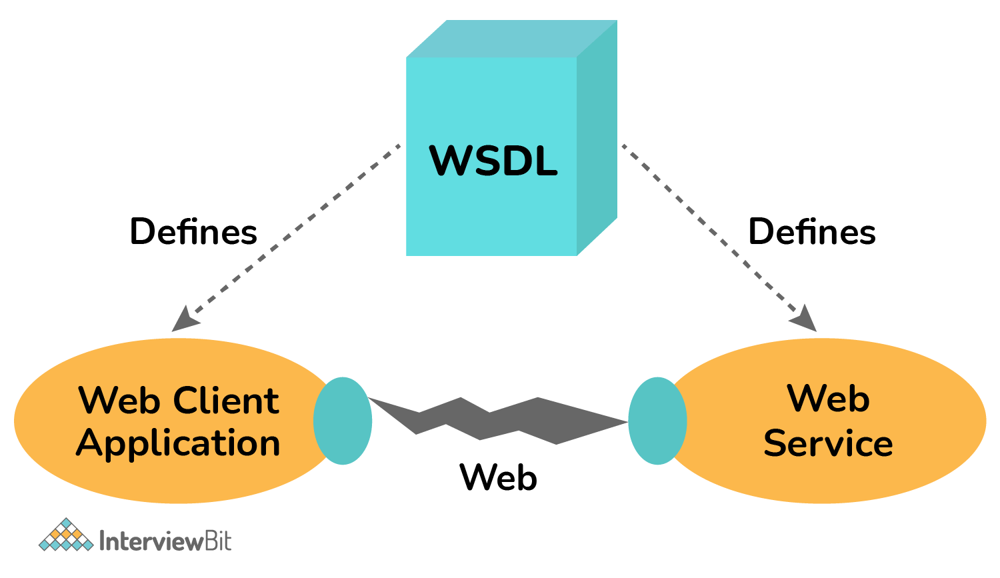
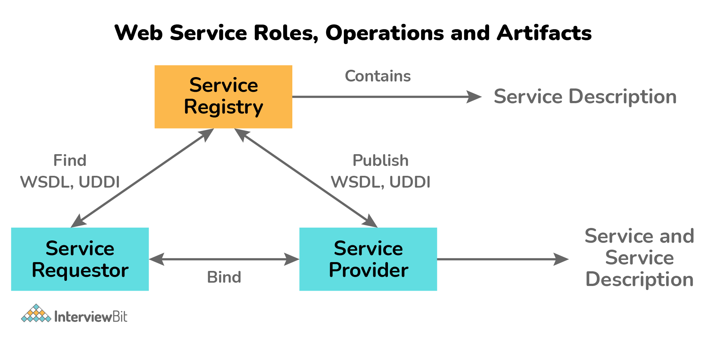

# Web Service

## Web Service là gì ? 

Dịch vụ Web đơn giản là một hệ thống phần mềm được thiết kế đặc biệt để giao tiếp với các ứng dụng server và client trên WWW (World Wide Web). Nói đơn giản hơn, nó là một phương thức cho giao tiếp giữa hai hay nhiều thiết bị trên mạng. Nó cho phép các ứng dụng được tạo bởi các ngôn ngữ lập trình khác nhau giao tiếp với nhau mà không có vấn đề gì. Nó sử dụng internet cho tương tác trực tiếp giữa ứng dụng với nhau, đồng thời cũng cho phép bạn hiển thị logic nghiệp vụ bằng cách sử dụng API.

## Câu hỏi phỏng vấn cho Fresher

## 1. Giải thích các kiểu web service khác nhau?

Có hai kiểu web service cơ bản là :

**SOAP (Simple Object Access Protocol)**: Nó còn được gọi là giao thức truyền tải thông điệp độc lập với mục đích chính là truyền thông báo, và dựa trên giao thức XML. 

**RESTful (Representational State Transfer)**: Nó được phát triển để khắc phục những thiếu sót của SOAP và làm cho các dịch vụ web hiệu quả hơn.

### 2. Các tính năng quan trọng của Web Service?

Một số tính năng quan trọng của dịch vụ web bao gồm:

- Được sử dụng để tiêu chuẩn hóa hệ thống truyền tải thông điệp XML.
- Không ràng buộc với bất kỳ ngôn ngữ lập trình hoặc hệ điều hành nào.
- Có thể tìm thấy thông qua một cơ chế tìm kiếm đơn giản.
- Có sẵn trên internet hoặc các mạng riêng.
- Hỗ trợ kết nối mềm giữa các hệ thống.
- Có thể đồng bộ hoặc bất đồng bộ.
- Hỗ trợ trao đổi dữ liệu minh bạch để tạo điều kiện tích hợp.
- Hỗ trợ giao tiếp giữa các ứng dụng khác nhau bằng HTML, XML, WSDL, SOAP, v.v.
- Hỗ trợ RPC (Remote Procedure Calls).

### 3. Các thành phần của Web Service 

Các thành phần khác nhau của web service:

- SOAP (Simple Object Access Protocol) 
- UDDI (Universal Description, Discovery, and Integration) 
- WSDL (Web Services Description Language) 
- RDF (Resource Description Framework) 
- XML (Extensible Markup Language) 

### 4. Khác biệt giữa API và Web Service

**API (Application Programming Interface):** hành động như một interface giữa hai thiết bị để chúng có thể giao tiếp với nhau mà không cần người dùng can thiệp. Một số tính năng của chúng như linh động, dễ tích hợp với GUI, ngôn ngữ độc lập,... Các API không nhất thiết phải là Web Service

**Web Service:** tạo điều kiện tương tác giữa hai thiết bị qua mạng. Chúng được sử dụng rộng rãi để trao đổi dữ liệu giữa các hệ thống hoặc ứng dụng. Một số tính năng của nó bao gồm liên kết mềm, hỗ trợ trao đổi dữ liệu, khả năng tương tác, khả năng mở rộng, v.v. Mọi dịch vụ Web đều là API.

| API | Web Service |
|-----|-------------|
| Có thể online hoặc offline | Buộc phải có mạng |
| Kiến trúc gọn nhẹ | Yêu cầu SOAP cho gửi và nhận dữ liệu mạng, do đó kiến trúc không nhẹ |
| Có thể dùng bất kỳ kiểu thiết kế hay giao thức nào | Chỉ dùng SOAP, thỉnh thoảng dùng REST, RPC, XML |
| Không yêu cầu mạng cho các thao tác | Cần mạng cho mọi thao tác |
| Mã nguồn mở và dùng XML | Mã nguồn đóng và dùng JSON |

### 5. Các công cụ kiểm thử web service

Có nhiều công cụ khác nhau cho kiểm tra web service:

* SoapUI 
* Poster 
* Postman 
* REST client 
* JMeter

### 6. WSDL là gì? 

WSDL (Web Services Description Language) được coi là định dạng tiêu chuẩn được sử dụng để mô tả tính khả dụng của các dịch vụ web và cách truy cập chúng. Nó dựa trên giao thức XML để trao đổi dữ liệu trong các môi trường phân tán và phi tập trung. Nó cũng mô tả các chi tiết kỹ thuật hoặc định vị giao diện người dùng cho dịch vụ web. Tài liệu WSDL chứa một số thông tin quan trọng như được cung cấp bên dưới:
- Tên phương thức và tham số
- Kiểu cổng
- Dịch vụ endpoint
- Thông tin header

### 7. XML-RPC là gì?

XML-RPC được xem là giao thức đơn giản và căn bản dựa trên XML để trao đổi dữ liệu giữa các thiết bị khác nhau trên mạng. Nó sử dụng HTTP như một giao thức truyền tải để truyền thông tin dữ liệu giữa hai thiết bị một cách nhanh chóng và dễ dàng. XML-RPC có thể sử dụng các ngôn ngữ như C, C++, Java, Python,...

### 8. Tính năng của XML-RPC?

- Nền tảng độc lập
- Cho phép ứng dụng giao tiếp đa dạng.
- Được coi là cách dễ nhất và đơn giản nhất để bắt đầu với các dịch vụ web.
- Sử dụng XML để mã hóa các cuộc gọi của nó và HTTP làm giao thức truyền tải.

### 9. UDDI là gì?

UDDI (Universal Description, Discovery, and Integration) là một dịch vụ thư mục được sử dụng để mô tả, phát hành và tìm kiếm các dịch vụ web. Nó dựa trên một tập hợp các tiêu chuẩn web bao gồm HTTP, XML, SOAP, WSDL, XML. Mục tiêu chính của nó là hợp lý hóa các giao dịch kỹ thuật số và thương mại điện tử giữa các hệ thống công ty.

### 10. Các tính năng nổi bật của UDDI

* Nền tảng độc lập
* Sử dụng WSDL để mô tả interface cho các dịch vụ web
* Có thể giao tiếp thông qua SOAP, Java RMI và Giao thức CORBA
* Phân định giữa interface và triển khai
* Trung lập về giao thức

### 11. Tên ngôn ngữ thường được sử dụng bởi UDDI?

Ngôn ngữ thường được UDDI sử dụng là WSDL (Web Service Description Language).

### 12. Giải thích về kiến trúc web service?

Mọi framework đều yêu cầu một số kiểu kiến trúc để đảm bảo rằng toàn bộ framework hột động hoàn hảo như mong muốn, đối với các dịch vụ web cũng vậy. Kiến trúc dịch vụ web được sử dụng để hỗ trợ nhà phát triển với các bước và thủ tục cần thiết để hoàn thành việc tạo. Kiến trúc dịch vụ web bao gồm ba vai trò riêng biệt, tức là nhà cung cấp dịch vụ, người yêu cầu dịch vụ và đăng ký dịch vụ. Nó cũng bao gồm ba hoạt động khác nhau bao gồm:

**Publish (Publication of Service Descriptions):** Một mô tả dịch vụ cần được phát hành để người yêu cầu dịch vụ có thể xác định vị trí và có quyền truy cập vào nó. Nó có thể được phát hành ở bất cứ đâu tùy thuộc vào yêu cầu của ứng dụng.

**Find (Finding of Services Descriptions):** một mô tả dịch vụ được truy xuất trực tiếp bởi người yêu cầu dịch vụ. Người yêu cầu tham khảo ý kiến của broker  để tìm một dịch vụ web đã được phát hành. 

**Bind (Invoking of Service based on Service Description):** mọi dịch vụ cần được gọi. Để xác định vị trí, liên hệ và gọi dịch vụ, người yêu cầu dịch vụ bắt đầu tương tác với dịch vụ trong thời gian chạy bằng cách sử dụng các chi tiết ràng buộc trong mô tả dịch vụ.

