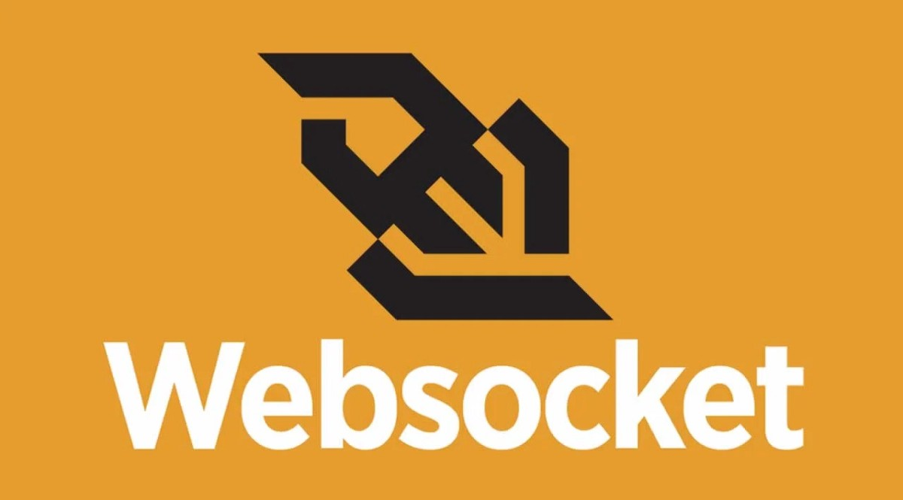

# Câu hỏi phỏng vấn WebSocket

## WebSocket là gì?

WebSoket là công nghệ hỗ trợ giao tiếp hai chiều giữa client và server bằng cách sử dụng một TCP socket để tạo một kết nối hiệu quả và ít tốn kém. Mặc dù được thiết kế để chuyên sử dụng cho các ứng dụng web, lập trình viên vẫn có thể đưa chúng vào bất kì loại ứng dụng nào.

WebSockets mới xuất hiện trong HTML5, là một kỹ thuật Reverse Ajax. WebSockets cho phép các kênh giao tiếp song song hai chiều và hiện đã được hỗ trợ trong nhiều trình duyệt (Firefox, Google Chrome và Safari). Kết nối được mở thông qua một HTTP request (yêu cầu HTTP), được gọi là liên kết WebSockets với những header đặc biệt. Kết nối được duy trì để bạn có thể viết và nhận dữ liệu bằng JavaScript như khi bạn đang sử dụng một TCP socket đơn thuần.

## Câu hỏi phỏng vấn WebSocket?

### 1. WebSockets là gì?

WebSocket là công nghệ cho phép client thiết lập kết nối hai chiều *full-duplex* để giao tiếp với server.

Với WebSocket, cả client và server có thể kích hoạt giao tiếp với phía còn lại, chúng có thể gửi tin nhắn cùng lúc. Ngược lại trong giao tiếp HTTP truyền thống chỉ có thể đi một chiều là client đến server.

### 2. Giải thích Server-Sent Events/EventSource?

SSE (Server-Sent Events) là một kỹ thuật cho gửi thông điệp, nó cho phép server đẩy cập nhật lên client bằng cách tận dụng JavaScript `EventSource`.

EventSource mở một một kết nối liên tục, một chiều với server qua HTTP sử dụng header đặc biệt `text/event-stream` và lắng nghe thông điệp, được code của bạn xử lý giống như sự kiện JavaScript.

Server-Sent Events (SSE) phù hợp cho các ứng dụng mà bạn không cần gửi cho server bất kỳ dữ liệu nào. Ví dụ: trang tin tức Twitter hoặc sàn chứng khoán cổ phiếu. Một điểm ưu việc khác là SSE hoạt đông qua HTTP và API tương đối dễ sử dụng.

Tuy nhiên:
- SSE không hỗ trợ các trình duyệt cũ.
- Phần lớn trình duyệt giới hạn số lượng kết nối SSE mà bạn tạo cùng lúc.

### 3. Tương tác với độ trễ thấp là gì?

**Độ trễ thấp (low latency)** có nghĩa là có rất ít độ trễ giữa thời gian bạn yêu cầu điều gì đó và thời gian bạn nhận được phản hồi. Như nó áp dụng cho webSockets, nó có nghĩa là dữ liệu có thể được gửi nhanh hơn (đặc biệt là qua các liên kết chậm) bởi vì kết nối đã được thiết lập nên không cần thêm gói tin để thiết lập kết nối TCP. 

### 4. Short Polling là gì?

Short Polling hoặc Ajax Polling là một kỹ thuật khi bạn yêu cầu client ping liên tục đến server, chẳng hạn như sau mỗi 500ms(hoặc trên một số độ trễ nhất định). Bằng cách đó, bạn nhận được dữ liệu mới sau mỗi 500ms:
1. Client yêu cầu trang web từ một server bằng HTTP thông thường.
2. Client nhận được trang web và thực thi JavaScript trên trang yêu cầu file từ server theo khoảng thời gian đều đặn (vd: 0.5s)
3. Server tính toán từng phản hồi và gửi lại, giống như lưu lượng HTTP thông thường.

Có một số nhược điểm rõ ràng của điều này:
- Có độ trễ 500ms
- Nó tiêu thụ tài nguyên server với một loạt các yêu cầu và hầu hết các yêu cầu sẽ trả về trống nếu dữ liệu không được cập nhật thường xuyên.

### 5. Tại sao dùng WebSocket thay vì HTTP?

WebSocket là một kết nối liên tục giữa client và server. Kết nối liên tục đó cho phép những điều sau:

- Dữ liệu có thể được gửi từ server đến client bất kỳ lúc nào mà không cần client yêu cầu. Điều này thường được gọi là đẩy server và rất có giá trị đối với các ứng dụng mà khách hàng cần biết khá nhanh khi có điều gì đó xảy ra trên server (chẳng hạn như một tin nhắn trò chuyện mới đã được nhận hoặc giá mới đã được cập nhật). Một client không thể được đẩy dữ liệu qua http. Khách hàng sẽ phải thường xuyên thăm dò ý kiến bằng cách đưa ra yêu cầu http vài giây một lần để có được dữ liệu mới kịp thời. Thăm dò ý kiến khách hàng không hiệu quả.

- Dữ liệu có thể được gửi theo cả hai cách rất hiệu quả. Bởi vì kết nối đã được thiết lập và khung dữ liệu webSocket được tổ chức rất hiệu quả, người ta có thể gửi dữ liệu hiệu quả hơn rất nhiều thông qua một yêu cầu HTTP nhất thiết phải chứa header, cookie, v.v.

### 6. Giải thích Long Polling là gì?

