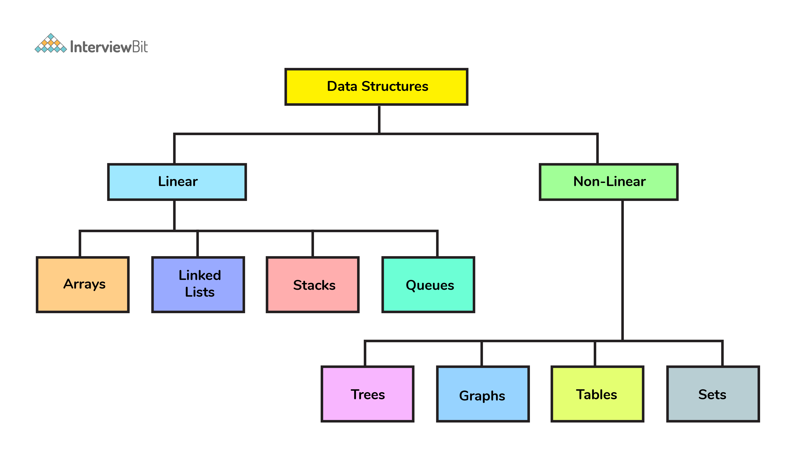
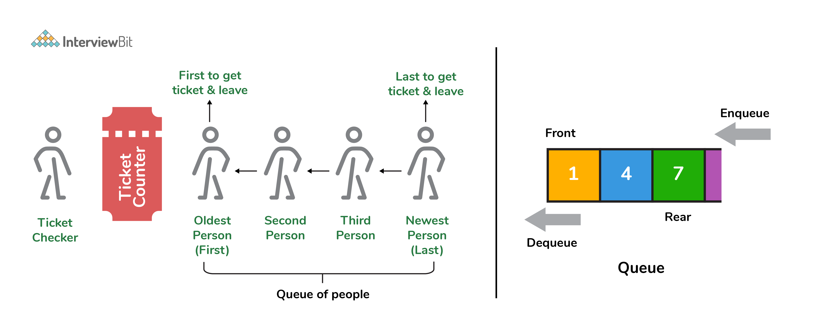
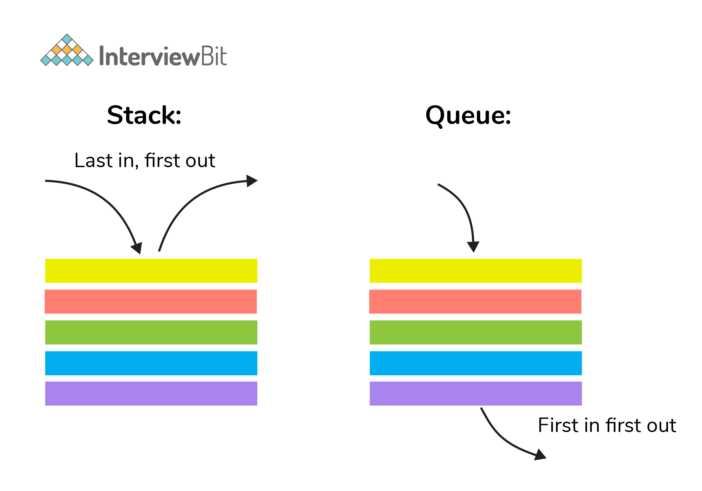

# Câu hỏi phỏng vấn Cấu Trúc Dữ Liệu

- Cấu trúc dữ liệu là một khái niệm cơ bản trong bất kỳ ngôn ngữ lập trình nào, là phần thiết yếu trong thiết kế thuật toán.

- Nó được sử dụng để tổ chức và sửa đổi dữ liệu một cách hiệu quả.

- Cấu trúc dữ liệu là cách dữ liệu và các mối quan hệ của nó được biểu diễn, hỗ trợ việc áp dụng các tính năng hoặc thuật toán khác nhau hoạt động một cách hiệu quả.

### Kiểu

Có hai kiểu cấu trúc dữ liệu:
- Cấu trúc dữ liệu tuyến tính: Nếu các phần tử của cấu trúc dữ liệu là một chuỗi tuần tự hoặc danh sách tuyến tính. Nó được gọi là cấu trúc dữ liệu tuyến tính. Ví dụ: ,mảng, danh sách liên kết, ngăn xếp, hàng đợi,...
- Cấu trúc dữ liệu phi tuyến tính: Nếu các phần tử của cấu trúc dữ liệu tạo ra cách duyệt qua các phần tử không theo thứ tự, thì nó là cấu trúc dữ liệu phi tuyến tính. Ví dụ: Cây, đồ thị,...



### Ứng dụng

Cấu trúc dữ liệu là nền tảng cốt lõi của lập trình phần mềm vì bất kỳ thuật toán hiệu quả cho một vấn đề nhất định nào đều phụ thuộc vào mức độ hiệu quả của dữ liệu được cấu trúc.

Các ứng dụng của cấu trúc dữ liệu:
- Các định danh được dùng cho triển khai biên dịch đang sử dụng bảng băm.
- Cấu trúc dữ liệu B-tree rất phù hợp cho triển khai cơ sở dữ liệu.
- Một vài lĩnh vực quan trong sử dụng cấu trúc dữ liệu như:
    1. Trí thông minh nhân tạo
    2. Thiết kế trình biên dịch
    3. Máy học
    4. Thiết kế và quản lý cơ sở dữ liệu
    5. Blockchain
    6. Tính toán và thống kê
    7. Phát triển hệ điều hành
    8. Xử lý hình ảnh và âm thanh
    9. Mã hoá


### Lợi ích

Bất kỳ vấn đề nào đều có những hạn chế về tốc độ giải quyết vấn đề (thời gian) và lượng tài nguyên tiêu tốn (không gian). Một vấn đề bị hạn chế bởi độ phức tạp về không gian và thời gian phải được giải quyết một cách hiệu quả.

Để làm được điều này, vấn đề phải được biểu diễn ở một dạng cấu trúc phù hợp mà ở đó các thuật toán được áp dụng hiệu quả.

Lựa chọn cấu trúc dữ liệu thích hợp trở thành bước quan trọng nhất trước khi áp dụng thuật toán cho bất kỳ vấn đề nào.

> "Có sẵn kiến thức về các loại cấu trúc dữ liệu khác nhau sẽ giúp lập trình viên lựa chọn cấu trúc dữ liệu phù hợp nhất để giải quyết vấn đề một cách hiệu quả. Nó không chỉ nằm ở việc làm giải pháp của bạn hoạt động, mà còn là giải pháp đó hoạt động hiệu quả như thế nào."

## Câu hỏi phỏng vấn cho Fresher

### 1. Bạn có thể giải thích sự khác nhau giữa cấu trúc tập tin và cấu trúc lưu trữ 

### 2. Bạn có thể nói sự khác biệt giữa cấu trúc dữ liệu tuyến tính và phi tuyến tính ?

Nếu các phần tử của cấu trúc dữ liệu là một chuỗi hay danh sách tuyến tính thì nó gọi là cấu trúc dữ liệu tuyến tính. Trong khi đó, cấu trúc dữ liệu cho duyệt các phần tử không theo thứ tự nào gọi cấu trúc dữ liệu phi tuyến tính.

Danh sách, ngăn xếp và hàng đợi là ví dụ của cấu trúc dữ liệu tuyến tính trong khi cây và đồ thị là cấu trúc dữ liệu phi tuyến tính.


### 3. Mảng là gì ?

Mảng là tập hợp các loại dữ liệu cùng **kiểu** được lưu trữ tại các vị trí bộ nhớ liền kề.
Đây là cấu trúc dữ liệu đơn giản nhất mà phần tử dữ liệu có thể được truy cập ngẫu nhiên chỉ bằng cách sử dụng chỉ mục của nó.

### 4. Mảng đa chiều là gì ?

Mảng đa chiều là những cấu trúc dữ liệu mảng trên nhiều chiều khác nhau.

Điều này chỉ ra rằng sẽ có nhiều hơn một chỉ mục cho mỗi điểm lưu trữ. Loại cấu trúc dữ liệu này chủ yếu được sử dụng trong trường hợp dữ liệu không thể được biểu diễn hoặc lưu trữ trên mảng một chiều. Mảng đa chiều được sử dụng phổ biến nhất là mảng hai chiều.

Mảng hai chiều mô phỏng cấu trúc dạng bảng giúp dễ dàng lưu trữ lượng lớn dữ liệu được truy cập bằng cách sử dụng con trỏ hàng và cột.


### 5. Danh sách liên kết là gì ?

Danh sách liên kết là một **chuỗi tuần tự các nút**, nơi các nút được liên kết với nhau thông qua con trỏ tham chiếu. Các phần tử **không được lưu trữ** tại các vị trí liền kề trong bộ nhớ. Chúng được liên kết bằng cách sử dụng con trỏ để tạo thành một chuỗi. Điều này tạo thành một liên kết dạng chuỗi để lưu trữ dữ liệu. 

Mỗi nút thường có hai phần:
- Trường dữ liệu
- Tham chiếu(con trỏ) đến nút kế tiếp

Nút đầu tiên trong danh sách liên kết gọi là head, nút cuối cùng gọi là tail và trỏ đến null. Null trong trường tham chiếu chỉ ra nút đó là tail. Nếu danh sách trống, head sẽ là tham chiếu null.


### 6. Danh sách liên kết là tuyến tính hay phi tuyến tính ?

Danh sách liên kết có thể được coi là cấu trúc dữ liệu tuyến tính và cả phi tuyến tính. Điều này phụ thuộc vào ứng dụng mà chúng được sử dụng.

Khi danh sách liên kết được sử dụng cho truy cập, nó được coi là một cấu trúc dữ liệu tuyến tính. Khi chúng được sử dụng để lưu trữ dữ liệu, nó có thể được coi là một cấu trúc dữ liệu phi tuyến tính.

### 7. Danh sách liên kết có hiệu quả hơn mảng ?

1. **Chèn và xoá**

- Quá trình chèn và xoá là rất tốn kém trong mảng vì phải tạo các phần tử mới cho các phần tử hiện có để dịch chuyển.
- Nhưng trong danh sách liên kết, các thao tác này dễ dàng hơn vì chỉ cập nhật địa chỉ hiện tại trong con trỏ tiếp theo của một nút.

2. **Cấu trúc dữ liệu động**

- Danh sách liên kết là cấu trúc dữ liệu động có nghĩa là không cần cho kích thước ban đầu khi tạo, nó có thể mở rộng hay co lại theo thời gian bởi cấp phát hay thu hổi của bộ nhớ.
- Trong khi đó, kích thước của mảng là giới hạn về số lượng phần tử được lưu trong bộ nhớ chính.

3. **Không lãng phí bộ nhớ**

- Vì kích thước của danh sách liên kết có thể tăng lên hoặc co lại dựa trên nhu cầu của chương trình, nên không có bộ nhớ nào bị lãng phí vì nó được cấp phát trong thời gian chạy.

- Với mảng, nếu chúng ta khai báo một mảng có kích thước 10 và chỉ lưu trữ 3 phần tử trong đó, thì không gian cho 7 phần tử sẽ bị lãng phí. Do đó, khả năng lãng phí bộ nhớ trong các mảng nhiều hơn.

### 8. Giải thích trường hợp nào sử dụng danh sách liên kết và trường hợp nào sử dụng mảng ?

Các trường hợp sử dụng danh sách liên kết tốt hơn mảng:

- Khi ta không biết trước chính xác số lượng phần tử.
- Khi ta biết sẽ có một lượng lớn thao tác thêm hoặc xoá.
- Số lượng thao tác truy cập ngẫu nhiên là rất ít.
- Khi muốn chèn các mục vào bất kỳ vị trí nào giữa danh sách, chẳng hạn như khi triển khai hàng đợi ưu tiên, danh sách liên kết sẽ phù hợp hơn.

Các trường hợp dùng mảng tốt hơn danh sách liên kết:
- Khi cần đánh chỉ mục cho các truy cập phần tử ngẫu nhiên thường xuyên.
- Khi ta biết trước số lượng phần tử mảng để cấp pháp bộ nhớ.
- Khi chúng ta cần tốc độ khi lặp lại các phần tử trong chuỗi.
- Khi cần quan tâm bộ nhớ:
    1. Một mảng đầy sẽ tốn ít bộ nhớ hơn danh sách liên kết
    2. Mỗi phần tử trong mảng chỉ biễu diễn dữ liệu trong khi mỗi nút trong danh sách liên kết phải biễu diễn thêm một hoặc nhiều con trỏ cho liên kết đến các nút khác.

Tóm lại, các yêu cầu về không gian, thời gian và mức độ dễ thực hiện được xem xét để quyết định cấu trúc dữ liệu nào sẽ được sử dụng cho mục đích gì.

### 9. Danh sách liên kết đôi (DDL) là gì ?

Đây là một loại danh sách liên kết phức tạp, trong đó một nút có hai tham chiếu:
- Một tham chiếu liên kết với nút tiếp theo trong chuỗi
- Một tham chiếu khác liên kết với nút trước đó.

Cấu trúc này cho phép duyệt các phần tử dữ liệu theo cả hai hướng (trái sang phải và ngược lại).

Các ứng dụng của DLL là:
- Danh sách phát nhạc với bài hát tiếp theo và các tùy chọn điều hướng bài hát trước đó.
- Bộ nhớ cache của trình duyệt với các trang đã truy cập BACK-FORWARD
- Chức năng hoàn tác và phục hồi trên các nền tảng như word, paint, v.v., nơi bạn có thể nút undo để truy cập trang trước.

### 10. Ngăn xếp là gì

Ngăn xếp là một cấu trúc dữ liệu tuyến tính tuân theo cách tiếp cận LIFO (Last In First Out) để truy cập các phần tử. 

Các thao tác cơ bản trong ngăn xếp:
- *Push*: thêm phần tử vào đỉnh ngăn xếp
- *Pop*: lấy phần tử từ đỉnh ngăn xếp
- *Peek*: lấy giá trị phần tử từ đỉnh ngăn xếp, mà không xóa nó khỏi ngăn xếp


Các ứng dụng của ngăn xếp:
- Tính các biểu thức đại số
- Quản lý bộ nhớ khi thi hành chương trình

### 11. Hàng đợi là gì

Hàng đợi là một cấu trúc dữ liệu tuyến tính tuân theo phương pháp FIFO (First In First Out) để truy cập các phần tử.

Các thao tác cơ bản trong hàng đợi:
- *enqueue*: thêm đối tượng vào cuối hàng đợi.
- *dequeue*: lấy đối tượng ở đầu ra khỏi hàng đợi và trả về giá trị của nó.
- *front*: trả về giá trị của phần tử nằm ở đầu hàng đợi mà không hủy nó.
- *rear*: trả về giá trị của phần tử nằm ở cuối hàng đợi mà không hủy nó.



Ứng dụng của hàng đợi:
- Dùng trong các hệ điều hành song song
- Xử lý yêu cầu trang web
- Dùng làm bộ đệm cho ứng dụng nghe nhạc
- Tác vụ CPU

### 12. Ngăn xếp và hàng đợi khác nhau thế nào ?

Trong ngăn xếp phần tử được thêm vào gần nhất sẽ được lấy ra đầu tiên, còn trong hàng đợi nó sẽ được lấy ra cuối cùng.



### 13. Giải thích quy trình đằng sau việc lưu trữ một biến trong bộ nhớ.

Một biến được lưu trữ trong bộ nhớ dựa trên dung lượng bộ nhớ cần thiết. Sau đây là các bước được thực hiện để lưu trữ một biến:

1. Số lượng bộ nhớ cần thiết được chỉ định đầu tiên.
2. Sau đó, nó được lưu trữ dựa trên cấu trúc dữ liệu đang được sử dụng.
    - Sử dụng các khái niệm như cấp phát động đảm bảo hiệu quả cao và các đơn vị lưu trữ có thể được truy cập dựa trên các yêu cầu trong thời gian thực.

### 14. Triển khai hàng đợi bằng ngăn xếp

Một hàng đợi có thể triển khai bằng cách dùng **hai ngăn xếp**. 

Cho hàng đợi `q` và hai ngăn xếp `stack1` và `stack2` để triển khai `q`. Ta biết ngăn xếp hỗ trợ các thao tác push, pop và peek, ta sẽ dùng các thao tác đó. Ta cần mô phỏng các hoạt đọngo của hàng đợi, enqueue và dequeue. Do đó, hàng đợi `q` có thể triển khai theo hai cách (cả hai cách đều có độ phức tạp không gian là O(n)):

1. Tốn kém cho enqueue

Ở đây, phần tử cũ nhất luôn ở trên cùng của `stack1` đảm bảo hoạt động dequeue xảy ra với độ phức tạp thời gian O (1).

Để đặt phần tử vào đầu `stack1`, `stack2` được sử dụng.

Mã giả:

- Enqueue: Độ phức tạp thời gian là O(n):

```text
enqueue(q, data):
    While stack1 is not empty:
        Push everything from stack1 to stack2.
        Push data to stack1
        Push everything back to stack1.
```

- Dequeue: Độ phức tạp thời gian là O(1):

```text
dequeue(q):
    If stack1 is empty then error
    else
        Pop an item from stack1 and return it
```

2. Tốn kém cho dequeue

Ở đây, đối với thao tác enqueue, phần tử mới được đẩy lên trên cùng của `stack1`.Thế nên, độ phức tạp thời gian hoạt động của enqueue là O (1).

Với dequeue, nếu `stack2` trống, tất cả các phần tử từ `stack1` sẽ được chuyển đến `stack2` và đầu của `stack2` là kết quả. Về cơ bản, đảo ngược danh sách bằng cách đẩy vào một ngăn xếp và trả về phần tử được enqueue đầu tiên. Thao tác đẩy tất cả các phần tử vào ngăn xếp mới có độ phức tạp O(n).

Mã giả:

- Enqueue: Độ phức tạp thời gian là O(1):

```text
enqueue(q, data):
    Push data to stack1
```

- Dequeue: Độ phức tạp thời gian là O(n):

```text
dequeue(q):
    If both stacks are empty then raise error.
    If stack2 is empty:
        While stack1 is not empty:
            push everything from stack1 to stack2.
    Pop the element from stack2 and return it.
```