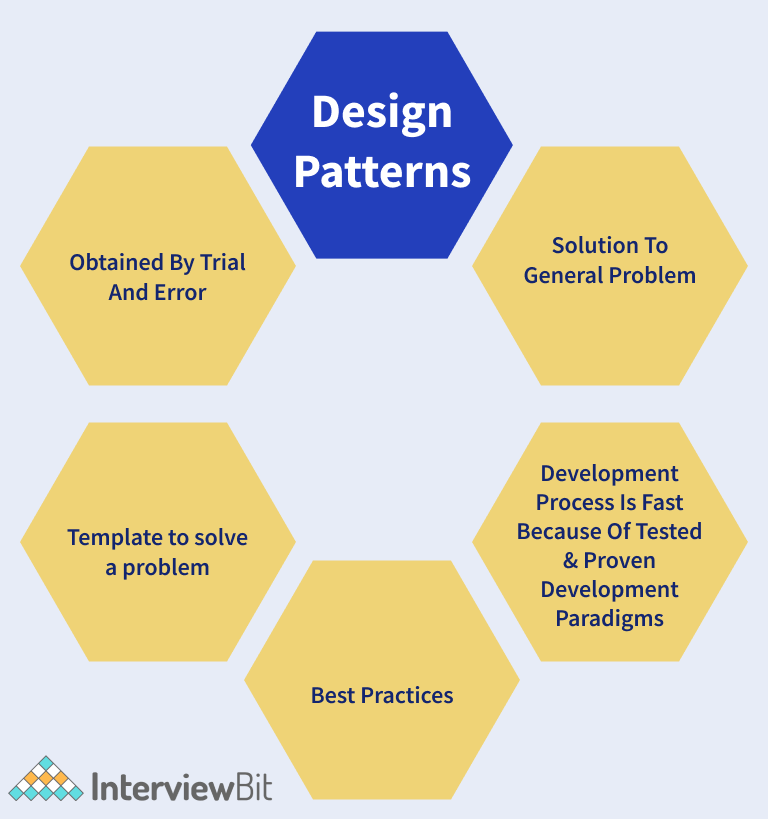
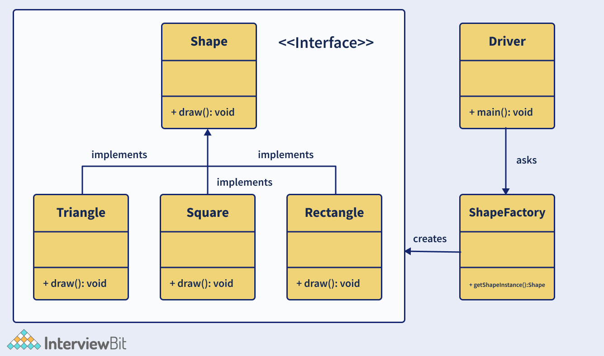
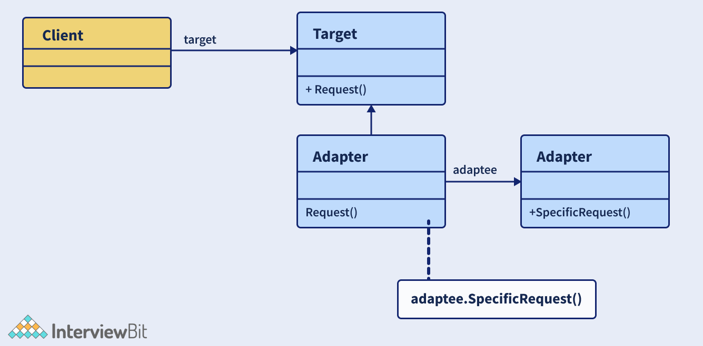
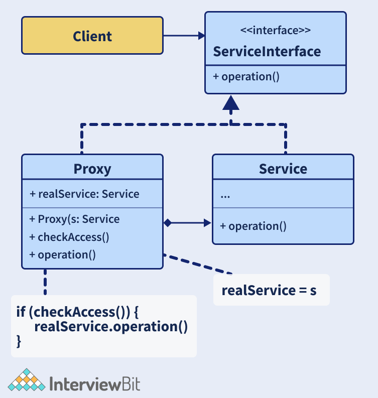
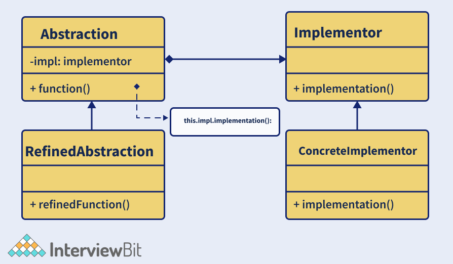
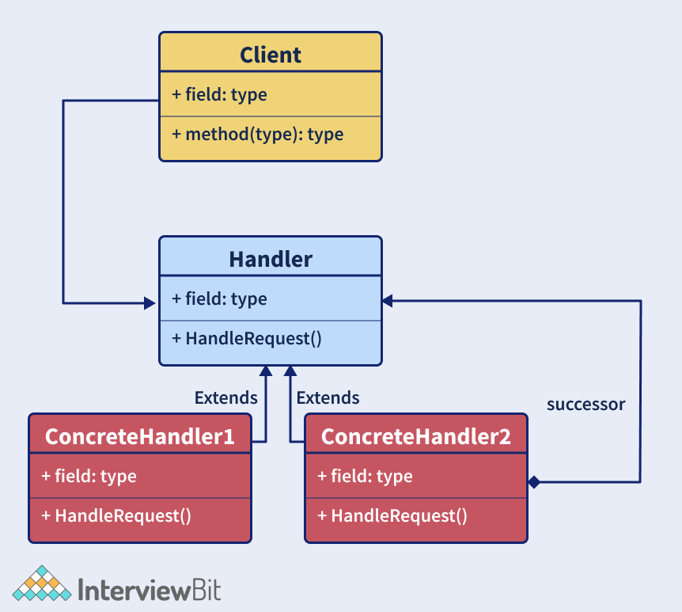
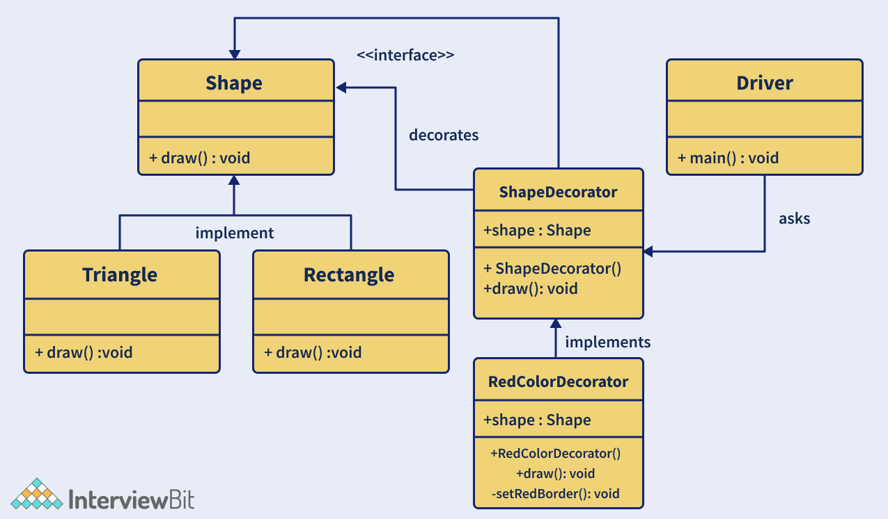
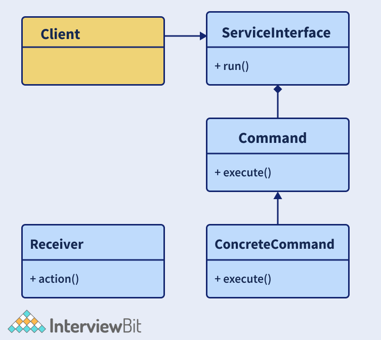
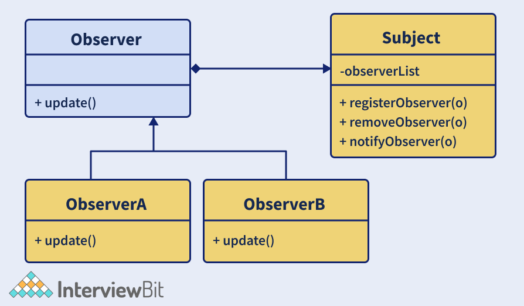
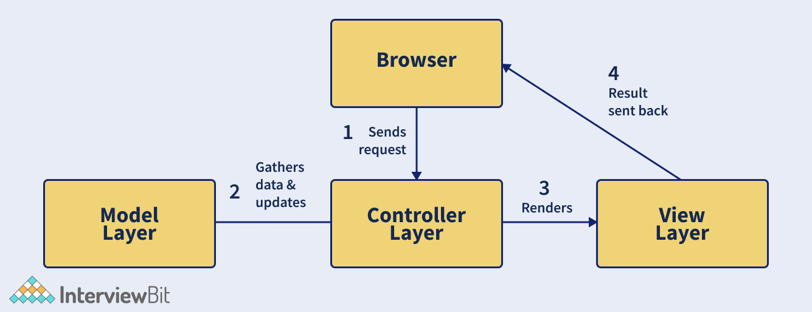

# Câu hỏi phỏng vấn về Design Pattern

Các design pattern là các giải pháp mẫu có thể tái sử dụng để giải quyết các vấn đề phổ biến trong phát triển phần mềm như lặp code, các pattern có thể sử dụng lại, các chức năng dư thừa, v.v. Chúng tương tự như các bản thiết kế có thể tùy chỉnh để giải quyết bất kỳ vấn đề nào. Khái niệm này được Christopher Alexander mô tả lần đầu tiên và sau đó được 4 tác giả -  Erich Gamma, John Vlissides, Ralph Johnson, and Richard Helm - thường được biết đến với cái tên Gang of Four xuất bản trong cuốn sách Design Patterns: Elements of Reusable Object-Oriented Software vào năm 1994. Design Patterns dạy các dev cách giải quyết các vấn đề thường lặp lại mà không tốn quá nhiều thời gian và công sức trong khi phát triển các giải pháp cho chúng. Do đó, nhu cầu cho các nhà phát triển phần mềm biết các pattern này đã tăng lên rất nhiều.

## Câu hỏi phỏng vấn Design Pattern cho Fresher

### 1. Design pattern là gì?

Design pattern là các giải pháp có thể tái sử dụng để giải quyết các vấn đề chung của phát triển phần mềm. Những vấn đề này bao gồm code lặp lại, các chức năng và logic dư thừa, v.v. Những vấn đề này giúp tiết kiệm đáng kể công sức và thời gian cần thiết cho các dev trong khi phát triển phần mềm. Các design pattern thường được sử dụng trong các sản phẩm phần mềm hướng đối tượng bằng cách kết hợp các phương pháp hay nhất và thúc đẩy khả năng tái sử dụng để phát triển mã mạnh mẽ. 



### 2. Design pattern trong Java?

Trong java, các pattern rất linh hoạt và dễ dàng xác định code lặp lại không mong muốn. Kiến trúc phần mềm có thể tuỳ chỉnh theo từng yêu cầu. Một vài lợi ích của sử dụng design pattern trong Java:

- Có thể tái sử dụng cho nhiều dự án.
- Cung cấp giải pháp mẫu cho thiết kế kiến trúc hệ thống.
- Chúng cung cấp sự minh bạch cho thiết kế phần mềm.
- Chúng là những giải pháp đã được thử nghiệm và chứng minh để phát triển phần mềm mạnh mẽ một cách dễ dàng.

### 3. Mô tả một design pattern như thế nào?

- Xác định tên và nhóm của design pattern sẽ thuộc về.
- Mô tả vấn đề và giải pháp phù hợp.
- Tìm các biến thể và lựa chọn ngôn ngữ cho vấn đề cần giải quyết.
- Các trường hợp thời gian thực và hiệu quả của pattern này.

### 4. Các kiểu design pattern?

- **Creational Pattern** cung cấp các cơ chế tạo đối tượng để tăng tính linh hoạt và tái sử dụng code hiện có.
    - Factory Method
    - Abstract Factory
    - Builder
    - Prototype
    - Singleton
- **Structural Pattern** giải thích cách tập hợp các đối tượng và lớp thành các cấu trúc lớn hơn, trong khi vẫn giữ cho cấu trúc linh hoạt và hiệu quả.
    - Adapter
    - Bridge
    - Composite
    - Decorator
    - Facade
    - Flyweight
    - Proxy
- **Behavioral Pattern** quan tâm đến việc giao tiếp hiệu quả và phân công nhiệm vụ giữa các đối tượng.
    - Chain Of Responsibility
    - Command
    - Iterator
    - Mediator
    - Memento
    - Observer
    - State
    - Strategy
    - Template Method
    - Visitor


### 5. Inversion of Control là gì?

**Inversion of Control (IoC)** là một nguyên lý thiết kế trong công nghệ phần mềm trong đó các thành phần nó dựa vào để làm việc bị đảo ngược quyền điều khiển khi so sánh với lập trình hướng thủ thục truyền thống.

Dependency injection (DI) là một mô hình triển khai từ nguyên lý IoC, là một kỹ thuật trong lập trình trong đó một đối tượng cung cấp những phụ thuộc (dependency - là đối tượng, dịch vụ, chức năng) của đối tượng khác.

Ví dụ: ta có lớp `A` sử dụng lớp `B` như bên dưới:

```java
public class A{
    private B b;
    
    public A(){
        this.b = new B();
    }
}
```

Ở đây, ta có phụ thuộc giữa lớp A và B. Nếu bạn triển khai IoC, bạn sẽ không phải dùng toán tử `new` để gán giá trị. 

```java
public class A {
    private IocB b;
    public A(IocB b) {
        this.b = b;
    }
}
```

Chúng ta đã dùng IoC cho việc khởi tạo đối tượng của lớp `B` cho lớp `IocB`.

### 6. GoF là gì?

**Gang of Four** (GOF) là 4 người đã phát minh ra khái niệm design pattern. Họ là Erich Gamma, Ralph Johnson, Richard Hel and John Vlissides. Những người này đã viết về các design pattern trong quyển sách "Design Patterns: Elements of Reusable Object-Oriented Software" năm 1995. Nếu không có họ, các nhà phát triển phần mềm sẽ lãng phí thời gian giải quyết các vấn đề có tính chất lặp lại thay vì tập trung vào các yêu cầu nghiệp vụ.

### 7. Các nguyên tắc SOLID là gì?

Nguyên tắc SOLID là các nguyên tắc hướng đối tượng được Robert C. Martin giới thiệu trong bài báo cáo "Design Principles and Design patterns" năm 2000. 


- **S - Single Responsibility Principle (SRP):** nguyên tắc trách nhiệm đơn nhất đảm bảo tất cả lớp hay module chỉ chịu trách nhiệm cho một chức năng duy nhất. 

- **O - Open Closed Principle (OCP):** nguyên tắc đóng mở cho phép tất cả lớp đều mở cho bổ sung nhưng đóng cho chỉnh sửa. Ở đây ta cho phép mở rộng hành vi các thực thể nhưng không được chỉnh sửa code đã tồn tại.
- **L - Liskov Substitution Principle(LSP):** nguyên tắc Liskoy nói rằng trạng thái của đối tượng có thể thay thế bằng các thể hiện con mà không ảnh hưởng đến tính đúng đắn của chương trình.
- **I - Interface Segregation Principle (ISP):** nguyên tắc phân tách interface nêu rõ rằng có thể sử dụng nhiều interface cụ thể cho các yêu cầu của client thay vì interface chung. Client không bị buộc phải thực hiện các chức năng mà họ không yêu cầu
- **D - Dependency Inversion Principle:** ở đây các module ở level cao nên độc lập với các module level thấp. Các module cao được xem là trừu tượng và module thấp là những triển khai cụ thể.

### 8. Bạn hiểu nguyên tắc đóng mở như thế nào?

Nguyên tắc Đóng mở quy định rằng bất kỳ lớp, thành phần hoặc thực thể nào phải mở để mở rộng nhưng đóng để sửa đổi. Một lớp có thể được mở rộng thông qua kế thừa, interface, hay composition bất cứ khi nào nhận được yêu cầu mới thay vì sửa đổi code của lớp. Hãy xem xét một trường hợp trong đó chúng ta có một lớp tính diện tích của một hình vuông. Sau đó, ta nhận được yêu cầu tính diện tích hình chữ nhật. Ở đây, thay vì sửa đổi lớp ban đầu, chúng ta có thể tạo một lớp cơ sở và lớp cơ sở này có thể được mở rộng bằng lớp hình chữ nhật mới.

### 9. Design pattern trong thư viện JDK của Java?

* **Decorator pattern** được dùng cho các lớp `Wrapper`.
* **Singleton pattern** được dùng cho các lớp `Calendar` và `Runtime`.
* **Factory pattern** được dùng cho các phương thức như `Integer.valueOf` trong các lớp `wrapper`.
* **Observer pattern** được dùng cho xử lý sự kiện framework như `awt`, `swing`,...


### 10.Design pattern và design principles khác nhau như thế nào?

**Design principles (Nguyên tắc thiết kế):** là những nguyên tắc được tuân theo trong khi thiết kế hệ thống phần mềm cho bất kỳ nền tảng nào hay phải sử dụng bất kỳ ngôn ngữ lập trình nào. Các nguyên tắc SOLID là các nguyên tắc thiết kế mà chúng ta tuân theo để phát triển các hệ thống phần mềm mạnh mẽ, có thể dễ dàng mở rộng. Những điều này áp dụng cho tất cả các khía cạnh của lập trình.

**Design pattern (Mẫu thiết kế):** là các giải pháp mẫu có thể tái sử dụng cho các vấn đề thường xảy ra có thể được tùy chỉnh theo yêu cầu của vấn đề. Đây là những giải pháp đã được thực hiện tốt, được thử nghiệm đúng cách và an toàn khi sử dụng. Mô hình thiết kế Factory, mô hình Singleton, mô hình Strategy là một vài trong số các ví dụ về các mẫu thiết kế.

### 11. Các design pattern khác các thuật toán như thế nào?

Cả design pattern và thuật toán đều mô tả các giải pháp điển hình cho bất kỳ vấn đề nào đã cho. Nhưng sự khác biệt chính là thuật toán xác định một tập hợp các hành động rõ ràng để đạt được mục tiêu còn design pattern cung cấp mô tả cấp cao về bất kỳ giải pháp nào. Các design pattern áp dụng cho hai vấn đề khác nhau có thể giống nhau nhưng logic thực hiện sẽ khác nhau dựa trên các yêu cầu.

## Câu hỏi phỏng vấn design pattern cho Experienced

### 12. Design pattern Factory là gì?

Factory thuộc nhóm design pattern creational. Ở đây các đối tượng được tạo mà không để lộ logic của việc tạo ra cho client. Bởi vì các đối tượng tham chiếu đến interface chung.

Ví dụ: Ta có 3 lớp `Square`, `Triangle` và `Rectangle`. Ta sẽ sử dụng design pattern factory cho tạo đối tượng từ 3 lớp mà không để lộ logic tạo bằng cách dùng lớp `ShapeFactory`. Lớp `Driver` sẽ truyền thông tin như RECTANGLE/SQUARE/TRIANGLE đến đối tượng cần thiết. Sơ đồ UML cho trường hợp này:



Bây giờ ta triển khai code cho ví dụ trên:

**Bước 1:** Tạo interface Shape

```java
//Shape.java
public interface Shape {
    void draw();
}
```

**Bước 2:** Tạo lớp cụ thể Rectangle, Square, Triangle sử dụng triển khai interface Shape.

```java
//Rectangle.java
public class Rectangle implements Shape {
    @Override
    public void draw() {
        System.out.println("Rectangle Drawn");
    }
}
```

```java
//Square.java
public class Square implements Shape {
    @Override
    public void draw() {
        System.out.println("Square Drawn");
    }
}
```

```java
//Triangle.java
public class Triangle implements Shape {
    @Override
    public void draw() {
        System.out.println("Triangle Drawn");
    }
}
```

**Bước 3:** Tạo lớp ShapeFactory và tạo một phương thức gọi là `getShapeInstance()` cho tạo đối tượng ở lớp cụ thể:

```java
//ShapeFactory.java
public class ShapeFactory {
    //the method will be used to get object of required shape
    public Shape getShapeInstance(String type){
        if(type == null){
            return null;
        } 
        if(type.equalsIgnoreCase("TRIANGLE")){
            return new Triangle();
        } else if(type.equalsIgnoreCase("SQUARE")){
            return new Square();
        } else if(type.equalsIgnoreCase("RECTANGLE")){
            return new Rectangle();
        }
        return null;
    }
}
```

**Bước 4:** Triển khai lớp Driver và sử dụng lớp factory để lấy đối tượng của kiểu được yêu cầu.

```java
//Driver.java
public class Driver {
    public static void main(String[] args) {
        ShapeFactory shapeFactory = new ShapeFactory();
        //get Triangle object and call draw()
        Shape triangle = shapeFactory.getShape("Triangle");
        triangle.draw();
        //get Rectangle object and call draw()
        Shape rectangle = shapeFactory.getShape("RECTANGLE");
        rectangle.draw();
        //get Square object and call draw()
        Shape square = shapeFactory.getShape("SQUARE");
        square.draw();
    }
}
```

**Bước 5:** Xem kết quả

```text
Triangle Drawn
Rectangle Drawn
Square Drawn
```

#### Các ưu điểm của design pattern factory là:

- Cho phép ẩn logic tạo của ứng dụng bằng cách sử dụng các interface và các lớp factory.
- Nó cho phép kiểm tra tính liền mạch của ứng dụng bằng cách sử dụng mô hình.
- Tạo kết nối mềm trong ứng dụng bằng cách cho phép sự linh hoạt trong việc triển khai các phương thức khi các lớp mới được thêm vào.

### 13. Design pattern Adapter là gì?

Thuộc nhóm design pattern structural để các đối tượng không tương thích cộng tác với nhau. Nó hành động như một wrapper giữa hai đối tượng khác nhau. Adapter nhận cuộc gọi từ một đối tượng và biến đổi chúng để đối tượng thứ hai có thể nhận.

Để dễ hiểu ta lấy ví dụ về bộ chuyển đổi từ USB sang Ethernet. Khi ta có một đầu là ethernet và đầu kia là USB, hai đầu này không tương thích nhau nên ta cần có một bộ chuyển đổi. Lớp `Client` sẽ mong đợi một số kiểu đối tượng và nó có lớp `Adaptee` có thể cung cấp tính năng tương tư nhưng bằng một interface khác. Bây giờ để cả hai giao tiếp, chúng ta có một lớp `Adapter`, `Client` yêu cầu `Adapter` sử dụng interface `Target`. Lớp `Adapter` dịch yêu cầu bằng interface `Adaptee`. `Client` nhận được kết quả mà không biết về vai trò của bộ chuyển đổi. Ta có sơ đồ lớp như bên dưới.



Bây giờ ta xem xét một interface `MediaPlayer` được triển khai bởi lớp `AudioPlayer`. `AudioPlayer` có thể chạy bài hát định dạng mp3. Mặt khác interface `AdvancedPlayer` được triển khai bởi lớp `MP4Player` có thể chạy định dạng mp4 và `WAVPlayer` chạy định dạng wav. Nếu ta muốn `AudioPlayer` chạy tất cả định dạng, ta phải sử dụng `MediaAdapter` để triển khai `MediaPlayer` và sử dụng đối tượng `AdavancedPlayer` cho các định dạng cần thiết. Code cho trường hợp này như sau:

```java
//MediaPlayer.java
public interface MediaPlayer {
    public void play(String format, String file);
}
```

```java
//AdvancedPlayer.java
public interface AdvancedPlayer { 
    public void playMp4(String file);
    public void playWav(String file);
}
```

```java
//Mp4Player.java
public class Mp4Player implements AdvancedPlayer{
    @Override
    public void playMp4(String file) {
        System.out.println("MP4 File "+ file + " Playing....");  
    }
    
    @Override
    public void playWav(String file) {
        //do nothing
    }
}
```

```java
//WAVPlayer.java
public class WAVPlayer implements AdvancedPlayer{
    @Override
    public void playMp4(String file) {
        //do nothing
    }
    
    @Override
    public void playWav(String file) {
        System.out.println("WAV File "+ file + " Playing....");  
    }
}
```

```java
//MediaAdapter.java
public class MediaAdapter implements MediaPlayer {
    AdvancedPlayer advancedPlayer;
    public MediaAdapter(String format){
        if(format.equalsIgnoreCase("mp4") ){
            advancedPlayer = new Mp4Player();   
        }else if(format.equalsIgnoreCase("wav") ){
            advancedPlayer = new WAVPlayer();   
        }
    }
    @Override
    public void play(String format, String file) {
    
        if(format.equalsIgnoreCase("mp4")){
            advancedPlayer.playMp4(file);
        }
        else if(format.equalsIgnoreCase("wav")){
            advancedPlayer.playWav(file);
        }
    }
}
```

```java
//AudioPlayer.java
public class AudioPlayer implements MediaPlayer {
    MediaAdapter mediaAdapter;
    @Override
    public void play(String format, String file) {  
        //inbuilt support to play mp3 music files
        if(format.equalsIgnoreCase("mp3")){
            System.out.println("MP3 file " + file +" Playing...");   
        } 
        //Make use of Adapter to support different formats
        else if(format.equalsIgnoreCase("wav") || format.equalsIgnoreCase("mp4")){
            mediaAdapter = new MediaAdapter(format);
            mediaAdapter.play(format, file);
        }
        else{
            System.out.println("Format not supported");
        }
    }   
}
```

```java
//Driver.java
public class Driver {
    public static void main(String[] args) {
        AudioPlayer audioPlayer = new AudioPlayer();
        audioPlayer.play("mp3", "music1.mp3");
        audioPlayer.play("wav", "music2.wav");
        audioPlayer.play("mp4", "music3.mp4");
        audioPlayer.play("avi", "music4.avi");
    }
}
```

Và đây là kết quả:

```text
MP3 file music1.mp3 Playing...
WAV File music2.wav Playing...
MP4 File music3.mp4 Playing...
Format not supported
```

### 14. Design pattern Proxy là gì?

Proxy thuộc nhóm structural, dùng ddeer biểu diễn một chức năng cho các lớp khác. Pattern này cho phép chúng ta tạo một vật thay thế cho một đối tượng khác, vật này được gọi là đối tượng proxy. Giúp kiểm soát quyền truy cập vào đối tượng ban đầu và cho phép thực hiện nhiều tác vụ trước hoặc sau khi yêu cầu đến đối tượng ban đầu.



Như hình ở trên, ta có interface `ServiceInterface` cho các thao tác. Interface này được triển khai bởi lớp `Service` và `Proxy`. Lớp `Service` chứa logic nghiệp vụ hữu ích và lớp `Proxy` chứa tham chiếu trỏ đến đối tượng `service`. Sau khi proxy hoàn thành quá trình lazy initialization, logging, caching,.. yêu cầu sẽ được truyền đến đối tượng service. Và cuối cùng, ta có client làm việc với service và proxy bằng cách dùng interface. 

### 15. Design pattern Bridge là gì?

Cũng thuộc nhóm structural design pattern giúp chia một lớp lớn thành một 2 hệ thống phân cấp lớp - trừu tượng và triển khai. Các hệ thống phân cấp này là độc lập và được dùng bất cứ khi nào cần tách sự trừu tượng khỏi triển khai. Điều này gọi là Bridge pattern bởi vì nó hành động như một cây cầu giữa lớp trừu tường và lớp triển khai. Trong pattern này, lớp trừu tượng và lớp triển khai có thể được chỉnh sửa độc lập mà không ảnh hưởng lẫn nhau.



Trong hình trên ta có 4 thành phần chính trong pattern này là:
- **Abstraction** – Đây là cốt lỗi của pattern, nó bao gồm một tham chiếu đến cho Implementer.
- **Refined Abstraction** – là mở rộng của abstraction nó lấy chi tiết yêu cầu và ẩn chúng với implementers.
- **Implementer** – là interface cho các lớp implementation.
- **Concrete Implementation** – Đây là các lớp triển khai cụ thể triển khai interface Implementer.

### 16. Một số trường hợp mà chúng ta thích các lớp trừu tượng hơn các interface trong Java?

Cả lớp trừu tượng và interface trong Java đều tuân theo nguyên tắc code cho interface thay vì implementation. Nguyên tắc này đảm bảo rằng tính linh hoạt được thêm vào code để giải quyết các yêu cầu động. Một số gợi ý để quyết định nên thích cái nào hơn:
- Java chỉ cho phép mở rộng một lớp và triển khai nhiều interface. Nếu chúng ta mở rộng một lớp thì ta không thể mở rộng các lớp khác. Trong trường hợp này, tốt hơn là triển khai interface ở bất cứ nơi đâu có thể và chỉ kế thừa các lớp cho những lớp quan trọng.
- Interface được dùng để biểu diễn hành vi của lớp. Java cho phép triển khai nhiều interface đó là lý do tại sao ta có thể dùng interface để giúp lớp có nhiều hành vi cùng lúc.
- Lớp trừu tượng nhanh hơn interface. Chúng có thể dùng cho các ứng dụng xem trọng thời gian.
- Trong trường hợp có các hành vi chung trên hệ thống phân cấp kế thừa, chúng có thể được mã hóa tại một nơi trong các lớp trừu tượng. Interface và lớp trừu tượng cũng có thể được sử dụng cùng nhau để định nghĩa một hàm trong interface và một chức năng trong lớp trừu tượng.

### 17. Chain of Responsibility là gì? Trong trường hợp nào thì áp dụng pattern này?

Chain of Responsibility thuộc nhóm behavioural design pattern để truyền yêu cầu theo một chuỗi xử lý. Bất cứ khi nào nhận được yêu cầu, trình xử lý quyết định xử lý yêu cầu hay truyền nó cho trình xử lý kế tiếp trong chuỗi. Nó được dùng để kết nối mềm trong đó yêu cầu của client được chuyển qua một chuỗi đối tượng xử lý.



Trong ảnh trên nó có 3 thành phần chính là:
- **Client**: điểm gửi yêu cầu gốc và thành phần truy cập trình xử lý để xử lý yêu cầu.
- **Handler**: có thể là lớp hay interface để nhận yêu cầu và gửi nó đến chuỗi xử lý. Handler này được biết như là trình xử lý đầu tiên trong chuỗi.
- **Concrete Handlers**: là những trình xử lý yêu cầu thực tế theo thứ tự tuần tự.

Ứng dụng của CoR:
- Bất cứ khi nào ta muốn tách người gửi và người nhận yêu cầu.
- Bất cứ khi nào ta muốn nhiều đối tượng xử lý một yêu cầu trong thời gian chạy.
- Bất cứ khi nào ta không muốn chỉ định rõ ràng các trình xử lý trong mã.
- Bất cứ khi nào ta muốn đưa ra một yêu cầu đến một số đối tượng mà không chỉ định rõ ràng các trình xử lý.

### 18. Design Pattern Decorator là gì?

Thuộc nhóm structural design pattern cho phép người dùng thêm tính năng vào đối tượng đã tồn tại mà không phải chỉnh sửa cấu trúc của nó. Pattern này tạo một lớp gọi là decorator hành động như một *wrapper*, bọc đối tượng đã tồn tại bằng cách giữ nguyên đặc trưng của các phương thức lớp. Pattern này sử dụng lớp trừu tượng và itnerface với composition để triển khai wrapper. Chúng chủ yếu được sử dụng để áp dụng SRP (Nguyên tắc Trách nhiệm Đơn lẻ) khi ya phân chia các chức năng thành các lớp với các mối quan tâm duy nhất. Pattern này có cấu trúc tương tự như CoR ở trên. Các bước triển khai decorator:
- Tạo một interface và lớp cụ thể triển khai interface này.
- Tạo lớp trừu tượng decorator để triển khai interface trên.
- Tạo lớp decorator cụ thể mở rộng từ lớp trừu tượng ở trên.
- Sử dụng lớp decorator cụ thể để thêm tính năng cho đối tượng interface và xác minh kết quả.

Ta làm thử ví dụ để dễ hiểu. Ở đây ta tạo interface `Shape` và các lớp cụ thể của nó `Rectangle` và `Triangle` để triển khai interface này. Ta sẽ tạo lớp trừu tượng là `ShapeDecorator` để triển khai interface `Shape`. Sau đó ta tạo `RedColorDecorator` mở rộng từ `ShapeDecorator`. Ta sẽ sử dụng decorator này cho các triển khai tính năng.



- Tạo interface Shape:

```java
// Shape.java
public interface Shape {
    void draw();
}
```

- Tạo lớp cụ thể Rectangle và Triangle để triển khai interface trên

```java
// Rectangle.java
public class Rectangle implements Shape {
    // Overriding the draw method
    @Override public void draw()
    {
        System.out.println("Rectangle Drawn...");
    }
}
```

```java
// Triangle.java
public class Triangle implements Shape {
    // Overriding the draw method
    @Override public void draw()
    {
        System.out.println("Triangle Drawn...");
    }
}
```

- Tạo lớp trừu tượng ShapeDecorator triển khai interface Shape:

```java
// ShapeDecorator.java
public abstract class ShapeDecorator implements Shape {
    protected Shape shapeDecorated;
    public ShapeDecorator(Shape shapeDecorated)
    {
        this.shapeDecorated = shapeDecorated;
    }
    public void draw() { 
        shapeDecorated.draw(); 
    }
}
```

- Tạo RedColorDecorator mở rộng rừ lớp ShapeDecorator:

```java
// RedColorDecorator.java
public class RedColorDecorator extends ShapeDecorator {
    public RedColorDecorator(Shape shapeDecorated)
    {
        super(shapeDecorated);
    }
    @Override 
    public void draw()
    {
        shapeDecorated.draw();
        setRedBorder(shapeDecorated);
    }
    private void setRedBorder(Shape shapeDecorated)
    {
        System.out.println("Red color border added...");
    }
}
```

- Triển khai lớp Driver cho demo:

```java
// Driver.java
public class Driver {
    // Main driver method
    public static void main(String[] args)
    {
    
        Shape triangle = new Triangle();
        Shape redTriangle
            = new RedColorDecorator(new Triangle());
        Shape redRectangle = new RedColorDecorator(new Rectangle());
        // Draw normal triangle
        triangle.draw();
        System.out.println(".........");
        // make the triangle red
        redTriangle.draw();
        System.out.println(".........");
        // make the rectangle red
        redRectangle.draw();
        System.out.println(".........");
    }
}
```

Xác minh kết quả ở output:

```text
  Triangle Drawn...
   .........
   Triangle Drawn...
   Red color border added...
   .........
   Rectangle Drawn...
   Red color border added...
   .........
```

### 19. Command là gì?

Thuộc nhóm behavioural design pattern dùng để truyền đổi một yêu cầu thành một đối tượng độc lập bao gồm các chi tiết của yêu cầu đó. Pattern này là một data-driven pattern vì ta sử dụng thông tin về yêu cầu bằng cách bọc nó dưới dạng một đối tượng và chuyển đến đối tượng invoker dưới dạng một command. Đối tượng invoker kiểm tra đối tượng có thể xử lý command và truyền cho nó để thực thi.



Ta thấy client gọi đến invoker để thực thi command. Ta có interface Command hành động như một sự trừu tượng hóa đối với các lớp cụ thể bên dưới.

Lấy ví dụ với điều khiển từ xa chỉ có một nút bấm. Sử dụng nút này ta sẽ điều khiển hành vi của hai đối tượng là radio và tubelight. Lệnh điều khiển sẽ được triển khai bằng cách dùng command pattern.

- Tạo interface Command:

```java
// Command Interface
interface Command
{
    public void execute();
}
```

- Tạo lớp tubelight và lớp commands của nó được mở rộng từ interface trên.

```java
// Tubelight class
class TubeLight
{
    public void lightOn(){
        System.out.println("TubeLight on...");
    }
    public void lightOff(){
        System.out.println("TubeLight off...");
    }
}
// Command class to turn on the tubelight
class TubeLightOnCommand implements Command
{
    TubeLight tubeLight;
    // The constructor is passed the light it
    // is going to control.
    public TubeLightOnCommand(TubeLight tubeLight){
        this.tubeLight = tubeLight;
    }
    public void execute(){
        tubeLight.lightOn();
    }
}
// Command class to turn off the tubelight
class TubeLightOffCommand implements Command
{
    TubeLight tubeLight;
    public TubeLightOffCommand(TubeLight tubeLight) {
        this.tubeLight = tubeLight;
    }
    public void execute() {
        tubeLight.lightOff();
    }
}
```

- Tạo lớp Radio tương tự

```java
// Radio class
class Radio
{
    public void radioOn()
    {
        System.out.println("Radio on ...");
    }
    public void radioOff()
    {
        System.out.println("Radio off...");
    }
    public void setVolume(int volumeLevel)
    {
        // code to set the volume
        System.out.println("Radio volume set to " + volumeLevel);
    }
}
// Command class to turn on the radio
class RadioOnCommand implements Command
{
    Radio radio;
    public RadioOnCommand(Radio radio)
    {
        this.radio = radio;
    }
    public void execute()
    {
        radio.radioOn();
    }
}
// Command class to set the volume of the radio
class RadioVolumeCommand implements Command
{
    Radio radio;
    int volumeLevel;
    public RadioVolumeCommand(Radio radio, int volumeLevel)
    {
        this.radio = radio;
        this.volumeLevel=volumeLevel;
    }
    public void execute()
    {
        radio.setVolume(volumeLevel);
    }
}
```

- Tạo lớp RemoteControl chỉ có một nút và khi click thực thi chức năng ấy.

```java
// remote control with one button 
class RemoteControl{
    Command button; // only one button
    public RemoteControl(){}
    public void setCommand(Command command){
        // set the command the remote will
        // execute
        button = command;
    }
    public void pressButton(){
        // execute the command on click (call) of the button
        button.execute();
    }
}
```

- Tạo lớp Driver triển khai pattern. Ở đây, đầu tiên chúng ta sẽ bật tubelight bằng lần click đầu tiên của nút, ở lần click tiếp theo, chúng ta sẽ bật radio, sau đó chúng ta sẽ đặt âm lượng của radio thành 4 và sau đó chúng ta sẽ tubelight.

```java
// Driver class
public class Driver
{
    public static void main(String[] args)
    {
            RemoteControl remote = new RemoteControl();
            TubeLight tubeLight = new TubeLight();
            Radio radio = new Radio();
            // Turn on Tubelight
            remote.setCommand(new TubeLightOnCommand(tubeLight));
            remote.pressButton();
            //Turn on Radio
            remote.setCommand(new RadioOnCommand(radio));
            remote.pressButton();
            //Turn off Radio
            remote.setCommand(new RadioVolumeCommand(radio,4));
            remote.pressButton();
            // Turn off Tubelight
            remote.setCommand(new TubeLightOffCommand(tubeLight));
            remote.pressButton();
    }
}
```

Kết quả:

```text
TubeLight on...
Radio on ...
Radio volume set to 4
TubeLight off...
```

### 20. Design pattern Observer là gì?

Observer thuộc nhóm behavioural design pattern được dùng cho xác định một hay nhiều phụ thuộc giữa các đối tượng. Nó hữu ích khi bạn muốn thông báo bất kỳ thay đổi nào trong trạng thái đối tượng. Trong pattern này, khi trạng thái của một đối tượng thay đổi, tất cả đối tượng phụ thuộc sẽ nhận được thông báo tự động. Đối tượng có trạng thái được quan tâm gọi là Subject trong khi các phụ thuộc gọi là OBservers. Trong java ta có thể triển khai pattern này bằng cách dùng lớp `java.util.Observable` và interface `java.util.Observer`. 



3 thành phần chính:

- **Subject** - có thể là interface hoặc lớp trừu tượng định nghĩa các hoạt động cho gắn (`registerObserver()`) và tách observers (`removeObserver()`) từ subject.
- **Concrete Subject** - là lớp cụ thể của Subject. Nó duy trì trạng thái đối tượng và bất cứ khi nào xảy ra thay đổi trạng thái, observer sẽ được thông báo bằng cách dùng phương thức `notifyObservers()`.
- **Observer** - là interface hoặc lớp trừu tượng xác định hoạt động để thông báo cho đối tượng này (`update()`)

Ví dụ thực tế của pattern này là Facebook hay Twitter, mỗi khi ai đó cập nhật trạng thái, tất cả follower sẽ nhận được thông báo. 

### 21. Vấn đề mà pattern Builder giải quyết là gì?

Builder thuộc nhóm creatonal design pattern giúp xây dựng một đối tượng phức tạp theo từng bước. Pattern cho phép tạo các biểu diễn khác nhau của đối tượng trên cùng logic khởi tạo. Nó giúp tạp các lớp bất biến có một tập hợp thuộc tính rất lớn. Ở các design pattern như Factory và Abstract Factory, ta gặp phải các vấn đề sau nếu đối tượng chứa rất nhiều thuộc tính:
- Khi lượng tham số ở hàm khởi tạo là quá lớn, chương trình sẽ gặp lỗi khi chuyển từ client và lớp factory theo một thứ tự cụ thế. Sẽ trở nên khó khi duy trì thứ tự của các tham số có kiểu giống hệt nhau.
- Có một số thuộc tính là tuỳ chọn nhưng ta buộc phải gửi tất cả và để chúng ở dạng null.
- Khi việc tạo đối tượng trở nên phức tạp do có nhiều thuộc tính, độ phức tạp của lớp sẽ trở nên khó hiểu.

Các vấn đề trên có thể giải quyết bằng cách sử dụng constructor với một tham số yêu cầu. Nhưng điều này lại gây ra vấn đề khi các tham số mới được thêm vào như một phần của yêu cầu mới. Nó sẽ dẫn đến mẫu thuẫn, đó là lúc cần đến Bulder.

Pattern này giải quyết vấn đề về một số lượng lớn các thuộc tính tùy chọn và trạng thái không nhất quán bằng cách cung cấp cách xây dựng một đối tượng theo từng bước và trả về đối tượng cuối cùng bằng cách sử dụng một phương thức khác.

Các bước thực hiện:
- Tạo một lớp tĩnh lồng nhau, sao chép tất cả tham số từ lớp bên ngoài. Lớp lồng này được gọi là builder.
    - Quy ước đặt tên phải tuân theo khi đặt tên cho lớp builder này. Ví dụ nếu tên lớp là `Interview` thì tên của builder sẽ là `InterverBuilder`.
- Lớp builder phải có một hàm khởi tạo công khai vói tất cả thuộc tính là tham số.
- Lớp builder nên có phương thức để thiết lập các tham số tùy chọn và trả về cùng một đối tượng builder khi thiết lập các giá trị này.
- Cuối cùng là một phương thức `build()` trong lớp builder trả về đối tượng mà client cần. Điều này yêu cầu một constructor riêng tư trong lớp lấy builder làm tham số.

Sau đây là ví dụ về triển khai builder. Ta có lớp `User` và ta sẽ xây dựng lớp `UserBuilder` để tạo đối tượng cho lớp `User`.

```java
class User 
{
    //All final attributes
    private final String firstName; // required
    private final String lastName; // required
    private final int age; // required
    private final String phoneNbr; // optional
    private final String address; // optional
    private final String nationality; //optional

    private User(UserBuilder builder) {
        this.firstName = builder.firstName;
        this.lastName = builder.lastName;
        this.age = builder.age;
        this.phoneNbr = builder.phoneNbr;
        this.address = builder.address;
        this.nationality = builder.nationality;
    }

    //Setters are not provided to make it immutable
    public String getFirstName() {
        return firstName;
    }
    public String getLastName() {
        return lastName;
    }
    public int getAge() {
        return age;
    }
    public String getPhoneNbr() {
        return phoneNbr;
    }
    public String getAddress() {
        return address;
    }
    public String getNationality() {
        return nationality;
    }

    @Override
    public String toString() {
        return "User: "+this.firstName+" "+this.lastName+", "+this.age+", "+this.nationality+", "+this.phoneNbr+", "+this.address;
    }

    public static class UserBuilder 
    {
        private final String firstName;
        private final String lastName;
        private int age;
        private String phoneNbr;
        private String address;
        private String nationality;

        public UserBuilder(String firstName, String lastName) {
            this.firstName = firstName;
            this.lastName = lastName;
        }
        public UserBuilder age(int age) {
            this.age = age;
            return this;
        }
        public UserBuilder phoneNbr(String phoneNbr) {
            this.phoneNbr = phoneNbr;
            return this;
        }
        public UserBuilder address(String address) {
            this.address = address;
            return this;
        }
        public UserBuilder nationality(String nationality) {
            this.nationality = nationality;
            return this;
        }
        // method to return the constructed object
        public User build() {
            User user =  new User(this);
            validateUserObject(user);
            return user;
        }
        private void validateUserObject(User user) {
            //Validate of the object does not break anything
        }
    }
}
public class Driver{
    public static void main(String[] args) {
        User firstUser = new User.UserBuilder("Harry", "Potter")
        .age(30)
        .phoneNbr("1234567")
        .address("221B Baker Street - London")
        .build();
        
        System.out.println(firstUser);
        
        User secondUser = new User.UserBuilder("Ron", "Weasley")
        .age(32)
        .phoneNbr("5655")
        //no address
        .build();
        
        System.out.println(secondUser);
        
        User thirdUser = new User.UserBuilder("Hermoine", "Granger").age(20).nationality("English")
        //No age
        //No phone
        //no address
        .build();
        
        System.out.println(thirdUser);
    }
}
```

Kết quả:

```text
User: Harry Potter, 30, null, 1234567, 221B Baker Street - London
User: Ron Weasley, 32, null, 5655, null
User: Hermoine Granger, 20, English, null, null
```

### 22. Hãy xem xét tình huống mà bạn đang viết các lớp để cung cấp dữ liệu thị trường và đột nhiên ta chuyển sang nhà cung cấp khác hoặc là chuyến hướng đến Direct Exchange Feed. Bạn sẽ tiếp cận vấn đề này như thế nào để thiết kế hệ thống? 

Ta có thể làm bằng cách dùng một interface là "MarketData" sẽ bao gồm các phương thức mà khách hàng yêu cầu. MarketData nên có một MarketDataProvider làm phần phụ thuộc bằng cách sử dụng Dependency Injection. Điều này đảm bảo rằng ngay cả khi nhà cung cấp thay đổi, dữ liệu thị trường sẽ không bị ảnh hưởng. 

### 23. Null Object pattern là gì?

Trong pattern này, một đối tượng null được sử dụng để thay thế việc kiểm tra xác thực một thực thể đối tượng là null hay không. Đối tượng Null này có mối quan hệ “không làm gì cả” và chúng có thể được sử dụng để cung cấp hành vi mặc định nếu dữ liệu không có sẵn.

### 24. MVC là gì?

MVC là viết tắt của Model-View-Controller. Pattern này tách ứng dụng thành ba phần:
- Model - Biểu diễn đối tượng của dữ liệu. Nó cũng bao gồm logic cho cập nhật controller khi dữ liệu thay đổi.
- View - Biểu diễn trực quan của dữ liệu ở model.
- Controller - Đây là interface giữa Model và View bằng cách điều khiển luồng dữ liệu trong model và cập nhật view bất cứ khi nào model thay đổi. Nó đảm bảo rằng model và view độc lập.



Ảnh trên đại diện cho luồng yêu cầu xảy ra trong MVC. Đầu tiên, trình duyệt (client) gửi yêu cầu đến một trang cho controller của server. Controlelr gọi model lấy dữ liệu và gửi phản hồi. Phản hồi sau đó được gửi đến view để hiển thị. Chế độ view sẽ gửi đến client để hiển thị.
