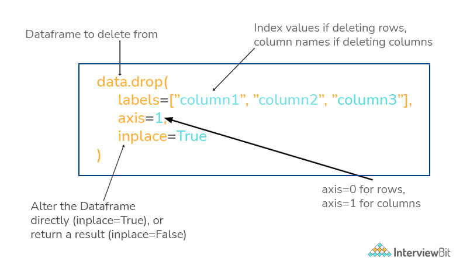
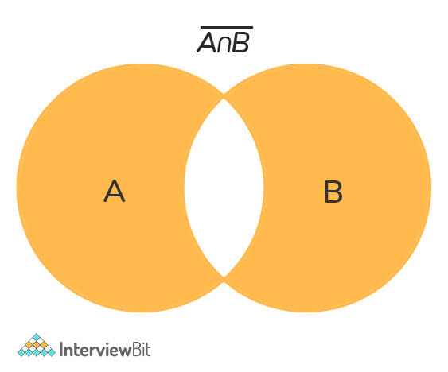

# Câu hỏi phỏng vấn Pandas

## Pandas là gì?


Pandas là một thư viện mã nguồn mở được phát triển bởi Wes McKinney vào năm 2008. Pandas được sử dụng chủ yếu để thao tác, phân tích và dọn dẹp dữ liệu. Pandas cung cấp rất nhiều cấu trúc dữ liệu cũng như các phép tính hỗ trợ thao tác dữ liệu số và dữ liệu thời gian(time series). Pandas nhanh, mạnh và hiệu quả.

Cái tên Pandas có nguồn gốc là **Panel Data**. Pandas hữu ích cho 5 thao tác chính với phân tích dữ liệu - Tải dữ liệu, quản lý, chuẩn bị, mô hình và phân tích dữ liệu.

## Câu hỏi phỏng vấn Pandas

### 1. Dataframe trong Pandas là gì?

Một dataframe là một cấu trúc bảng có thể thay đổi dùng cho biểu diễn dữ liệu được gắn nhãn với các trục - hàng và cột.

Cú pháp tạo dataframe

```py
import pandas as pd
dataframe = pd.DataFrame(data, index, columns, dtype)
```

Trong đó:
- **data** - biểu diễn các định dạng khác nhau như map, list, ndarray, series,...
- **index** - tham số tuỳ chọn dùng để biểu diễn một chỉ mục đến nhãn hàng.
- **columns** - tham số tuỳ chọn cho nhãn cột.
- **dtype** - kiểu dữ liệu cho từng cột. Cũng là tuỳ chọn.

### 2. Kết hợp các dataframe khác nhau như thế nào?

Dataframe có thể kết hợp bằng các cách như sau:
- **Phương thức append():** Phương thức này được sử dụng để xếp chồng các dataframe theo chiều ngang.

```py
df1.append(df2)
```

- **Phương thức concat():** Phương thức này được sử dụng để xếp chồng các khung dữ liệu theo chiều dọc. Nó hữu ích khi các dataframe có cùng cột và trường giống nhau.

```py
pd.concat([df1, df2])
```

- **Phương thức join():** Phương thức này dùng cho trích xuất dữ liệu từ dataframe khác có nhiều hơn một cột chung.

```py
df1.join(df2)
```

### 3. Có thể tạo một serie từ một đối tượng dictionary trong Pandas không?

Mảng một chiều có thể lưu trữ các kiểu dữ liệu khác nhau được gọi là một serie. Ta có thể tạo serie từ một đối tượng dictionary trong Pandas như sau:

```py
import pandas as pd    
dict_info = {'key1' : 2.0, 'key2' : 3.1, 'key3' : 2.2}  
series_obj = pd.Series(dict_info)    
print (series_obj)    
```

Kết quả:

```
x     2.0
y     3.1
z     2.2
dtype: float64
```

Nếu một chỉ mục không được chỉ định trong phương thức input, thì các khoá của dictionary được sắp xếp theo thứ tự tăng dần để tạo chỉ mục. Trong trường hợp chỉ mục được truyền vào, thì các giá trị của nhãn chỉ mục sẽ được trích xuất từ dictionary.

### 4. Cách xác định và xử lý giá trị bị mất trong dataframe?

Ta có thể xác định nếu một dataframe mất dữ liệu bằng cách dùng phương thức `isnull()` và `isna()`.

```py
missing_data_count=df.isnull().sum()
```

Ta có thể xử lý dữ liệu bị mất bằng cách thay giá trị trong cột với 0:

```py
df['column_name'].fillna(0)
```

Hoặc thay thế với giá trị trung bình của cột

```py
df['column_name'] = df['column_name'].fillna((df['column_name'].mean()))
```

### 5. Reindexing trong Pandas là gì?

Reindexing là quá trình điều chỉnh dataframe thành một chỉ mục mới với logic điền tuỳ chọn. Nếu các giá trị bị thiếu trong chỉ mục trước, thì `NaN/NA` được đặt vào vị trí.  Một đối tượng mới được trả về trừ khi chỉ mục mới được tạo ra tương đương với chỉ mục hiện tại. Giá trị sao chép được đặt thành `False`. Điều này cũng được sử dụng để thay đổi chỉ mục của các hàng và cột trong dataframe. 

### 6. Cách thêm cột vào dataframe?

```py
import pandas as pd      
data_info = {'first' : pd.Series([1, 2, 3], index=['a', 'b', 'c']),    
       'second' : pd.Series([1, 2, 3, 4], index=['a', 'b', 'c', 'd'])}    
  
df = pd.DataFrame(data_info)    
#To add new column third
df['third']=pd.Series([10,20,30],index=['a','b','c'])    
print (df)    
#To add new column fourth
df['fourth']=df['first']+info['third']    
print (df)   
```

### 7. Các xoá chỉ mục, hàng và cột khỏi dataframe?

#### Để xoá mục

- Thực thi `del df.index.name` cho xoá chỉ mục bằng tên.
- Hoặc gán `df.index.name` với None.

Ví dụ ta có dataframe:

```text
                Column 1
    Names             
    John               1
    Jack               2
    Judy               3
    Jim                4
```

Để xoá chỉ mục tên "Names":

```py
df.index.name = None
# Or run the below:
# del df.index.name
print(df)
```

Kết quả

```
        Column 1
John          1
Jack          2
Judy          3
Jim           4
```

#### Để xoá hàng/cột 

- Phương thức `drop()` được dùng để xoá hàng/cột khỏi dataframe.
- Đối số trục được truyền cho phương thức drop trong đó nếu giá trị là 0, nó chỉ ra là xóa một hàng còn nếu là 1, nó phải xoá cột.
- Ngoài ra, chúng ta có thể  xóa các hàng/cột tại chỗ bằng cách đặt giá trị `inplace` thành `True`. Điều này đảm bảo rằng công việc được hoàn thành mà không cần phải phân công lại.
- Có thể xóa các giá trị trùng lặp từ hàng/cột bằng cách sử dụng phương thức `drop_duplicates()`.



### 8. Có thể lấy mục từ serie A mà không ảnh hưởng đến serie B?

Điều này có thể thực hiện bằng cách sử dụng phương thức `~` (ký hiệu phủ định) và `isin()` như dưới đây.

```py
import pandas as pd
df1 = pd.Series([2, 4, 8, 10, 12])
df2 = pd.Series([8, 12, 10, 15, 16])
df1=df1[~df1.isin(df2)]
print(df1)
```

Kết quả:

```text
Output:
0    2
1    4
dtype: int64
```

### 9. Có thể lấy phần không trùng của serie A và B hay không?



Chúng ta có thể thực hiện được điều này bằng cách thực hiện kết hợp cả hai serie, rồi lấy giao điểm của cả hai serie. Sau đó, chúng ta tiếp cận để lấy các mục của phần kết hợp mà không có trong danh sách giao điểm.

Code minh hoạ như sau:

```py
import pandas as pd
import numpy as np
df1 = pd.Series([2, 4, 5, 8, 10])
df2 = pd.Series([8, 10, 13, 15, 17])
p_union = pd.Series(np.union1d(df1, df2))  # union of series
p_intersect = pd.Series(np.intersect1d(df1, df2))  # intersection of series
unique_elements = p_union[~p_union.isin(p_intersect)]
print(unique_elements)
```

Kết quả:

```text
0     2
1     4
2     5
5    13
6    15
7    17
dtype: int64
```

### 10. Trong khi import dữ liệu từ các nguồn khác nhau, có thể xác định ngày tháng hay không?

Có, nhưng với một số trợ giúp. Chúng ta cần thêm đối số `parse_dates` trong khi đang đọc dữ liệu từ các nguồn. Hãy xem xét một ví dụ trong đó ta đọc dữ liệu từ file CSV, ta có thể gặp các định dạng ngày giờ khác nhau mà thư viện Pandas không thể đọc được. Trong trường hợp này, Pandas cung cấp sự linh hoạt để xây dựng trình phân tích cú pháp ngày tùy chỉnh với sự trợ giúp của các hàm lambda như bên dưới:

```py
import pandas as pd
from datetime import datetime
dateparser = lambda date_val: datetime.strptime(date_val, '%Y-%m-%d %H:%M:%S')
df = pd.read_csv("some_file.csv", parse_dates=['datetime_column'], date_parser=dateparser)
```