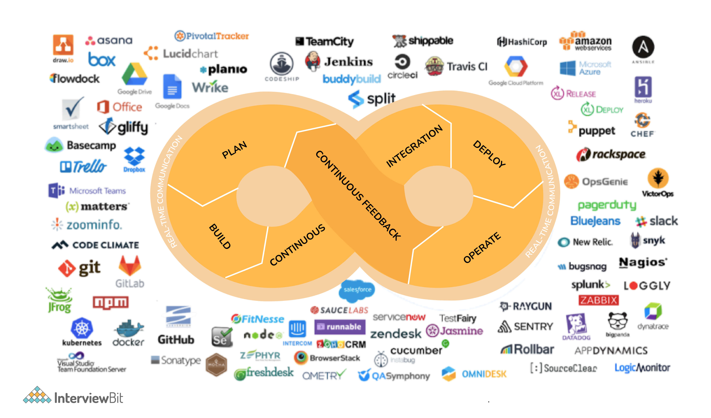
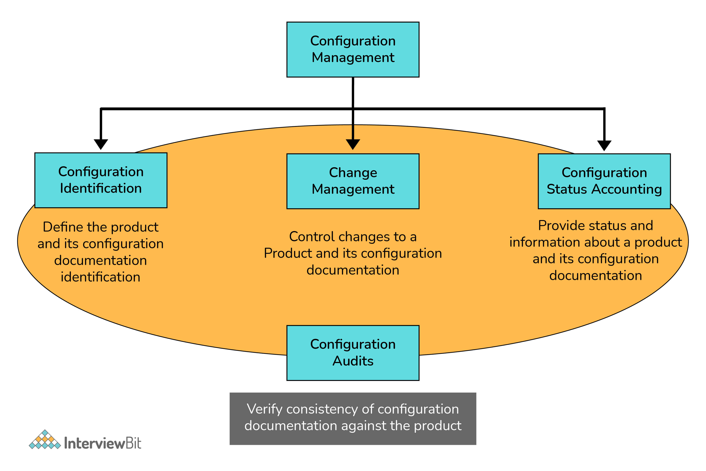

# Câu hỏi phỏng vấn DevOps

## DevOps là gì?

DevOps được ghép bởi 2 từ tiếng anh Development (Dev) và Operations (Ops). Nghĩa là có sự kết hợp giữa kỹ sư phát triển phần mềm với bộ phận  Operator để  rút ngắn quá trình phát triển sản phẩm. 

DevOps thực chất không phải là một công cụ hỗ trợ làm việc mà chính là sự tổng hợp của các nguyên lý, thực tiễn, quy trình cùng các công cụ và mang lại sự tự động hóa trong lập trình, chuyển giao phần mềm. 

## Công cụ DevOps

DevOps là một phương pháp nhằm tăng năng suất và chất lượng của quá trình phát triển sản phẩm. Các công cụ chính được sử dụng trong phương pháp này là:
- Version Control System. Vd.: git.
- Continuous Integration. Vd.: Jenkins
- Continuous Testing. Vd.: Selenium
- Configuration Management & Deployment. Vd.:Puppet, Chef, Ansible
- Continuous Monitoring. Vd.: Nagios
- Containerization. Vd.: Docker

Các tổ chức đã áp dụng phương pháp này được báo cáo là đã hoàn thành gần hàng nghìn lần triển khai chỉ trong một ngày, do đó cung cấp độ tin cậy, độ ổn định và bảo mật cao hơn cùng với sự hài lòng của khách hàng.

## Câu hỏi phỏng vấn DevOps cho Fresher

### 1. Kỹ sư DevOps là gì?

Kỹ sư DevOps làm việc với lập trình viên và nhân viên IT để giám sát việc phát hành code. Họ có thể xuất phát là các lập trình viên, quan tâm đến việc triển khai và vận hành mạng. Hoặc họ là các sysadmin (quản trị hệ thống) có niềm đam mê viết script và coding, chuyển sang mảng phát triển nơi họ có thể cải thiện việc lập kế hoạch kiểm thử và triển khai. Đôi lúc, người làm DevOps là developer hay sysadmin kiêm nhiệm luôn trọng trách của một DevOps trong khi vẫn tiếp tục với vai trò chính của mình.

Kỹ sư DevOps là người hiểu rõ về chu kỳ phát triển phần mềm (Software Development Life Cycle – SDLC). Họ cũng là người hiểu toàn diện về các công cụ tự động hóa khác nhau được dùng trong CI/CD pipelines.

### 2. Tại sao cần DevOps?

DevOps cho phép các nhóm phát triển nhanh để thực hiện tích hợp liên tục (Continuous Integration) và phân phối liên tục (Continuous Delivery). Điều này giúp họ đưa sản phẩm ra thị trường nhanh hơn.

Các lý do quan trọng khác là:

- **Khả năng dự đoán (Predictability):** DevOps có thể dự đoán những rủi ro có thể gặp phải và giúp giảm đáng kể tỷ lệ thất bại của các phiên bản mới.
- **Tự khôi phục (Reproducibility):** Bạn có thể khôi phục ứng dụng của mình về phiên bản cũ hơn bất cứ lúc nào.
- **Khả năng duy trì(Maintainability):** Việc khôi phục có thể được thực hiện dễ dàng nếu phiên bản mới gặp sự cố hoặc hệ thống hiện tại không khả dụng.
Thời gian triển khai (Time to market): DevOps giảm thời gian triển khai lên production 50% bằng cách hợp lý hóa quy trình phân phối phần mềm.
- **Chất lượng cao hơn (Greater Quality):** DevOps giúp nhóm cải thiện chất lượng phát triển ứng dụng.
- **Giảm rủi ro (Reduced Risk):** DevOps bao gồm kiểm tra bảo mật trong vòng đời phân phối phần mềm. Nó giúp giảm rủi ro bảo mật trong suốt vòng đời phần mềm.
- **Khả năng phục hồi (Resiliency):** Trạng thái hoạt động của hệ thống phần mềm ổn định hơn và an toàn hơn, và khi có bất cứ sự cố nào xảy ra, hệ thống có thể tự phục hồi.
- **Hiệu quả chi phí (Cost Efficiency):** DevOps cung cấp hiệu quả chi phí trong quy trình phát triển phần mềm, đây luôn là điều mà công ty trong lĩnh vực Internet mong đợi.
- **Chia các code base lớn thành các phần nhỏ (Breaks larger code base into small pieces):** DevOps dựa trên các phương pháp lập trình nhanh. Do đó, nó cho phép một code base lớn được chia thành các khối nhỏ hơn và dễ quản lý hơn.

### 3. SSH là gì?

SSH, hoặc được gọi là Secure Shell, là một giao thức điều khiển từ xa cho phép người dùng kiểm soát và chỉnh sửa server từ xa qua Internet. Dịch vụ được tạo ra nhằm thay thế cho trình Telnet vốn không có mã hóa và sử dụng kỹ thuật cryptographic để đảm bảo tất cả giao tiếp gửi tới và gửi từ server từ xa diễn ra trong tình trạng mã hóa. Nó cung cấp thuật toán để chứng thực người dùng từ xa, chuyển input từ client tới host, và gửi kết quả trả về tới client.

### 4. Quản lý cấu hình là gì?

Quản lý cấu hình (Configuration management - CM) về cơ bản là một hoạt động xử lý các thay đổi hệ thống để không mất đi tính toàn vẹn của nó trong một khoảng thời gian. Điều này liên quan đến các chính sách, kỹ thuật, thủ tục và công cụ nhất định để đánh giá các đề xuất thay đổi, quản lý và theo dõi tiến trình của chúng cùng với việc duy trì tài liệu thích hợp cho cùng một đề xuất.

CM giúp đưa ra các định hướng quản lý và kỹ thuật để thiết kế và phát triển việc tăng giá trị sản phẩm.

### 5. Tầm quan trọng của quản lý cấu hình trong DevOps?

CM giúp nhóm tự đóng hoá các công việc nhàm chán và tốn thời gian, qua đó nâng cao hiệu suất và năng lực tổ chức.

Nó cũng giúp mang lại tính nhất quán và cải thiện quy trình phát triển sản phẩm bằng cách sử dụng các phương tiện thiết kế tinh giản, tài liệu mở rộng, kiểm soát và thực hiện thay đổi trong các giai đoạn/phát hành khác nhau của dự án.

### 6. CAMS là gì?

CAMS là viết tắt của Culture, Automation, Measurement và Sharing. Nó biểu diễn các yếu tố cốt lõi của DevOps.

### 7. Tích hợp liên tục là gì?

Tích hợp liên tục (CI) là phương pháp phát triển phần mềm đòi hỏi các thành viên trong nhóm tích hợp công việc thường xuyên. Mỗi ngày, các thành viên đều phải theo dõi và phát triển công việc của họ ít nhất một lần. Việc này sẽ được một nhóm khác kiểm tra tự động, nhóm này sẽ tiến hành kiểm thử truy hồi để phát hiện lỗi nhanh nhất có thể. Cả nhóm thấy rằng phương pháp tiếp cận này giúp giảm bớt vấn đề về tích hợp hơn và cho phép phát triển phần mềm gắn kết nhanh hơn. 

.jpg)

Dựa vào hình trên, ta có cái nhìn tổng thể về quy trình CI:
- Các nhà phát triển thường xuyên kiểm tra code trong không gian làm việc cục bộ của họ và làm việc trên các tính năng họ được giao.
- Sau khi hoàn tất công việc, code được commit và push lên repository chung từ xa được xử lý bằng cách sử dụng các công cụ kiểm soát phiên bản hiệu quả như git.
- CI Server theo dõi các thay đổi được thực hiện đối với repository chung và nó pull các thay đổi ngay khi phát hiện ra chúng.
- Sau đó, CI Server sẽ kích hoạt việc build code và chạy các unit test và tích hợp nếu được thiết lập.
- Nhóm được thông báo về kết quả build. Trong trường hợp không thành công, nhóm phải làm việc để khắc phục sự cố càng sớm càng tốt và sau đó quá trình lặp lại.

### 8. Tại sao lại cần tích hợp liên tục?

Bằng cách kết hợp Tích hợp liên tục cho cả quá trình phát triển và thử nghiệm, người ta nhận thấy rằng chất lượng phần mềm đã được cải thiện và thời gian cung cấp các tính năng của phần mềm đã giảm đáng kể.

Điều này cũng cho phép nhóm phát triển phát hiện và sửa lỗi ở giai đoạn ban đầu vì mỗi commit đối với repository chung được build tự động và chạy dựa trên các trường hợp thử nghiệm đơn vị và tích hợp.

### 9. Kiểm tra liên tục là gì?

Kiểm tra liên tục (Continuous Testing - CT) là giai đoạn DevOps bao gồm quá trình chạy các trường hợp kiểm thử tự động như một phần của quy trình phân phối phần mềm tự động với mục đích duy nhất là nhận được phản hồi ngay lập tức về chất lượng và xác nhận các rủi ro nghiệp vụ liên quan đến việc build tự động code của các nhà phát triển.

Giai đoạn này sẽ giúp nhóm kiểm tra liên tục từng bản build (ngay sau khi code được push), do đó tạo cơ hội cho các nhóm phát triển nhận được phản hồi tức thì về công việc của họ và đảm bảo rằng những vấn đề này không đến trong các giai đoạn sau của Chu trình SDLC.

Thực hiện điều này sẽ tăng tốc đáng kể quy trình làm việc, vì các nhà phát triển bỏ qua được các bước can thiệp thủ cộng để build lại dự án và chạy các trường hợp kiểm thử tự động mỗi khi thay đổi được thực hiện.

### 10. Các yếu tố quan trọng của DevOps KPI?

- Giảm thời gian trung bình cần thiết để hồi phục sau sự cố.
- Tăng tần suất triển khai khi việc triển khai diễn ra.
- Giảm tỷ lệ triển khai không thành công.