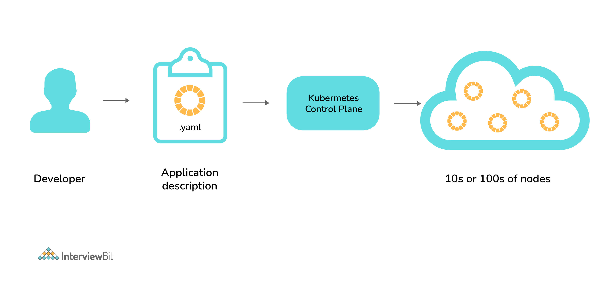

# Câu hỏi phỏng vấn Kubernetes


## Kubernetes là gì?

Kubernetes là công nghệ phân phối mã nguồn mở giúp ta lên lịch và thực thi container ứng dụng trên nhiều cụm. Kubernetes bao gồm hai kiểu tài nguyên:

**Master** => Điều phối tất cả các hoạt động trong cụm, ví dụ, => lập lịch ứng dụng, duy trì trạng thái của ứng dụng, mở rộng ứng dụng và tung ra các bản cập nhật mới

**Node** => Một node là một phiên bản của hệ điều hành đóng vai trò là một worker trong cụm Kubernetes.

Ngoài ra, Node có hai thành phần:

- Kubelet =? Tác nhân quản lý và giao tiếp với master
- Tool (Docker/container) =? Công cụ để chạy các hoạt động container


Nó được thiết kế dựa trên cơ sở là một tập hợp các container được kết hợp lỏng lẻo, tập trung vào việc triển khai, duy trì và mở rộng khối lượng công việc. Hoạt động như một động cơ để giải quyết trạng thái bằng cách hội tụ trạng thái thực tế và trạng thái mong muốn của hệ thống (tự phục hồi). Ẩn khỏi phần cứng cơ bản của các node và cung cấp giao diện thống nhất cho khối lượng công việc được triển khai và sử dụng nhóm tài nguyên (phần cứng) được chia sẻ để đơn giản hóa việc triển khai.

Pod là đơn vị nhỏ nhất của các đối tượng có thể được triển khai trên Kubernetes, Kubernetes đóng gói một hoặc nhiều container vào một cấu trúc cấp cao hơn được gọi là pod.

**POD** luôn chạy trên một Node nhưng chúng chia sẻ một số tài nguyên có thể là khối lượng chhung, IP duy nhất của cụm, thông tin về cách chạy từng container. Tất cả các container chứa trong pod sẽ được lập lịch trên một node tương đương.

Các Service là cách thống nhất để truy cập khối lượng công việc trên các nhóm, Control plane là cốt lõi của Kubernetes, là một máy chủ API cho phép bạn truy vấn, thao tác trạng thái của một đối tượng trong Kubernetes.


Hình ảnh sau đây mô tả luồng công việc của Kubernetes từ cấp độ cao, trong đó mô tả ứng dụng là file YAML còn được gọi là file cấu hình hoặc thông số kỹ thuật để có thể triển khai các ứng dụng được đóng gói dưới dạng pod trong cụm hoặc node.



## Câu hỏi phỏng vấn Kubernetes cho Fresher?

### 1. Làm thế nào để thực hiện bảo trì trên node K8?

Bất cứ khi nào có sẵn các bản vá bảo mật, quản trị viên Kubernetes phải thực hiện nhiệm vụ bảo trì để áp dụng bản vá bảo mật cho container đang chạy nhằm ngăn nó khỏi lỗ hổng bảo mật, đây thường là một phần không thể tránh khỏi trong quản trị. Hai lệnh sau rất hữu ích để thoát node K8s một cách an toàn.

```
kubectl cordon
kubectl drain –ignore-daemon set
```

Lệnh đầu tiên chuyển node sang chế độ bảo trì hoặc làm cho node không khả dụng, tiếp theo là lệnh `kubectl drain` sẽ loại bỏ pod khỏi node. Sau khi lệnh thoát thành công, bạn có thể thực hiện bảo trì.

Lưu ý nếu bạn muốn thực hiện bảo trì trên một pod đơn, có thể dùng hai lệnh sau:

- `kubectl get nodes`: hiển thị tất cả node
- `kubectl drain <node name>`: thoát một node cụ thể

### 2. Làm cách nào để kiểm soát việc sử dụng tài nguyên của POD?

Ta có thể dùng limit và request:

- **Request:** Số lượng tài nguyên đang được yêu cầu cho một container. Nếu một container vượt quá yêu cầu tài nguyên của nó, nó có thể được điều chỉnh trở lại.
- **Limit:** Giới hạn trên đối với các tài nguyên mà một container duy nhất có thể sử dụng. Nếu nó cố gắng vượt quá giới hạn được xác định trước này, nó có thể bị chấm dứt nếu K8's quyết định rằng một container khác cần những tài nguyên này. Nếu bạn nhạy cảm với việc khởi động lại pod, bạn nên đặt tổng tất cả các giới hạn tài nguyên container nhỏ hơn hoặc bằng tổng dung lượng tài nguyên cho cụm của bạn.

Ví dụ:

```
apiVersion: v1
kind: Pod
metadata:
 name: demo
spec:
 containers:
 - name: example1
 image:example/example1
 resources:
   requests:
     memory: "_Mi"
     cpu: "_m"
   limits:
     memory: "_Mi"
     cpu: "_m"
```