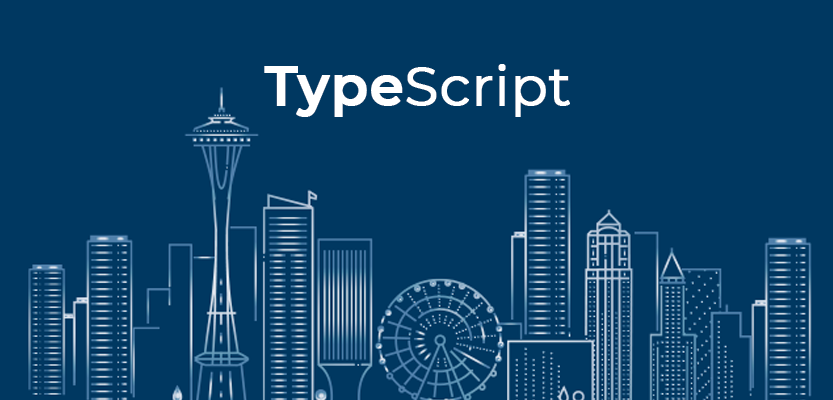

# Câu hỏi phỏng vấn TypeScript



TypeScript là một dự án mã nguồn mở được phát triển bởi Microsoft, nó có thể được coi là một phiên bản nâng cao của Javascript bởi việc bổ sung tùy chọn kiểu tĩnh và lớp hướng đối tượng mà điều này không có ở Javascript. Nó có thể chạy ở bất cứ trình duyệt, hệ điều hành hay nền tảng nào. Mọi thứ dùng được code JavaScript thì cũng dùng được TypeScript. 

## Tại sao lại dùng TypeScript?

- **Dễ phát triển dự án lớn:** Với việc sử dụng các kỹ thuật mới nhất và lập trình hướng đối tượng nên TypeScript giúp chúng ta phát triển các dự án lớn một cách dễ dàng.
- **Nhiều Framework lựa chọn:** Hiện nay các Javascript Framework đã dần khuyến khích nên sử dụng TypeScript để phát triển, ví dụ như Angular và NestJs.
- **Hỗ trợ các tính năng của Javascript phiên bản mới nhất:** TypeScript luôn đảm bảo việc sử dụng đầy đủ các kỹ thuật mới nhất của Javascript, ví dụ như version hiện tại là ECMAScript 2015 (ES6).
- **Là mã nguồn mở:** TypeScript là một mã nguồn mở nên bạn hoàn toàn có thể sử dụng mà không mất phí, bên cạnh đó còn được cộng đồng hỗ trợ.
- **TypeScript là JavaScript:** Bản chất của TypeScript là biên dịch tạo ra các đoạn mã javascript nên ban có thê chạy bất kì ở đâu miễn ở đó có hỗ trợ biên dịch Javascript. Ngoài ra bạn có thể sử dụng trộn lẫn cú pháp của Javascript vào bên trong TypeScript, điều này giúp các lập trình viên tiếp cận TypeScript dễ dàng hơn.


TypeScript sử dụng file mở rộng `.ts`, tương tự với `.js` ở file JavaScript. Ở đây là chương trình cộng hai số trong TypeScript.

```ts
function add(a: number, b: number): number {
    const sum = a + b;
    return sum;
}
```

Khi ta biên dịch file TypeScript với lệnh `tsc`, trình biên dịch TypeScript tạo file JavaScript tương ứng. 

```js
function add(a, b) {
    const sum = a + b;
    return sum;
}
```


TypeScript bổ sung thêm các tính năng static typing, interface, class, modules và generics. TypeScript hoàn toàn là một công cụ compile-time. Khi biên dịch, chương trình sẽ chỉ còn là JavaScript đơn giản. TypeScript là một ngôn ngữ để phát triển quy mô ứng dụng JavaScript.


## Câu hỏi phỏng vấn TypeScript cho Freshers

### 1. Các kiểu nguyên thuỷ trong TypeScript?

Trong TypeScript có loại kiểu dữ liệu là kiểu có sẵn (built-in) và kiểu người dùng định nghĩa (user-defined).

* Built-in:
    - string
    - number
    - boolean
    - void
    - symbol
    - null & undefined
* User-defined:
    - arrays
    - enums
    - classes
    - interfaces


### 2. Giải thích các mảng làm việc trong TypeScript?

Ta sử dụng mảng cho lưu trữ các giá trị cùng kiểu. Mảng là tập hợp giá trị có thứ tự và được đánh chỉ mục. Phần tử đầu tiên có chỉ mục là 0, kế tiếp là 1, ....

Cú pháp khai báo và khởi tạo mảng trong TypeScript:

```ts
let values: number[] = [];
values[0] = 10;
values[1] = 20;
values[2] = 30;
```

Ta có thể tạo mảng với cú pháp đơn giản hơn:

```ts
let values: number[] = [15, 20, 25, 30];
```

Hoặc là dùng từ khoá Array:

```ts
let values: Array<number> = [15, 20, 25, 30];
```

### 3. Kiểu any là gì?

Khi bạn muốn lưu một biến mà không biết trước kiểu của biến đó. Ví dụ, giá trị từ lệnh gọi API hoặc đầu vào người dùng. Kiểu `any` cho phép gán bất kỳ giá trị nào cho biến.

```ts
let person: any = "Foo";
```

Ví dụ:

```ts
// json may come from a third-party API
const employeeData: string = `{"name": "John Doe", "salary": 60000}`;

// parse JSON to build employee object
const employee: any = JSON.parse(employeeData);

console.log(employee.name);
console.log(employee.salary);
```

### 4. Kiểu void là gì?

Void cho biết sự vắng mặt của kiểu với biến. Nó hoạt động như đối lập với bất kỳ kiểu nào. Nó hữu ích cho các hàm không trả về giá trị.

```ts
function notify(): void {
    alert("The user has been notified.");
}
```

