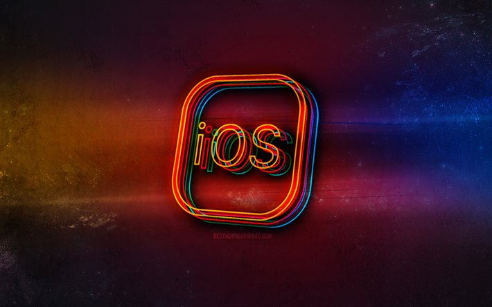
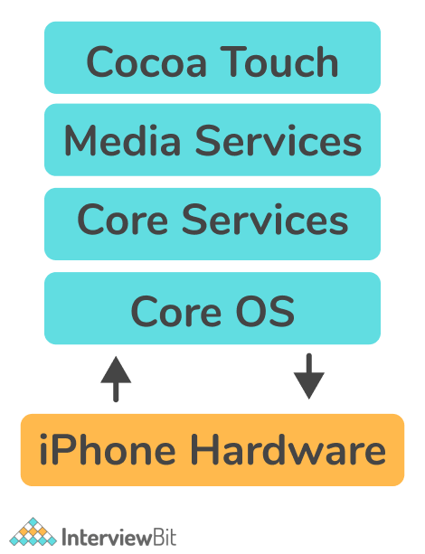

# Câu hỏi phỏng vấn iOS



## iOS là gì?

iOS là viết tắt của "iPhone Operating System". Đây là hệ điều hành dành cho các thiết bị của Apple, và nó được coi là hệ điều hành di động phổ biến thứ hai trên toàn cầu sau Android. Hệ điều hành này hỗ trợ nhiều sản phẩm của Apple bao gồm iPhone, iPad và iPod. iOS được nhiều người khen ngợi vì giao diện trực quan và thân thiện với người dùng.

**Tính năng của iOS**

- iPhone cung cấp khả năng đa nhiệm. Trên thiết bị iOS, bạn có thể dễ dàng chuyển đổi giữa các ứng dụng bằng tính năng đa nhiệm hoặc cử chỉ nhiều ngón tay.
- iOS giúp bạn dễ dàng tích hợp các tương tác mạng xã hội với ứng dụng của mình bằng cách hiển thị luồng hoạt động và chia sẻ nội dung.
- Dịch vụ iCloud của Apple cho phép người dùng lưu trữ dữ liệu trên Internet. Nó cung cấp mức độ mã hóa cao và tùy chọn sao lưu để đảm bảo người dùng không bị mất dữ liệu.
- Cửa hàng ứng dụng của Apple có sẵn trên tất cả các nền tảng, cung cấp cho người dùng các dịch vụ và tài liệu bổ sung bao gồm các mặt hàng kỹ thuật số (iOS, iPad, macOS), đăng ký và nội dung cao cấp.
- Bạn có thể xem tất cả các cảnh báo ứng dụng của mình trong Trung tâm thông báo trong iOS. Tuy nhiên, cài đặt thông báo có thể được sửa đổi.
- iOS là một hệ thống đóng. Mã nguồn của các ứng dụng của Apple không có sẵn cho các nhà phát triển và chủ sở hữu iPhone và iPad không thể sửa đổi code trên thiết bị của họ. Điều này làm cho các thiết bị chạy iOS khó bị hack hơn.

## Câu hỏi phỏng vấn iOS cho Fresher

### 1. Giải thích kiến trúc iOS?

iOS hoạt động theo cấu trúc lớp. Kiến trúc iOS bao gồm bốn lớp, mỗi lớp cung cấp một framework lập trình để tạo các ứng dụng hoạt động trên phần cứng. Giao tiếp sẽ được tăng cường bởi các lớp giữa lớp ứng dụng và lớp phần cứng. Lớp cấp thấp hơn cung cấp các dịch vụ mà tất cả các ứng dụng yêu cầu, trong khi lớp cấp cao cung cấp các dịch vụ liên quan đến đồ họa và giao diện.



- **Lớp core OS:** nằm ngay trên đầu phần cứng thiết bị và là lớp dưới cùng của kiến trúc hệ điều hành iPhone. Ngoài các dịch vụ hệ điều hành cơ bản, chẳng hạn như quản lý bộ nhớ, xử lý hệ thống file và luồng, lớp này còn cung cấp mạng cấp thấp, quyền truy cập vào các phụ kiện bên ngoài,...
- **Lớp dịch vụ:** Mục đích của nó là thiết kế các dịch vụ mà lớp trên hoặc người dùng yêu cầu. Các tính năng thiết yếu của nó là các đối tượng khối, Grand Central Dispatch, mua hàng trong ứng dụng và lưu trữ iCloud. Lớp dịch vụ đã được củng cố bằng cách bổ sung tính năng ARC Automatic Reference Counting.
- **Lớp Media:** xử lý media như video, âm thanh, hình ảnh,... Lớp media cho phép ta sử dụng tất cả công nghệ đồ hoạ, âm thanh, hình ảnh của hệ thống.
- **Lớp Cocoa Touch:** còn biết đến là lớp ứng dụng. Đây là nơi mà các framework được tạo ra khi các ứng dụng được xây dựng. Ngoài ra, nó có chức năng như giao diện để người dùng iOS làm việc với hệ điều hành. Điều này bao gồm khả năng cảm ứng và chuyển động.

### 2. Thuộc tính trong iOS?

Thuộc tính cơ bản là các giá trị được liên kết với một class, struct hay enum. Nó có thể là một biến con, một phần của đối tượng khác.

Ví dụ:

```swift
struct Icecream  
{ 
    var flavor: String = ""
} 
var choco = Icecream() 
choco.flavor = "Chocolate Icecream"
```

Trong đoạn code trên, ta tạo một cấu trúc gọi là `Icecream`. Một trong những thuộc tính của nó được gọi là `flavor`, có giá trị ban đầu là một chuỗi trống.

#### Phân loại thuộc tính

- **Thuộc tính lưu trữ**: kiểu thuộc tính này dành cho lưu trữ một giá trị hằng hoặc biến và thường được cung cấp bởi class hay structure.

Ví dụ:

```swift
class Programmer {
    var progName: String
    let progLanguage: String
    var totalExperience = 0
    var secondLanguage: String?
}
```

Ở trên, lớp `Programmer` khai báo bốn thuộc tính: `progName`, `progLanguage`, `totalExperience`, và `secondLanguage`. Chúng là thuộc tính lưu trữ có thể bao gồm giá trị và là một phần của thực thể lớp. Đoạn code trên hiển thị thuộc tính mà không có giá trị mặc định.

- **Thuộc tính tính toán**: các thuộc tính này dùng cho tính toán thay vì lưu trữ thường được cung cấp bởi class, enum hay struct.

Ví dụ:

```swift
struct Angle {
    var degrees: Double = 0

    var rads: Double {
        get {
            return degrees * .pi / 180
        }
        set(newRads) {
            degrees = newRads * 180 / .pi
        }
    }
}
```

Ở trên, cấu trúc `Angle` có thuộc tính lưu trữ `degrees` để lưu trữ độ của góc. Hơn thế nữa, `Angle` còn thế có chuyển thành radian, thế nên `Angle` bao gồm thuộc tính `rads` để tính toán thuộc tính.

### 3. Bạn có thể giải thích sự khác biệt giữa các thuộc tính atomic và nonatomic không?

**Thuộc tính atomic:** Nó là thuộc tính mặc định và đảm bảo một giá trị hợp lệ sẽ được trả về từ getter hoặc được thiết lập bởi setter. Điều này đảm bảo rằng chỉ một luồng có thể truy cập getter/setter của một thuộc tính nhất định tại một thời điểm và tất cả các luồng khác phải đợi cho đến khi luồng đầu tiên giải phóng getter/setter. Mặc dù luồng an toàn, nhưng nó không nhanh, vì nó đảm bảo rằng quá trình được hoàn thành hoàn toàn.

**Thuộc tính nonatomic:** Với thuộc tính này, nhiều luồng có thể truy cập vào phương thức getter/setter của một thuộc tính nhất định cùng một lúc, do đó có khả năng tồn tại sự không nhất quán giữa các giá trị. Chúng đi kèm với quyền truy cập nâng cao, nhưng không đảm bảo về giá trị trả về.

### 4. Các trạng thái khác nhau của ứng dụng iOS?

Trong quá trình thực thi, ứng dụng iOS trải qua một loạt trạng thái. Mỗi trạng thái này được coi là trạng thái vòng đời của ứng dụng. Dưới đây là năm trạng thái có thể xảy ra đối với ứng dụng iOS:


- **Not running:** ở trạng thái này, ứng dụng đã không được khởi chạy hoặc đã bị đóng bởi hệ thống.
- **Inactive:** một trạng thái không hoạt động ngắn xảy ra khi ứng dụng đang rời khỏi hoặc đang ở trạng thái hoạt động. Mặc dù chạy ở chế độ đã hiển thị, nó vẫn chưa sẵn sàng để chấp nhận đầu vào hoặc sự kiện từ người dùng. Điều này có nghĩa là ứng dụng vẫn không hoạt động tại thời điểm này.
- **Active:** trạng thái này cho biết rằng ứng dụng đang được hiển thị và nhận các sự kiện. Đây là chế độ bình thường cho các ứng dụng và Giao diện người dùng có thể truy cập được.
- **Background:** trong trạng thái này, giao diện người dùng của ứng dụng bị ẩn, nhưng nó vẫn tiếp tục chạy trong nền của hệ thống iOS. Các ứng dụng thường vượt qua trạng thái này trước khi bị đình chỉ.
- **Suspended:** Trong trường hợp này, ứng dụng đang ở chế độ nền nhưng không chạy code. Trong điều kiện bộ nhớ thấp, hệ thống có thể xóa các ứng dụng ở trạng thái bị treo mà không cần cảnh báo.

### 5. Trách nhiệm của nhà phát triển iOS?

Nhà phát triển iOS là một lập trình viên hoặc kỹ sư phần mềm, người thiết kế và phát triển các ứng dụng chạy iOS của Apple trên thiết bị iOS. Tốt nhất, nhà phát triển iOS phải có kỹ năng trong hai ngôn ngữ lập trình, là Objective-C và Swift.

Trách nhiệm của nhà phát triển iOS:

- Code sạch sẽ, hiệu quả cho các ứng dụng iOS.
- Đảm bảo code an toàn bằng cách thực hiện khắc phục sự cố và sửa lỗi cho các ứng dụng.
- Việc phát triển và triển khai các tính năng ứng dụng nâng cao cũng như duy trì và cải tiến các tính năng hiện có.
- Phát triển các giải pháp sáng tạo để đáp ứng nhu cầu kinh doanh của khách hàng.
- Hỗ trợ tất cả các khía cạnh của phát triển ứng dụng, bao gồm thiết kế, thử nghiệm, phát hành và hỗ trợ.
- Khám phá, đánh giá và triển khai các công nghệ mới liên tục để tối đa hóa hiệu quả phát triển.

