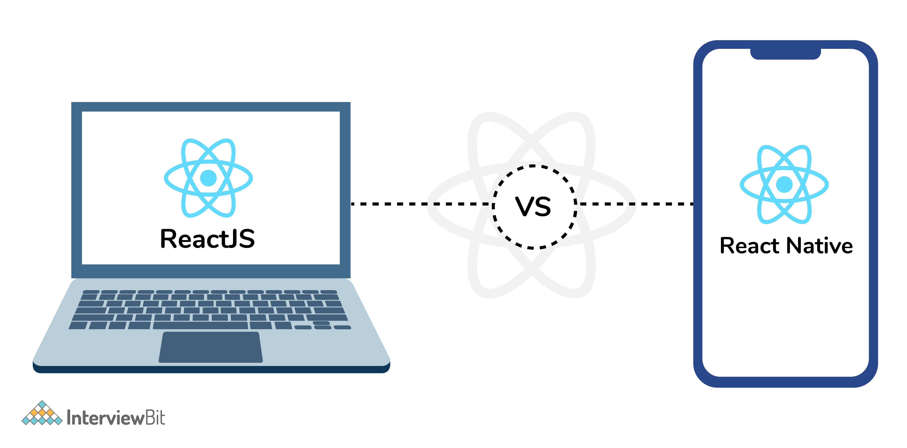
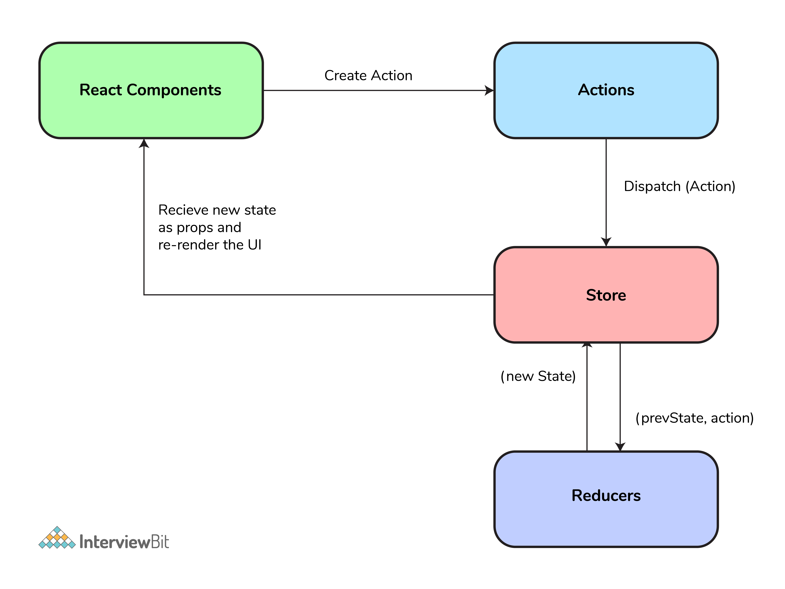
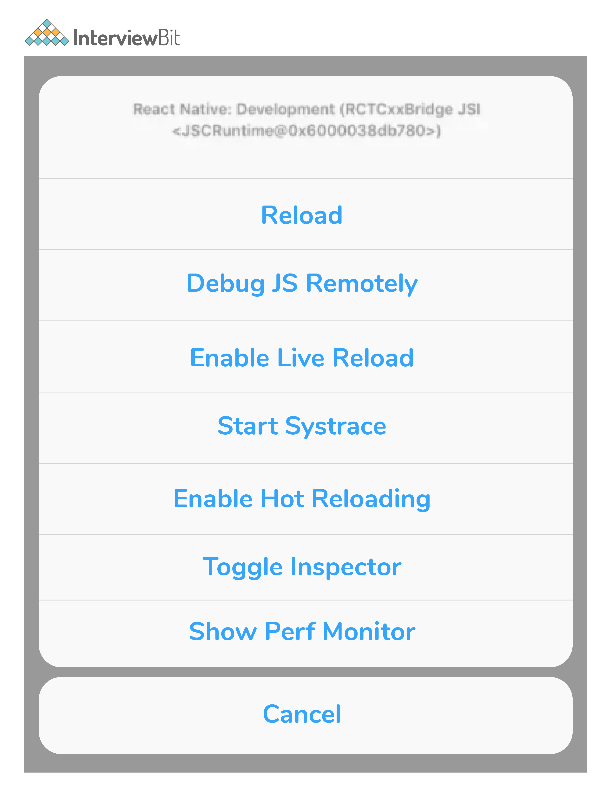
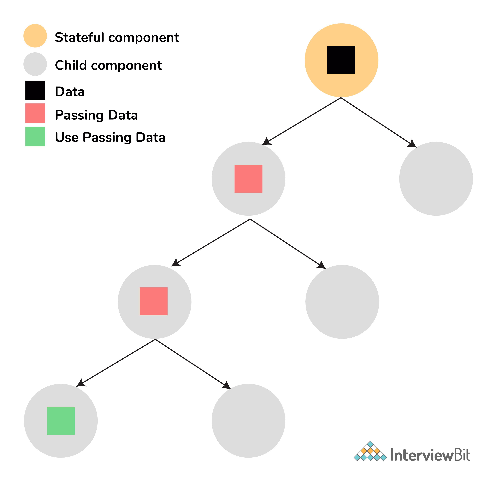

# Câu hỏi phỏng vấn React Native


React Native là một framework ứng dụng di động dựa trên JavaScript, được thiết kế để tạo các ứng dụng di động cho iOS và Android bằng cách cung cấp cho người lập trình một công cụ để sử dụng React cùng với nền tảng di động native. Ưu điểm chính của React Native là code có thể được viết và chia sẻ một lần giữa cả iOS và Android. Các ứng dụng dành cho thiết bị di động thực sự "native" về cả giao diện và cảm nhận có thể được xây dựng bằng chính Javascript.

## Câu hỏi phỏng vấn React Native cho Fresher

### 1. Sự khác biệt giữa ReactJS và React Native?

- Mục đích:
    + ReactJS là thư viện dùng cho xây dựng giao diện người dùng trên ứng dụng web
    + React Native là framework cho tạo ứng dụng di động ở như một ứng dụng native.
- Cú pháp: cả hai đều dùng JSX nhưng React dùng cú pháp `<div>`, `<h1>`, `<p>` còn React Native dùng `<view>`, `<text>`,...
- Animation:
    + ReactJS sử dụng CSS animation để tạo ảnh động trên ứng dụng web.
    + React Native sử dụng Animated API
- Cơ chế routing:
    + React dùng react-router cho chuyển hướng trang
    + React Native sử dụng thư viện Navigator cho chuyển hướng trên ứng dụng di động.



| React JS | React Native |
|-|-|
| Dùng cho phát triển ứng dụng web | Dùng cho phát triển ứng dụng di động |
| Dùng react-router cho điều hướng trang | Dùng thư viện navigator cho điều hướng trong ứng dụng di động |
| Dùng thẻ HTML | Không dùng thẻ HTML |
| Cung cấp bảo mật cao | Bảo mật thấp hơn so với ReactJS |
| Sử dụng virtual DOM để render trên trình duyệt | Dùng API để render cho ứng dụng di động |

### 2. Flexbox là gì?

Nó là mô hình bố cục cho phép phần tử được căn chỉnh và cách đều trong container. Với flexbox ta có thể tuỳ chỉnh width và height một cách linh hoạt, tất cả bên trong container chính có thể được căn chỉnh để lấp đầy hoặc cách khoảng giữa các phần tử, điều này làm cho nó trở thành một công cụ tuyệt vời để sử dụng cho các hệ thống thiết kế reponsive.

| Property | Values | Desc |
|-|-|-|
| flexDirection | 'column', 'row' | Dùng cho căn chỉnh phần tử theo chiều dọc hay ngang |
| justifyContent | 'center','flex-start','flex-end','space-around','space-between' | Được sử dụng để xác định cách các phần tử nên được cách khoảng bên trong container |
| alignItems | 'center','flex-start','flex-end','stretched' | Được sử dụng để xác định cách các phần tử nên được cách khoảng bên trong container dọc theo trục thứ cấp (ngược với flexDirection) |

### 3. Ưu điểm của React Native?

**Cộng đồng lớn**

React Native là một Framework mã nguồn mở, nó hoàn toàn do cộng đồng thúc đẩy phát triển nên mọi vấn đề đều có thể được giải quyết bằng cách nhận trợ giúp trực tuyến từ các nhà phát triển khác.
 
**Khả năng tái sử dụng**

Code có thể được viết một lần và có thể được sử dụng cho cả iOS và Android, giúp duy trì và cũng như debug các ứng dụng phức tạp lớn vì không cần nhóm riêng biệt để hỗ trợ cả hai nền tảng, điều này cũng làm giảm chi phí ở mức độ lớn.
 
**Hot Reloading**

Thói quen thông thường của dev khi code là test các thay đổi mỗi lần code được viết. Để thực hiện được, app cần phải được đóng gói lại và cài đặt hoặc trong 1 simulator hoặc một thiết bị thật sự.

Với React Native, phần lớn thời gian, bạn không cần phải tổng hợp lại app mỗi lần có thay đổi. Bạn chỉ cần làm mới app trong simulator, emulator hoặc thiết bị. Thậm chí còn có một tính năng là Live Reload để tự động refresh app mỗi lần phát hiện 1 thay đổi trong code.

**Các plugin bổ sung của bên thứ ba**
Nếu các module hiện có không đáp ứng yêu cầu nghiệp vụ trong React Native, chúng ta cũng có thể sử dụng các plugin của Bên thứ ba để giúp tăng tốc quá trình phát triển.

### 4. Giải thích các thread khác nhau trong React Native?


Luồng điều khiển tuần tự đơn trong một chương trình có thể được điều khiển bởi một thread.

**React Native sử dụng 3 threads**

- **MAIN/UI Thread** - Đây là thread chính mà ứng dụng Android/iOS của bạn đang chạy. Giao diện người dùng của ứng dụng có thể được thay đổi bởi thread chính và có quyền truy cập vào nó.

- **Shadow Thread** - bố cục được tạo bởi thư viện React trong React Native.
- **JavaScript Thread** - code JavaScript sẽ được thực thi ở thread này.

### 5. defaultProps có khả dụng trong React Native không?

Có, nó hoạt động trong React Native tương tự như ở ReactJS.

```jsx
import {View, Text} from 'react-native';

class DefaultPropComponent extends Component {
    render() {
        return ( 
            <View>
                <Text> 
                {this.props.name} 
                </Text> 
            </View>
        )
    }
}
Demo.defaultProps = {
   name: 'BOB'
}

export default DefaultPropComponent;
```

### 6. Xử lý input trong React Native?

TextInput là component chính cho phép người dùng nhập văn bản vào. Nó có `onChangeText` để nhận một hàm gọi mỗi khi văn bản có thay đổi, và `onSubmitEditing` để nhận một hàm gọi mỗi khi có submit.

```jsx
import React, { useState } from 'react';
import { Text, TextInput, View } from 'react-native';

const PizzaTranslator = () => {
    const [text, setText] = useState('');
    return (
        <View style={{padding: 10}}>
            <TextInput
                style={{height: 40}}
                placeholder="Type here to translate!"
                onChangeText={text => setText(text)}
                defaultValue={text}
            />
            <Text style={{padding: 10, fontSize: 42}}>
                {text.split(' ').map((word) => word && '🍕').join(' ')}
            </Text>
        </View>
    );
}

export default PizzaTranslator;
```

### 7. Cách sử dụng state trong React Native?

Nó dùng cho điều khiển component. Biến dữ liệu có thể lưu trong state, và nó có thể thay đổi giá trị bất cứ lúc nào. Ví dụ

```jsx
import React, {Component} from 'react';    
import { Text, View } from 'react-native';

export default class App extends Component {    
    state = {
        myState: 'State of Text Component'
    }

    updateState = () => this.setState({myState: 'The state is updated'})
    render() {
        return (
            <View>    
                <Text onPress={this.updateState}> {this.state.myState} </Text>    
            </View> 
        ); 
    } 
}
```

### 8. Redux trong React Native?

Redux là một công cụ quản lý trạng thái được dùng cho các ứng dụng JavaScript. Nó giúp toàn bộ luồng dữ liệu của ứng dụng được xử lý trong một container duy nhất không khi trạng thái trước đó vẫn tồn tại.



*Actions*: là khối lượng thông tin gửi dữ liệu từ ứng dụng của bạn đến store. Chúng là nguồn thông tin duy nhất cho store. Điều này có nghĩa là nếu bất kỳ thay đổi trạng thái nào là cần thiết, sẽ được thực hiện thông qua các action.

*Reducers*: Các action mô tả thực tế là có điều gì đó đã xảy ra, nhưng không chỉ rõ trạng thái của ứng dụng thay đổi như thế nào để phản hồi. Đây là công việc của những reducer.

*Store*: một store có thể được tạo ra với sự trợ giúp của các reducers lưu giữ toàn bộ trạng thái của ứng dụng. Cách được khuyến khích là sử dụng một store duy nhất cho toàn bộ ứng dụng, vì có nhiều store sẽ vi phạm việc sử dụng redux vốn chỉ có một store duy nhất.

*Component*: đây là nơi lưu giữ giao diện người dùng của ứng dụng.

### 9. Các hàm thời gian trong React Native?

- **setTimeout, clearTimeout**

Có các yêu cầu nghiệp vụ, `setTimeout` để thực thi một mẫu code sau một khoảng thời gian chờ đợi. `clearTimeout` dùng để xoá timer lại thời gian được bắt đầu.

```js
setTimeout(() => {
    yourFunction();
}, 3000);
```

- **setInterval, clearInterval**

Là phương thức để gọi một hàm hoặc chạy code sau những khoảng thời gian cụ thể, được chỉ định trong tham số thứ hai.

```js
setInterval(() => {
    console.log('Interval triggered');
}, 1000);
```

Một hàm hoặc khối code được liên kết với một khoảng thời gian sẽ thực thi cho đén khi nó bị dừng. Để dùng khoảng thời gian, ta dùng phương thức `clearInterval()`.

- **setImmediate, clearImmediate**

Gọi hàm thực thi sớm nhất có thể.

```js
var immediateID = setImmediate(function);
// The below code displays the alert dialog immediately.
var immediateId = setImmediate(
    () => {    alert('Immediate Alert');
}
```

`clearImmediate()` dùng để huỷ hành động ngay lập tức nếu nó được thiết lập bằng `setImmediate()`.

- **requestAnimationFrame, cancelAnimationFrame**

Là chuẩn để thực hiện ảnh động.

Gọi một hàm để cập nhật ảnh động trước khi đến frame ảnh động kế tiếp.

```js
var requestID = requestAnimationFrame(function);
// The following code performs the animation.
var requestId = requestAnimationFrame(
    () => { // animate something}
)
```

`cancelAnimationFrame()` dùng để huỷ hàm được thiết lập bởi `requestAnimationFrame()`.

### 10. Cách debug ứng dụng React Native và các công cụ cần thiết?

Trong React Native, có rất nhiều cách debug khác nhau với nhiều công cụ khác nhau, do React Native chạy trên cả hai môi trường Android và iOS. 

- Danh mục:
Reload: reloads the app
Debug JS Remotely: opens a channel to a JavaScript debugger
Enable Live Reload: makes the app reload automatically on clicking Save
Enable Hot Reloading: watches for changes accrued in a changed file
Toggle Inspector: toggles an inspector interface, which allows us to inspect any UI element on the screen and its properties, and presents an interface that has other tabs like networking, which shows us the HTTP calls, and a tab for performance.




### 11. Props Drilling là gì?

Props Drilling là một khái niệm đề cập đến quá trình truyền dữ liệu từ component cha đến component con chính xác NHƯNG ở giữa có rất nhiều component truyền props như một chuỗi.



#### Các bước tránh nó

- React Context API
- Composition
- Render props
- HOC
- Redux, Mobx

### 12. Mô tả kết nối mạng trong React Native?

React Native cung cấp fetch API cho kết nối mạng. Để lấy nội dung từ một URL, ta có thể làm như sau:

```js
fetch('https://mywebsite.com/endpoint/', {
    method: 'POST',
    headers: {
        Accept: 'application/json',
        'Content-Type': 'application/json'
    },
    body: JSON.stringify({
        firstParam: 'yourValue',
        secondParam: 'yourOtherValue'
    })
});
```

Kết nối mạng là một hoạt động bất đồng bộ. Các phương thức fetch sẽ trả về một Promise giúp dễ dàng viết code hoạt động theo cách bất đồng bộ:

```js
const getMoviesFromApi = () => {
    return fetch('https://reactnative.dev/movies.json')
        .then((response) => response.json())
        .then((json) => {
            return json.movies;
        })
        .catch((error) => {
            console.error(error);
        });
};
```

API XMLHttpRequest là api sẵn có trong React Native. Ta cũng có thể sử dụng axios với frisbee với api này.

```js
var request = new XMLHttpRequest();
request.onreadystatechange = (e) => {
    if (request.readyState !== 4) {
        return;
    }

    if (request.status === 200) {
        console.log('success', request.responseText);
    } else {
        console.warn('error');
    }
};

request.open('GET', 'https://mywebsite.com/endpoint/');
request.send();
```

### 13. Liệt kê các điểm chính để tích hợp React Native trong một ứng dụng Android?

Các điểm chính cần lưu ý để tích hợp các React Native vào ứng dụng Android của bạn là:

- Thiết lập cấu trúc thư mục và phụ thuộc React Native.
- Phát triển các component React Native của bạn trong JavaScript.
- Thêm ReactRootView vào ứng dụng Android của bạn. Chế độ xem này sẽ đóng vai trò là container cho component React Native của bạn.
- Khởi động React Native server và chạy ứng dụng native của bạn.
- Cuối cùng, chúng tôi cần xác minh việc React Native trong ứng dụng của bạn hoạt động như mong đợi.

### 14. Code React Native được xử lý như thế nào?